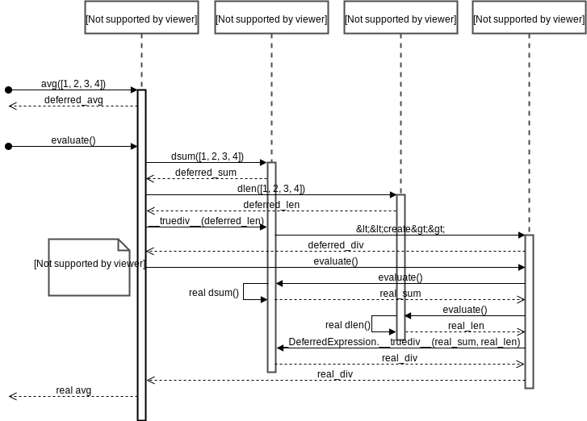

===================================================
Understanding the Mechanism of Deferrable Functions
===================================================

This section describes the mechanism behind deferrable functions, which in ReFrame, they are used for sanity and performance checking.
Generally, writing a new sanity function in a :class:`~reframe.core.pipeline.RegressionTest` is as straightforward as decorating a simple member function with the built-in :func:`~reframe.core.builtins.sanity_function` decorator.
Behind the scenes, this decorator will convert the Python function into a deferrable function and schedule its evaluation for the sanity stage of the test.
However, when dealing with more complex scenarios such as a deferrable function taking as an argument the results from other deferrable functions, it is crucial to understand how a deferrable function differs from a regular Python function, and when is it actually evaluated.

What Is a Deferrable Function?
------------------------------

A deferrable function is a function whose a evaluation is deferred to a later point in time.
You can define any function as deferrable by wrapping it with the :func:`~reframe.core.pipeline.RegressionMixin.deferrable` when decorating a member function of a class derived from :class:`~reframe.core.pipeline.RegressionMixin`, or alternatively, the :func:`reframe.utility.sanity.deferrable` decorator can be used for any other function.
The example below demonstrates a simple scenario:

.. code-block:: python

  import reframe.utility.sanity as sn

  @sn.deferrable
  def foo():
      print('hello')

If you try to call ``foo()``, its code will not execute:

.. code-block:: pycon

  >>> foo()
  <reframe.core.deferrable._DeferredExpression object at 0x2b70fff23550>

Instead, a special object is returned that represents the function whose execution is deferred.
Notice the more general *deferred expression* name of this object. We shall see later on why this name is used.

In order to explicitly trigger the execution of ``foo()``, you have to call :func:`evaluate <reframe.utility.sanity.evaluate>` on it:

.. code-block:: pycon

  >>> from reframe.utility.sanity import evaluate
  >>> evaluate(foo())
  hello

If the argument passed to :func:`evaluate <reframe.utility.sanity.evaluate>` is not a deferred expression, it will be simply returned as is.

Deferrable functions may also be combined as we do with normal functions. Let's extend our example with ``foo()`` accepting an argument and printing it:

.. code-block:: python

  import reframe.utility.sanity as sn

  @sn.deferrable
  def foo(arg):
      print(arg)

  @sn.deferrable
  def greetings():
      return 'hello'

If we now do ``foo(greetings())``, again nothing will be evaluated:

.. code-block:: pycon

  >>> foo(greetings())
  <reframe.core.deferrable._DeferredExpression object at 0x2b7100e9e978>

If we trigger the evaluation of ``foo()`` as before, we will get expected result:

.. code-block:: pycon

  >>> evaluate(foo(greetings()))
  hello

Notice how the evaluation mechanism goes down the function call graph and returns the expected result.
An alternative way to evaluate this expression would be the following:

.. code-block:: pycon

  >>> x = foo(greetings())
  >>> x.evaluate()
  hello

As you may have noticed, you can assign a deferred function to a variable and evaluate it later.
You may also do ``evaluate(x)``, which is equivalent to ``x.evaluate()``.

To demonstrate more clearly how the deferred evaluation of a function works, let's consider the following ``size3()`` deferrable function that simply checks whether an ``iterable`` passed as argument has three elements inside it:

.. code-block:: python

  @sn.deferrable
  def size3(iterable):
      return len(iterable) == 3

Now let's assume the following example:

.. code-block:: pycon

  >>> l = [1, 2]
  >>> x = size3(l)
  >>> evaluate(x)
  False
  >>> l += [3]
  >>> evaluate(x)
  True

We first call ``size3()`` and store its result in ``x``.
As expected when we evaluate ``x``, :class:`False` is returned, since at the time of the evaluation our list has two elements.
We later append an element to our list and reevaluate ``x`` and we get :class:`True`, since at this point the list has three elements.

.. note:: Deferred functions and expressions may be stored and (re)evaluated at any later point in the program.

An important thing to point out here is that deferrable functions *capture* their arguments at the point they are called.
If you change the binding of a variable name (either explicitly or implicitly by applying an operator to an immutable object), this change will not be reflected when you evaluate the deferred function.
The function instead will operate on its captured arguments.
We will demonstrate this by replacing the list in the above example with a tuple:

.. code-block:: pycon

  >>> l = (1, 2)
  >>> x = size3(l)
  >>> l += (3,)
  >>> l
  (1, 2, 3)
  >>> evaluate(x)
  False

Why this is happening?
This is because tuples are immutable so when we are doing ``l += (3,)`` to append to our tuple, Python constructs a new tuple and rebinds ``l`` to the newly created tuple that has three elements.
However, when we called our deferrable function, ``l`` was pointing to a different tuple object, and that was the actual tuple argument that our deferrable function has captured.

The following augmented example demonstrates this:

.. code-block:: pycon

  >>> l = (1, 2)
  >>> x = size3(l)
  >>> l += (3,)
  >>> l
  (1, 2, 3)
  >>> evaluate(x)
  False
  >>> l = (1, 2)
  >>> id(l)
  47764346657160
  >>> x = size3(l)
  >>> l += (3,)
  >>> id(l)
  47764330582232
  >>> l
  (1, 2, 3)
  >>> evaluate(x)
  False

Notice the different IDs of ``l`` before and after the ``+=`` operation.
This a key trait of deferrable functions and expressions that you should be aware of.

Deferred expressions
--------------------

You might be still wondering why the internal name of a deferred function refers to the more general term deferred expression.
Here is why:

.. code-block:: pycon

  >>> @sn.deferrable
  ... def size(iterable):
  ...     return len(iterable)
  ...
  >>> l = [1, 2]
  >>> x = 2*(size(l) + 3)
  >>> x
  <reframe.core.deferrable._DeferredExpression object at 0x2b1288f4e940>
  >>> evaluate(x)
  10

As you can see, you can use the result of a deferred function inside arithmetic operations.
The result will be another deferred expression that you can evaluate later.
You can practically use any Python builtin operator or builtin function with a deferred expression and the result will be another deferred expression.
This is quite a powerful mechanism, since with the standard syntax you can create arbitrary expressions that may be evaluated later in your program.

There are some exceptions to this rule, though.
The logical :keyword:`and`, :keyword:`or` and :keyword:`not` operators as well as the :keyword:`in` operator cannot be deferred automatically.
These operators try to take the truthy value of their arguments by calling :func:`bool <python:bool>` on them.
As we shall see later, applying the :func:`bool <python:bool>` function on a deferred expression causes its immediate evaluation and returns the result.
If you want to defer the execution of such operators, you should use the corresponding :func:`~reframe.utility.sanity.and_`, :func:`~reframe.utility.sanity.or_`, :func:`~reframe.utility.sanity.not_` and :func:`~reframe.utility.sanity.contains` functions in :mod:`reframe.utility.sanity`, which basically wrap the expression in a deferrable function.

In summary deferrable functions have the following characteristics:

* You can make any function deferrable by wrapping it with the :func:`~reframe.utility.sanity.deferrable` decorator.
* When you call a deferrable function, its body is not executed but its arguments are *captured* and an object representing the deferred function is returned.
* You can execute the body of a deferrable function at any later point by calling :func:`evaluate <reframe.utility.sanity.evaluate>` on the deferred expression object that it has been returned by the call to the deferred function.
* Deferred functions can accept other deferred expressions as arguments and may also return a deferred expression.
* When you evaluate a deferrable function, any other deferrable function down the call tree will also be evaluated.
* You can include a call to a deferrable function in any Python expression and the result will be another deferred expression.

How a Deferred Expression Is Evaluated?
---------------------------------------

As discussed before, you can create a new deferred expression by calling a function whose definition is decorated by the ``@deferrable`` decorator or by including an already deferred expression in any sort of arithmetic operation.
When you call :func:`evaluate <reframe.utility.sanity.evaluate>` on a deferred expression, you trigger the evaluation of the whole subexpression tree.
Here is how the evaluation process evolves:

A deferred expression object is merely a placeholder of the target function and its arguments at the moment you call it.
Deferred expressions leverage also the Python's data model so as to capture all the binary and unary operators supported by the language.
When you call ``evaluate()`` on a deferred expression object, the stored function will be called passing it the captured arguments.
If any of the arguments is a deferred expression, it will be evaluated too.
If the return value of the deferred expression is also a deferred expression, it will be evaluated as well.

This last property lets you call other deferrable functions from inside a deferrable function.
Here is an example where we define two deferrable variations of the builtins :func:`sum <pythom:sum>` and :func:`len <python:len>` and another deferrable function ``avg()`` that computes the average value of the elements of an iterable by calling our deferred builtin alternatives.

.. code-block:: python

  @sn.deferrable
  def dsum(iterable):
      return sum(iterable)

  @sn.deferrable
  def dlen(iterable):
      return len(iterable)

  @sn.deferrable
  def avg(iterable):
      return dsum(iterable) / dlen(iterable)

If you try to evaluate ``avg()`` with a list, you will get the expected result:

.. code-block:: pycon

  >>> avg([1, 2, 3, 4])
  <reframe.core.deferrable._DeferredExpression object at 0x2b1288f54b70>
  >>> evaluate(avg([1, 2, 3, 4]))
  2.5

The return value of ``evaluate(avg())`` would normally be a deferred expression representing the division of the results of the other two deferrable functions.
However, the evaluation mechanism detects that the return value is a deferred expression and it automatically triggers its evaluation, yielding the expected result.
The following figure shows how the evaluation evolves for this particular example:

  Sequence diagram of the evaluation of the deferrable ``avg()`` function.

Implicit evaluation of a deferred expression
--------------------------------------------

Although you can trigger the evaluation of a deferred expression at any time by calling :func:`evaluate <reframe.utility.evaluate>`, there are some cases where the evaluation is triggered implicitly:

* When you try to get the truthy value of a deferred expression by calling :func:`bool <python:bool>` on it.
  This happens for example when you include a deferred expression in an :keyword:`if` statement or as an argument to the :keyword:`and`, :keyword:`or`, :keyword:`not` and :keyword:`in` (:func:`__contains__ <python:object.__contains__>`) operators.
  The following example demonstrates this behavior:

  .. code-block:: pycon

    >>> if avg([1, 2, 3, 4]) > 2:
    ...     print('hello')
    ...
    hello

  The expression ``avg([1, 2, 3, 4]) > 2`` is a deferred expression, but its evaluation is triggered from the Python interpreter by calling the ``bool()`` method on it, in order to evaluate the :keyword:`if` statement.
  A similar example is the following that demonstrates the behaviour of the :keyword:`in` operator:

  .. code-block:: pycon

    >>> from reframe.utility.sanity import defer
    >>> l = defer([1, 2, 3])
    >>> l
    <reframe.core.deferrable._DeferredExpression object at 0x2b1288f54cf8>
    >>> evaluate(l)
    [1, 2, 3]
    >>> 4 in l
    False
    >>> 3 in l
    True

  The :func:`defer <reframe.utility.sanity.defer>` is simply a deferrable version of the identity function (a function that simply returns its argument).
  As expected, ``l`` is a deferred expression that evaluates to the ``[1, 2, 3]`` list. When we apply the :keyword:`in` operator, the deferred expression is immediately evaluated.

  .. note:: Python expands this expression into ``bool(l.__contains__(3))``.
    Although :func:`__contains__ <python:object.__contains__>` is also defined as a deferrable function in :class:`_DeferredExpression <reframe.core.deferrable._DeferredExpression>`, its evaluation is triggered by the :func:`bool <python:bool>` builtin.

* When you try to iterate over a deferred expression by calling the :func:`iter <python:iter>` function on it.
  This call happens implicitly by the Python interpreter when you try to iterate over a container.
  Here is an example:

  .. code-block:: pycon

    >>> @sn.deferrable
    ... def getlist(iterable):
    ...     ret = list(iterable)
    ...     ret += [1, 2, 3]
    ...     return ret
    >>> getlist([1, 2, 3])
    <reframe.core.deferrable._DeferredExpression object at 0x2b1288f54dd8>
    >>> for x in getlist([1, 2, 3]):
    ...     print(x)
    ...
    1
    2
    3
    1
    2
    3

  Simply calling ``getlist()`` will not execute anything and a deferred expression object will be returned.
  However, when you try to iterate over the result of this call, then the deferred expression will be evaluated immediately.

* When you try to call :func:`str <python:str>` on a deferred expression.
  This will be called by the Python interpreter every time you try to print this expression.
  Here is an example with the ``getlist`` deferrable function:

  .. code-block:: pycon

    >>> print(getlist([1, 2, 3]))
    [1, 2, 3, 1, 2, 3]

How to Write a Deferrable Function?
-----------------------------------

The answer is simple:
like you would with any other normal function!
We've done that already in all the examples we've shown in this documentation.
A question that somehow naturally comes up here is whether you can call a deferrable function from within a deferrable function, since this doesn't make a lot of sense:
after all, your function will be deferred anyway.

The answer is, yes.
You can call other deferrable functions from within a deferrable function.
Thanks to the implicit evaluation rules as well as the fact that the return value of a deferrable function is also evaluated if it is a deferred expression, you can write a deferrable function without caring much about whether the functions you call are themselves deferrable or not.
However, you should be aware of passing mutable objects to deferrable functions.
If these objects happen to change between the actual call and the implicit evaluation of the deferrable function, you might run into surprises.
In any case, if you want the immediate evaluation of a deferrable function or expression, you can always do that by calling :func:`evaluate <reframe.utility.sanity.evaluate>` on it.

The following example demonstrates two different ways writing a deferrable function that checks the average of the elements of an iterable:

.. code-block:: python

  import reframe.utility.sanity as sn

  @sn.deferrable
  def check_avg_with_deferrables(iterable):
      avg = sn.sum(iterable) / sn.len(iterable)
      return -1 if avg > 2 else 1

  @sn.deferrable
  def check_avg_without_deferrables(iterable):
      avg = sum(iterable) / len(iterable)
      return -1 if avg > 2 else 1

.. code-block:: pycon

  >>> evaluate(check_avg_with_deferrables([1, 2, 3, 4]))
  -1
  >>> evaluate(check_avg_without_deferrables([1, 2, 3, 4]))
  -1

The first version uses the :func:`sum <reframe.utility.sanity.sum>` and :func:`len <reframe.utility.sanity.len>` functions from :mod:`reframe.utility.sanity`, which are deferrable versions of the corresponding builtins.
The second version uses directly the builtin :func:`sum <python:sum>` and :func:`len <python:len>` functions.
As you can see, both of them behave in exactly the same way.
In the version with the deferrables, ``avg`` is a deferred expression but it is evaluated by the :keyword:`if` statement before returning.

Generally, inside a sanity function, it is a preferable to use the non-deferrable version of a function, if that exists, since you avoid the extra overhead and bookkeeping of the deferring mechanism.

Ready to Go Deferrable Functions
--------------------------------

Normally, you will not have to implement your own deferrable functions, since ReFrame provides already a variety of them.
You can find the complete list of provided sanity functions in :ref:`deferrable-functions`.

Deferrable functions vs Generators
----------------------------------

Python allows you to create functions that will be evaluated lazily.
These are called `generator functions <https://wiki.python.org/moin/Generators>`__.
Their key characteristic is that instead of using the :keyword:`return` keyword to return values, they use the :keyword:`yield` keyword.
I'm not going to go into the details of the generators, since there is plenty of documentation out there, so I will focus on the similarities and differences with our deferrable functions.

Similarities
^^^^^^^^^^^^

* Both generators and our deferrables return an object representing the deferred expression when you call them.
* Both generators and deferrables may be evaluated explicitly or implicitly when they appear in certain expressions.
* When you try to iterate over a generator or a deferrable, you trigger its evaluation.

Differences
^^^^^^^^^^^

- You can include deferrables in any arithmetic expression and the result will be another deferrable expression.
  This is not true with generator functions, which will raise a :class:`TypeError` in such cases or they will always evaluate to :class:`False` if you include them in boolean expressions
  Here is an example demonstrating this:

  .. code-block:: pycon

    >>> @sn.deferrable
    ... def dsize(iterable):
    ...     print(len(iterable))
    ...     return len(iterable)
    ...
    >>> def gsize(iterable):
    ...     print(len(iterable))
    ...     yield len(iterable)
    ...
    >>> l = [1, 2]
    >>> dsize(l)
    <reframe.core.deferrable._DeferredExpression object at 0x2abc630abb38>
    >>> gsize(l)
    <generator object gsize at 0x2abc62a4bf10>
    >>> expr = gsize(l) == 2
    >>> expr
    False
    >>> expr = gsize(l) + 2
    Traceback (most recent call last):
      File "<stdin>", line 1, in <module>
    TypeError: unsupported operand type(s) for +: 'generator' and 'int'
    >>> expr = dsize(l) == 2
    >>> expr
    <reframe.core.deferrable._DeferredExpression object at 0x2abc630abba8>
    >>> expr = dsize(l) + 2
    >>> expr
    <reframe.core.deferrable._DeferredExpression object at 0x2abc630abc18>

Notice that you cannot include generators in expressions, whereas you can generate arbitrary expressions with deferrables.

* Generators are iterator objects, while deferred expressions are not.
  As a result, you can trigger the evaluation of a generator expression using the :func:`next <python:next>` builtin function.
  For a deferred expression you should use :func:`evaluate <reframe.utility.sanity.evaluate>` instead.

* A generator object is iterable, whereas a deferrable object will be iterable if and only if the result of its evaluation is iterable.

  .. note:: Technically, a deferrable object is iterable, too, since it provides the :func:`__iter__ <python:__iter__>` method.
    That's why you can include it in iteration expressions. However, it delegates this call to the result of its evaluation.

  Here is an example demonstrating this difference:

  .. code-block:: pycon

    >>> for i in gsize(l): print(i)
    ...
    2
    2
    >>> for i in dsize(l): print(i)
    ...
    2
    Traceback (most recent call last):
      File "<stdin>", line 1, in <module>
      File "/users/karakasv/Devel/reframe/reframe/core/deferrable.py", line 73, in __iter__
        return iter(self.evaluate())
    TypeError: 'int' object is not iterable

  Notice how the iteration works fine with the generator object, whereas with the deferrable function, the iteration call is delegated to the result of the evaluation, which is not an iterable, therefore yielding :class:`TypeError`.
  Notice also, the printout of ``2`` in the iteration over the deferrable expression, which shows that it has been evaluated.
