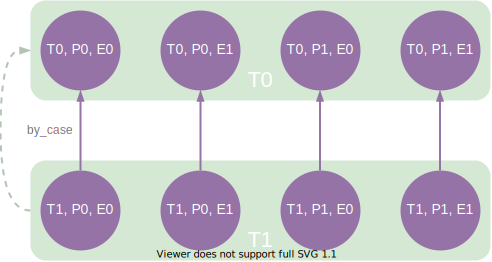
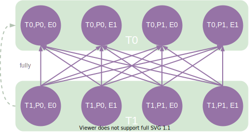
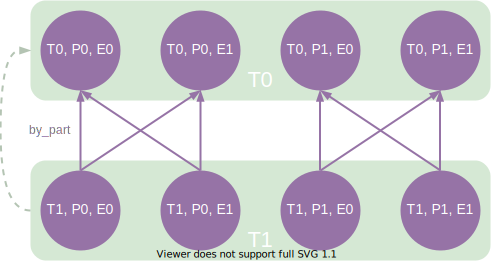
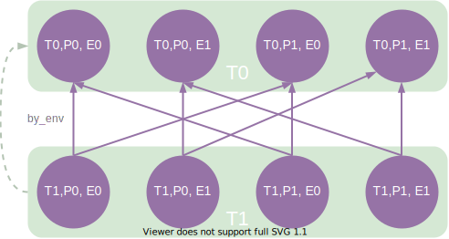
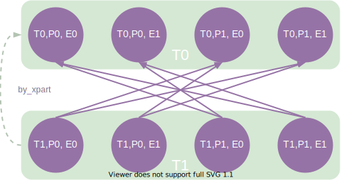
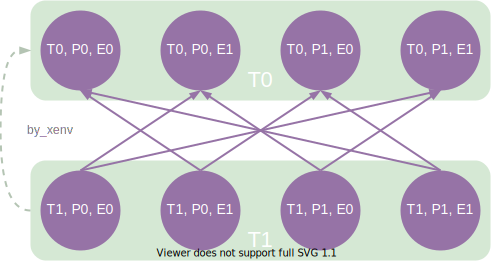
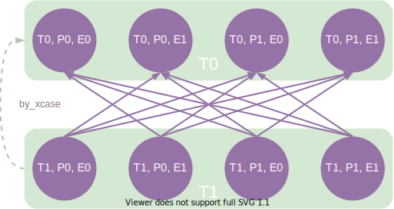
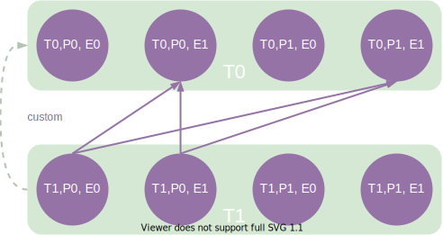
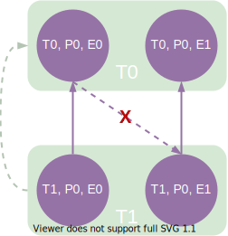

=====================================
How Test Dependencies Work In ReFrame
=====================================

Dependencies in ReFrame are defined at the test level using the :func:`depends_on` function, but are projected to the `test cases <pipeline.html>`__ space.
We will see the rules of that projection in a while.
The dependency graph construction and the subsequent dependency analysis happen also at the level of the test cases.

Let's assume that test :class:`T1` depends on :class:`T0`.
This can be expressed inside :class:`T1` using the :func:`depends_on` method:

.. code:: python

   @rfm.simple_test
   class T0(rfm.RegressionTest):
       ...
       valid_systems = ['P0', 'P1']
       valid_prog_environs = ['E0', 'E1']

   @rfm.simple_test
   class T1(rfm.RegressionTest):
       ...
       valid_systems = ['P0', 'P1']
       valid_prog_environs = ['E0', 'E1']

       @run_after('init')
       def setup_deps(self):
           self.depends_on('T0')

Conceptually, this dependency can be viewed at the test level as follows:

  :sub:`Simple test dependency presented conceptually.`

For most of the cases, this is sufficient to reason about test dependencies.
In reality, as mentioned above, dependencies are handled at the level of test cases.
If not specified differently, test cases on different partitions or programming environments are independent.
This is the default behavior of the :func:`depends_on` function.
The following image shows the actual test case dependencies of the two tests above:

  :sub:`Test case dependencies partitioned by case (default).`

This means that test cases of :class:`T1` may start executing before all test cases of :class:`T0` have finished.
You can impose a stricter dependency between tests, such that :class:`T1` does not start execution unless all test cases of :class:`T0` have finished.
You can achieve this as follows:

.. code:: python

   import reframe.utility.udeps as udeps

   @rfm.simple_test
   class T1(rfm.RegressionTest):
       ...
       @run_after('init')
       def setup_deps(self):
           self.depends_on('T0', how=udeps.fully)

This will create a fully connected graph between the test cases of the two tests as it is shown in the following figure:

  :sub:`Fully dependent test cases.`

There are more options that the test case subgraph can be split than the two extremes we presented so far.
The following figures show the different splittings.

Split by partition
------------------

The test cases are split in fully connected components per partition.
Test cases from different partitions are independent.

  :sub:`Test case dependencies partitioned by partition.`

Split by environment
--------------------

The test cases are split in fully connected components per environment.
Test cases from different environments are independent.

  :sub:`Test case dependencies partitioned by environment.`

Split by exclusive partition
----------------------------

The test cases are split in fully connected components that do not contain the same partition.
Test cases from the same partition are independent.

  :sub:`Test case dependencies partitioned by exclusive partition.`

Split by exclusive environment
------------------------------

The test cases are split in fully connected components that do not contain the same environment.
Test cases from the same environment are independent.

  :sub:`Test case dependencies partitioned by exclusive environment.`

Split by exclusive case
-----------------------

The test cases are split in fully connected components that do not contain the same environment and the same partition.
Test cases from the same environment and the same partition are independent.

  :sub:`Test case dependencies partitioned by exclusive case.`

Custom splits
-------------

Users may define custom dependency patterns by supplying their own ``how`` function.
The ``how`` argument accepts a :py:class:`callable` which takes as arguments the source and destination of a possible edge in the test case subgraph.
If the callable returns :class:`True`, then ReFrame will place an edge (i.e., a dependency) otherwise not.
The following code will create dependencies only if the source partition is ``P0`` and the destination environment is ``E1``:

.. code:: python

   def myway(src, dst):
       psrc, esrc = src
       pdst, edst = dst
       return psrc == 'P0' and edst == 'E1'

   @rfm.simple_test
   class T1(rfm.RegressionTest):
       ...
       @run_after('init')
       def setup_deps(self):
           self.depends_on('T0', how=myway)

This corresponds to the following test case dependency subgraph:

  :sub:`Custom test case dependencies.`

Notice how all the rest test cases are completely independent.

Cyclic dependencies
-------------------

Obviously, cyclic dependencies between test cases are not allowed.
Cyclic dependencies between tests are not allowed either, even if the test case dependency graph is acyclic.
For example, the following dependency set up is invalid:

The test case dependencies here, clearly, do not form a cycle, but the edge from ``(T0, P0, E0)`` to ``(T1, P0, E1)`` introduces a dependency from ``T0`` to ``T1`` forming a cycle at the test level.
If you end up requiring such type of dependency in your tests, you might have to reconsider how you organize your tests.

.. note::
   Technically, the framework could easily support such types of dependencies, but ReFrame's output would have to change substantially.

Resolving dependencies
----------------------

As shown in the :doc:`tutorial_deps`, test dependencies would be of limited usage if you were not able to use the results or information of the target tests.
Let's reiterate over the :func:`set_executable` function of the :class:`OSULatencyTest` that we presented previously:

.. literalinclude:: ../tutorials/deps/osu_benchmarks.py
   :pyobject: OSULatencyTest.set_executable

The ``@require_deps`` decorator does some magic -- we will unravel this shortly -- with the function arguments of the :func:`set_executable` function and binds them to the target test dependencies by their name.
However, as discussed in this section, dependencies are defined at test case level, so the ``OSUBuildTest`` function argument is bound to a special function that allows you to retrieve an actual test case of the target dependency.
This is why you need to "call" ``OSUBuildTest`` in order to retrieve the desired test case.
When no arguments are passed, this will retrieve the test case corresponding to the current partition and the current programming environment.
We could always retrieve the ``PrgEnv-gnu`` case by writing ``OSUBuildTest('PrgEnv-gnu')``.
If a dependency cannot be resolved, because it is invalid, a runtime error will be thrown with an appropriate message.

The low-level method for retrieving a dependency is the :func:`getdep() <reframe.core.pipeline.RegressionTest.getdep>` method of the :class:`RegressionTest`.
In fact, you can rewrite :func:`set_executable` function as follows:

.. code:: python

   @run_after('setup')
   def set_executable(self):
       target = self.getdep('OSUBuildTest')
       self.executable = os.path.join(
           target.stagedir,
           'osu-micro-benchmarks-5.6.2', 'mpi', 'pt2pt', 'osu_latency'
       )
       self.executable_opts = ['-x', '100', '-i', '1000']

Now it's easier to understand what the ``@require_deps`` decorator does behind the scenes.
It binds the function arguments to a partial realization of the :func:`getdep` function and attaches the decorated function as an after-setup hook.
In fact, any ``@require_deps``-decorated function will be invoked before any other after-setup hook.

.. _cleaning-up-stage-files:

Cleaning up stage files
-----------------------

In principle, the output of a test might be needed by its dependent tests.
As a result, the stage directory of the test will only be cleaned up after all of its *immediate* dependent tests have finished successfully.
If any of its children has failed, the cleanup phase will be skipped, such that all the test's files will remain in the stage directory.
This allows users to reproduce manually the error of a failed test with dependencies, since all the needed resources of the failing test are left in their original location.
