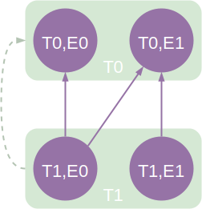
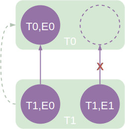

=====================================
How Test Dependencies Work In ReFrame
=====================================

Dependencies in ReFrame are defined at the test level using the :func:`depends_on` function, but are projected to the `test cases <pipeline.html>`__ space.
We will see the rules of that projection in a while.
The dependency graph construction and the subsequent dependency analysis happen also at the level of the test cases.

Let's assume that test :class:`T1` depends in :class:`T0`.
This can be expressed inside :class:`T1` using the :func:`depends_on` method:

.. code:: python

   @rfm.simple_test
   class T1(rfm.RegressionTest):
       def __init__(self):
           ...
           self.depends_on('T0')

Conceptually, this dependency can be viewed at the test level as follows:

.. figure:: _static/img/test-deps.svg
  :align: center
  :alt: Simple test dependency presented conceptually.

For most of the cases, this is sufficient to reason about test dependencies.
In reality, as mentioned above, dependencies are handled at the level of test cases.
Test cases on different partitions are always independent.
If not specified differently, test cases using programming environments are also independent.
This is the default behavior of the :func:`depends_on` function.
The following image shows the actual test case dependencies assuming that both tests support the ``E0`` and ``E1`` programming environments (for simplicity, we have omitted the partitions, since tests are always independent in that dimension):

.. figure:: _static/img/test-deps-by-env.svg
  :align: center
  :alt: Test case dependencies by environment (default).

This means that test cases of :class:`T1` may start executing before all test cases of :class:`T0` have finished.
You can impose a stricter dependency between tests, such that :class:`T1` does not start execution unless all test cases of :class:`T0` have finished.
You can achieve this as follows:

.. code:: python

   @rfm.simple_test
   class T1(rfm.RegressionTest):
       def __init__(self):
           ...
           self.depends_on('T0', how=rfm.DEPEND_FULLY)

This will create the following test case graph:

.. figure:: _static/img/test-deps-fully.svg
  :align: center
  :alt: Fully dependent test cases.

You may also create arbitrary dependencies between the test cases of different tests, like in the following example, where the dependencies cannot be represented in any of the other two ways:

These dependencies can be achieved as follows:

.. code:: python

   @rfm.simple_test
   class T1(rfm.RegressionTest):
       def __init__(self):
           ...
           self.depends_on('T0', how=rfm.DEPEND_EXACT,
                           subdeps={'E0': ['E0', 'E1'], 'E1': ['E1']})

The ``subdeps`` argument defines the sub-dependencies between the test cases of :class:`T1` and :class:`T0` using an adjacency list representation.

Cyclic dependencies
-------------------

Obviously, cyclic dependencies between test cases are not allowed.
Cyclic dependencies between tests are not allowed either, even if the test case dependency graph is acyclic.
For example, the following dependency set up is invalid:

.. figure:: _static/img/test-deps-cycle.svg
  :align: center
  :alt: Any cyclic dependencies between tests are not allowed, even if the underlying test case dependencies are not forming a cycle.

The test case dependencies here, clearly, do not form a cycle, but the edge from ``(T0, E0)`` to ``(T1, E1)`` introduces a dependency from ``T0`` to ``T1`` forming a cycle at the test level.
The reason we impose this restriction is that we wanted to keep the original processing of tests by ReFrame, where all the test cases of a test are processed before moving to the next one.
Supporting this type of dependencies would require to change substantially ReFrame's output.

Dangling dependencies
---------------------

In our discussion so far, :class:`T0` and :class:`T1` had the same valid programming environments.
What happens if they do not?
Assume, for example, that :class:`T0` and :class:`T1` are defined as follows:

.. code:: python

   import reframe as rfm
   import reframe.utility.sanity as sn

   @rfm.simple_test
   class T0(rfm.RegressionTest):
       def __init__(self):
           self.valid_systems = ['P0']
           self.valid_prog_environs = ['E0']
           ...

   @rfm.simple_test
   class T1(rfm.RegressionTest):
       def __init__(self):
           self.valid_systems = ['P0']
           self.valid_prog_environs = ['E0', 'E1']
           self.depends_on('T0')
           ...

As discussed previously, :func:`depends_on` will create one-to-one dependencies between the different programming environment test cases.
So in this case it will try to create an edge from ``(T1, E1)`` to ``(T0, E1)`` as shown below:

This edge cannot be resolved since the target test case does not exist.
ReFrame will complain and issue an error while trying to build the test dependency graph.
The remedy to this is to use either ``DEPEND_FULLY`` or pass the exact dependencies with ``DEPEND_EXACT`` to :func:`depends_on`.

If :class:`T0` and :class:`T1` had their :attr:`valid_prog_environs` swapped, such that :class:`T0` supported ``E0`` and ``E1`` and :class:`T1` supported only ``E0``,
the default :func:`depends_on` mode would work fine.
The ``(T0, E1)`` test case would simply have no dependent test cases.

Resolving dependencies
----------------------

As shown in the :doc:`tutorial_deps`, test dependencies would be of limited usage if you were not able to use the results or information of the target tests.
Let's reiterate over the :func:`set_executable` function of the :class:`OSULatencyTest` that we presented previously:

.. literalinclude:: ../tutorial/advanced/osu/osu_benchmarks.py
   :lines: 32-38

The ``@require_deps`` decorator does some magic -- we will unravel this shortly -- with the function arguments of the :func:`set_executable` function and binds them to the target test dependencies by their name.
However, as discussed in this section, dependencies are defined at test case level, so the ``OSUBuildTest`` function argument is bound to a special function that allows you to retrieve an actual test case of the target dependency.
This is why you need to "call" ``OSUBuildTest`` in order to retrieve the desired test case.
When no arguments are passed, this will retrieve the test case corresponding to the current partition and the current programming environment.
We could always retrieve the ``PrgEnv-gnu`` case by writing ``OSUBuildTest('PrgEnv-gnu')``.
If a dependency cannot be resolved, because it is invalid, a runtime error will be thrown with an appropriate message.

The low-level method for retrieving a dependency is the :func:`getdep() <reframe.core.pipeline.RegressionTest.getdep>` method of the :class:`RegressionTest`.
In fact, you can rewrite :func:`set_executable` function as follows:

.. code:: python

   @rfm.run_after('setup')
   def set_executable(self):
       target = self.getdep('OSUBuildTest')
       self.executable = os.path.join(
           target.stagedir,
           'osu-micro-benchmarks-5.6.2', 'mpi', 'pt2pt', 'osu_latency'
       )
       self.executable_opts = ['-x', '100', '-i', '1000']

Now it's easier to understand what the ``@require_deps`` decorator does behind the scenes.
It binds the function arguments to a partial realization of the :func:`getdep` function and attaches the decorated function as an after-setup hook.
In fact, any ``@require_deps``-decorated function will be invoked before any other after-setup hook.

Cleaning up stage files
-----------------------

In principle, the output of a test might be needed by its dependent tests.
As a result, the stage directory of the test will only be cleaned up after all of its *immediate* dependent tests have finished successfully.
If any of its children has failed, the cleanup phase will be skipped, such that all the test's files will remain in the stage directory.
This allows users to reproduce manually the error of a failed test with dependencies, since all the needed resources of the failing test are left in their original location.
