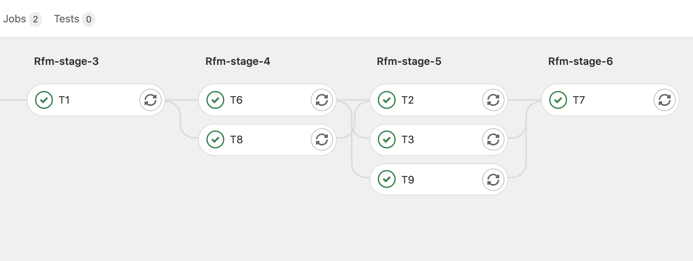

.. currentmodule:: reframe.core.pipeline.RegressionTest

===============
ReFrame How Tos
===============

This is a collection of "How To" articles on specific ReFrame usage topics.

.. contents:: Table of Contents
   :local:
   :depth: 3

Working with build systems
==========================

ReFrame supports building the test's code in many scenarios.
We have seen in the :doc:`tutorial` how to build the test's code if it is just a single file.
However, ReFrame knows how to interact with Make, CMake and Autotools.
Additionally, it supports integration with the `EasyBuild <https://easybuild.io/>`__ build automation tool as well as the `Spack <https://spack.io/>`__ package manager.
Finally, if none of the above build systems fits, users are allowed to use their custom build scripts.

Using Make, CMake or Autotools
------------------------------

We have seen already in the `tutorial <tutorial.html#compiling-the-test-code>`__ how to build a test with a single source file.
ReFrame can also build test code using common build systems, such as `Make <https://www.gnu.org/software/make/>`__, `CMake <https://cmake.org/>`__ or `Autotools <https://www.gnu.org/software/automake/>`__.
The build system to be used is selected by the :attr:`build_system` test attribute.
This is a "magic" attribute where you assign it a string and ReFrame will create the appropriate `build system object <regression_test_api.html#build-systems>`__.
Each build system can define its own properties, but some build systems have a common set of properties that are interpreted accordingly.
Let's see a version of the STREAM benchmark that uses ``make``:

.. literalinclude:: ../examples/tutorial/stream/stream_make.py
   :caption:
   :lines: 5-

Build system properties are set in a pre-compile hook.
In this case we set the CFLAGS and also pass Makefile target to the Make build system's :attr:`~reframe.core.buildsystems.Make.options`.

.. warning::

   You can't set build system options inside the test class body.
   The test must be instantiated in order for the conversion from string to build system to happen.
   The following will yield therefore an error:

   .. code-block:: python

        class build_stream(rfm.CompileOnlyRegressionTest):
            build_system = 'Make'
            build_system.flags = ['-O3']

Based on the selected build system, ReFrame will generate the analogous build script.

.. code-block:: bash

    reframe -C config/baseline_environs.py -c stream/stream_make.py -p gnu -r
    cat output/tutorialsys/default/gnu/build_stream_40af02af/rfm_build.sh

.. code-block:: bash

    #!/bin/bash

    _onerror()
    {
        exitcode=$?
        echo "-reframe: command \`$BASH_COMMAND' failed (exit code: $exitcode)"
        exit $exitcode
    }

    trap _onerror ERR

    make -j 1 CC="gcc" CXX="g++" FC="ftn" NVCC="nvcc" CFLAGS="-O3 -fopenmp" stream_c.exe

Note that ReFrame passes sets several variables in the ``make`` command apart from those explicitly requested by the test, such as the ``CFLAGS``.
The rest of the flags are implicitly requested by the selected test environment, in this case ``gnu``, and ReFrame is trying its best to make sure that the environment's definition will be respected.
In the case of Autotools and CMake these variables will be set during the "configure" step.
Users can still override this behaviour and request explicitly to ignore any flags coming from the environment by setting the build system's :attr:`~reframe.core.buildsystems.BuildSystem.flags_from_environ` to :obj:`False`.
In this case, only the flags requested by the test will be emitted.

The Autotools and CMake build systems are quite similar.
For passing ``configure`` options, the :attr:`~reframe.core.buildsystems.ConfigureBasedBuildSystem.config_opts` build system attribute should be set, whereas for ``make`` options the :attr:`~reframe.core.buildsystems.ConfigureBasedBuildSystem.make_opts` should be used.
The `OSU benchmarks <tutorial.html#multi-node-tests>`__ in the main tutorial use the Autotools build system.

Finally, in all three build systems, the :attr:`~reframe.core.buildsystems.Make.max_concurrency` can be set to control the number of parallel make jobs.

Integrating with EasyBuild
--------------------------

.. versionadded:: 3.5.0

ReFrame integrates with the `EasyBuild <https://easybuild.io/>`__ build automation framework, which allows you to use EasyBuild for building the source code of your test.

Let's consider a simple ReFrame test that installs ``bzip2-1.0.6`` given the easyconfig `bzip2-1.0.6.eb <https://github.com/eth-cscs/production/blob/master/easybuild/easyconfigs/b/bzip2/bzip2-1.0.6.eb>`__ and checks that the installed version is correct.
The following code block shows the check, highlighting the lines specific to this tutorial:

.. literalinclude:: ../examples/tutorial/easybuild/eb_test.py
   :caption:
   :start-at: import reframe

The test looks pretty standard except that we use the ``EasyBuild`` build system and set some build system-specific attributes.
More specifically, we set the :attr:`~reframe.core.buildsystems.EasyBuild.easyconfigs` attribute to the list of packages we want to build and install.
We also pass the ``-f`` option to EasyBuild's ``eb`` command through the :attr:`~reframe.core.buildsystems.EasyBuild.options` attribute, so that we force the build even if the corresponding environment module already exists.

For running this test, we need the following Docker image:

.. code-block:: bash

   docker run -h myhost --mount type=bind,source=$(pwd)/examples/,target=/home/user/reframe-examples -it <IMAGE>  /bin/bash -l

EasyBuild requires a `modules system <#working-with-environment-modules>`__ to run, so we need a configuration file that sets the modules system of the current system:

.. literalinclude:: ../examples/tutorial/config/baseline_modules.py
   :caption:
   :lines: 5-

We talk about modules system and how ReFrame interacts with them in :ref:`working-with-environment-modules`.
For the moment, we will only use them for running the EasyBuild example:

.. code-block:: bash

   reframe -C config/baseline_modules.py -c easybuild/eb_test.py -r

ReFrame generates the following commands to build and install the easyconfig:

.. code-block:: bash

   cat output/tutorialsys/default/builtin/BZip2EBCheck/rfm_build.sh

.. code-block:: bash

   ...
   export EASYBUILD_BUILDPATH=${stagedir}/easybuild/build
   export EASYBUILD_INSTALLPATH=${stagedir}/easybuild
   export EASYBUILD_PREFIX=${stagedir}/easybuild
   export EASYBUILD_SOURCEPATH=${stagedir}/easybuild
   eb bzip2-1.0.6.eb -f

All the files generated by EasyBuild (sources, temporary files, installed software and the corresponding modules) are kept under the test's stage directory, thus the relevant EasyBuild environment variables are set.

.. tip::

   Users may set the EasyBuild prefix to a different location by setting the :attr:`~reframe.core.buildsystems.EasyBuild.prefix` attribute of the build system.
   This allows you to have the built software installed upon successful completion of the build phase, but if the test fails in a later stage (sanity, performance), the installed software will not be cleaned up automatically.

.. note::

   ReFrame assumes that the ``eb`` executable is available on the system where the compilation is run (typically the local host where ReFrame is executed).

To run the freshly built package, the generated environment modules need to be loaded first.
These can be accessed through the :attr:`~reframe.core.buildsystems.EasyBuild.generated_modules` attribute *after* EasyBuild completes the installation.
For this reason, we set the test's :attr:`modules` in a pre-run hook.
This generated final run script is the following:

.. code-block:: bash

   cat output/tutorialsys/default/builtin/BZip2EBCheck/rfm_job.sh

.. code-block:: bash

   module use ${stagedir}/easybuild/modules/all
   module load bzip/1.0.6
   bzip2 --help

Packaging the installation
^^^^^^^^^^^^^^^^^^^^^^^^^^

The EasyBuild build system offers a way of packaging the installation via EasyBuild's packaging support.
To use this feature, `the FPM package manager <https://fpm.readthedocs.io/en/latest/>`__ must be available.
By setting the dictionary :attr:`~reframe.core.buildsystems.Easybuild.package_opts` in the test, ReFrame will pass ``--package-{key}={val}`` to the EasyBuild invocation.
For instance, the following can be set to package the installations as an rpm file:

.. code-block:: python

   self.keep_files = ['easybuild/packages']
   self.build_system.package_opts = {
       'type': 'rpm',
   }

The packages are generated by EasyBuild in the stage directory.
To retain them after the test succeeds, :attr:`~reframe.core.pipeline.RegressionTest.keep_files` needs to be set.

Integrating with Spack
----------------------

.. versionadded:: 3.6.1

ReFrame can also use `Spack <https://spack.io/>`__ to build a software package and test it.

The example shown here is the equivalent to the `EasyBuild <#integrating-with-easybuild>`__ one that built ``bzip2``.
Here is the test code:

.. literalinclude:: ../examples/tutorial/spack/spack_test.py
   :start-at: import reframe

When :attr:`~reframe.core.pipeline.RegressionTest.build_system` is set to ``'Spack'``, ReFrame will leverage Spack environments in order to build the test code.
By default, ReFrame will create a new Spack environment in the test's stage directory and add the requested :attr:`~reframe.core.buildsystems.Spack.specs` to it.

.. note::
   Optional spec attributes, such as ``target`` and ``os``, should be specified in :attr:`~reframe.core.buildsystems.Spack.specs` and not as install options in :attr:`~reframe.core.buildsystems.Spack.install_opts`.

You can set Spack configuration options for the new environment with the :attr:`~reframe.core.buildsystems.Spack.config_opts` attribute. These options take precedence over Spack's ``spack.yaml`` defaults.

Users may also specify an existing Spack environment by setting the :attr:`~reframe.core.buildsystems.Spack.environment` attribute.
In this case, ReFrame treats the environment as a *test resource* so it expects to find it under the test's :attr:`~reframe.core.pipeline.RegressionTest.sourcesdir`, which defaults to ``'src'``.

To run this test, use the same container as with EasyBuild:

.. code-block:: bash

   docker run -h myhost --mount type=bind,source=$(pwd)/examples/,target=/home/user/reframe-examples -it <IMAGE>  /bin/bash -l

Conversely to EasyBuild, Spack does not require a modules systems to be configured, so you could simply run the test with the ReFrame's builtin configuration:

.. code-block:: bash

   reframe -c spack/spack_test.py -r

As with every other test, ReFrame will copy the test's resources to its stage directory before building it.
ReFrame will then activate the generated environment (either the one provided by the user or the one generated by ReFrame), add the given specs using the ``spack add`` command  and, finally, install the packages in the environment.
Here is what ReFrame generates as a build script for this example:

.. code:: bash

   spack env create -d rfm_spack_env
   spack -e rfm_spack_env config add "config:install_tree:root:opt/spack"
   spack -e rfm_spack_env add bzip2@1.0.6
   spack -e rfm_spack_env install

As you might have noticed ReFrame expects that Spack is already installed on the system.
The packages specified in the environment and the tests will be installed in the test's stage directory, where the environment is copied before building.
Here is the stage directory structure:

.. code:: console

   stage/generic/default/builtin/BZip2SpackCheck/
   ├── rfm_spack_env
   │   ├── spack
   │   │   └── opt
   │   │       └── spack
   │   │           ├── bin
   │   │           └── darwin-catalina-skylake
   │   ├── spack.lock
   │   └── spack.yaml
   ├── rfm_BZip2SpackCheck_build.err
   ├── rfm_BZip2SpackCheck_build.out
   ├── rfm_BZip2SpackCheck_build.sh
   ├── rfm_BZip2SpackCheck_job.err
   ├── rfm_BZip2SpackCheck_job.out
   └── rfm_BZip2SpackCheck_job.sh

Finally, here is the generated run script that ReFrame uses to run the test, once its build has succeeded:

.. code-block:: bash

   #!/bin/bash
   spack env create -d rfm_spack_env
   eval `spack -e rfm_spack_env load --sh bzip2@1.0.6`
   bzip2 --help

From this point on, sanity and performance checking are exactly identical to any other ReFrame test.

.. tip::

   While developing a test using Spack or EasyBuild as a build system, it can be useful to run ReFrame with the :option:`--keep-stage-files` and :option:`--dont-restage` options to prevent ReFrame from removing the test's stage directory upon successful completion of the test.
   For this particular type of test, these options will avoid having to rebuild the required package dependencies every time the test is retried.

Custom builds
-------------

There are cases where you need to test a code that does not use of the supported build system of ReFrame.
In this case, you could set the :attr:`build_system` to ``'CustomBuild'`` and supply the exact commands to build the code:

.. code-block:: python

    @rfm.simple_test
    class CustomBuildCheck(rfm.RegressionTest):
        build_system = 'CustomBuild'

        @run_before('compile')
        def setup_build(self):
            self.build_system.commands = [
                './myconfigure.sh',
                './build.sh'
            ]

.. warning::

    You should use  this build system with caution, because environment management, reproducibility and any potential side effects are all controlled by the custom build system.

.. _working-with-environment-modules:

Working with environment modules
================================

A common practice in HPC environments is to provide the software stack through `environment modules <https://modules.readthedocs.io/>`__.
An environment module is essentially a set of environment variables that are sourced in the user's current shell for making available the requested software stack components.

ReFrame allows users to associate an environment modules system to a system in the configuration file.
Tests may then specify the environment modules needed for them to run.

We have seen environment modules in practice with the EasyBuild integration.
Systems that use environment modules must set the :attr:`~config.systems.modules_system` system configuration parameter to the modules system that the system uses.

.. literalinclude:: ../examples/tutorial/config/baseline_modules.py
   :lines: 5-

The tests that require environment modules must simply list the required modules in their :attr:`modules` variable.
ReFrame will then emit the correct commands to load the modules based on the configured modules system.
For older modules systems, such as Tmod 3.2, that do not support automatic conflict resolution, ReFrame will also emit commands to unload the conflicted modules before loading the requested ones.

Test environments can also use modules by settings their :attr:`~config.environments.modules` parameter.

.. code-block:: python

    'environments': [
        ...
        {
            'name': 'gnu',
            'cc': 'gcc',
            'cxx': 'g++',
            'modules': ['gnu'],
            'features': ['openmp'],
            'extras': {'omp_flag': '-fopenmp'}
        }
        ...
    ]

.. _generate-ci-pipeline:

Integrating into a CI pipeline
==============================

.. versionadded:: 3.4.1

Instead of running your tests, you can ask ReFrame to generate a `child pipeline <https://docs.gitlab.com/ee/ci/parent_child_pipelines.html>`__ specification for the Gitlab CI.
This will spawn a CI job for each ReFrame test respecting test dependencies.
You could run your tests in a single job of your Gitlab pipeline, but you would not take advantage of the parallelism across different CI jobs.
Having a separate CI job per test makes it also easier to spot the failing tests.

As soon as you have set up a `runner <https://docs.gitlab.com/ee/ci/quick_start/>`__ for your repository, it is fairly straightforward to use ReFrame to automatically generate the necessary CI steps.
The following is an example of ``.gitlab-ci.yml`` file that does exactly that:

.. code-block:: yaml

   stages:
     - generate
     - test

   generate-pipeline:
     stage: generate
     script:
       - reframe --ci-generate=${CI_PROJECT_DIR}/pipeline.yml -c ${CI_PROJECT_DIR}/path/to/tests
     artifacts:
       paths:
         - ${CI_PROJECT_DIR}/pipeline.yml

   test-jobs:
     stage: test
     trigger:
       include:
         - artifact: pipeline.yml
           job: generate-pipeline
       strategy: depend

It defines two stages.
The first one, called ``generate``, will call ReFrame to generate the pipeline specification for the desired tests.
All the usual `test selection options <manpage.html#test-filtering>`__ can be used to select specific tests.
ReFrame will process them as usual, but instead of running the selected tests, it will generate the correct steps for running each test individually as a Gitlab job in a child pipeline.
The generated ReFrame command that will run each individual test reuses the :option:`-C`, :option:`-R`, :option:`-v` and :option:`--mode` options passed to the initial invocation of ReFrame that was used to generate the pipeline.
Users can define CI-specific execution modes in their configuration in order to pass arbitrary options to the ReFrame invocation in the child pipeline.

Finally, we pass the generated CI pipeline file to second phase as an artifact and we are done!
If ``image`` keyword is defined in ``.gitlab-ci.yml``, the emitted pipeline will use the same image as the one defined in the parent pipeline.
Besides, each job in the generated pipeline will output a separate junit report which can be used to create GitLab badges.

The following figure shows one part of the automatically generated pipeline for the test graph depicted `above <#fig-deps-complex>`__.

   :sub:`Snapshot of a Gitlab pipeline generated automatically by ReFrame.`

.. note::

   The ReFrame executable must be available in the Gitlab runner that will run the CI jobs.

Using the Flux framework scheduler
==================================

This is a how to that will show how to use refame with `Flux
Framework <https://github.com/flux-framework/>`__. First, build the
container here from the root of reframe.

.. code:: bash

   $ docker build -f tutorials/flux/Dockerfile -t flux-reframe .

Then shell inside, optionally binding the present working directory if
you want to develop.

.. code:: bash

   $ docker run -it -v $PWD:/code flux-reframe
   $ docker run -it flux-reframe

Note that if you build the local repository, you’ll need to bootstrap
and install again, as we have over-written the bin!

.. code:: bash

   ./bootstrap.sh

And then reframe will again be in the local ``bin`` directory:

.. code:: bash

   # which reframe
   /code/bin/reframe

Then we can run ReFrame with the custom config `config.py <config.py>`__
for flux.

.. code:: bash

   # What tests are under tutorials/flux?
   $ cd tutorials/flux
   $ reframe -c . -C settings.py -l

.. code:: console

   [ReFrame Setup]
     version:           4.0.0-dev.1
     command:           '/code/bin/reframe -c tutorials/flux -C tutorials/flux/settings.py -l'
     launched by:       root@b1f6650222bc
     working directory: '/code'
     settings file:     'tutorials/flux/settings.py'
     check search path: '/code/tutorials/flux'
     stage directory:   '/code/stage'
     output directory:  '/code/output'

   [List of matched checks]
   - EchoRandTest /66b93401
   Found 1 check(s)

   Log file(s) saved in '/tmp/rfm-ilqg7fqg.log'

This also works

.. code:: bash

   $ reframe -c tutorials/flux -C tutorials/flux/settings.py -l

And then to run tests, just replace ``-l`` (for list) with ``-r`` or
``--run`` (for run):

.. code:: bash

   $ reframe -c tutorials/flux -C tutorials/flux/settings.py --run

.. code:: console

   root@b1f6650222bc:/code# reframe -c tutorials/flux -C tutorials/flux/settings.py --run
   [ReFrame Setup]
     version:           4.0.0-dev.1
     command:           '/code/bin/reframe -c tutorials/flux -C tutorials/flux/settings.py --run'
     launched by:       root@b1f6650222bc
     working directory: '/code'
     settings file:     'tutorials/flux/settings.py'
     check search path: '/code/tutorials/flux'
     stage directory:   '/code/stage'
     output directory:  '/code/output'

   [==========] Running 1 check(s)
   [==========] Started on Fri Sep 16 20:47:15 2022

   [----------] start processing checks
   [ RUN      ] EchoRandTest /66b93401 @generic:default+builtin
   [       OK ] (1/1) EchoRandTest /66b93401 @generic:default+builtin
   [----------] all spawned checks have finished

   [  PASSED  ] Ran 1/1 test case(s) from 1 check(s) (0 failure(s), 0 skipped)
   [==========] Finished on Fri Sep 16 20:47:15 2022
   Run report saved in '/root/.reframe/reports/run-report.json'
   Log file(s) saved in '/tmp/rfm-0avso9nb.log'

For advanced users or developers, here is how to run tests within the container:

Testing
-------

.. code:: console

    ./test_reframe.py --rfm-user-config=tutorials/flux/settings.py unittests/test_schedulers.py -xs

Generating tests programmatically
=================================

You can use ReFrame to generate tests programmatically using the special :func:`~reframe.core.meta.make_test` function.
This function creates a new test type as if you have typed it manually using the :keyword:`class` keyword.
You can create arbitrarily complex tests that use variables, parameters, fixtures and pipeline hooks.

In this tutorial, we will use :func:`~reframe.core.meta.make_test` to build a simple domain-specific syntax for generating variants of STREAM benchmarks.
Our baseline STREAM test is the one presented in the :doc:`tutorial` that uses a build fixture:

.. literalinclude:: ../examples/tutorial/stream/stream_fixtures.py
   :caption:
   :lines: 5-

For our example, we would like to create a simpler syntax for generating multiple different :class:`stream_test` versions that could run all at once.
Here is an example specification file for those tests:

.. literalinclude:: ../examples/tutorial/stream/stream_config.yaml
   :caption:
   :lines: 5-

The :attr:`thread_scaling` configuration parameter for the last workflow will create a parameterised version of the test using different number of threads.
In total, we expect six :class:`stream_test` versions to be generated by this configuration.

The process for generating the actual tests from this spec file comprises three steps and everything happens in a somewhat unconventional, though valid, ReFrame test file:

1. We load the test configuration from a spec file that is passed through the ``STREAM_SPEC_FILE`` environment variable.
2. Based on the loaded test specs we generate the actual tests using the :func:`~reframe.core.meta.make_test` function.
3. We register the generated tests with the framework by applying manually the :func:`@simple_test <reframe.core.decorators.simple_test>` decorator.

The whole code for generating the tests is the following and is only a few lines.
Let's walk through it.

.. literalinclude:: ../examples/tutorial/stream/stream_workflows.py
   :caption:
   :lines: 5-

The :func:`load_specs()` function simply loads the test specs from the YAML test spec file and does some simple sanity checking.

The :func:`generate_tests()` function consumes the test specs and generates a test for each entry.
Each test inherits from the base :class:`stream_test` and redefines its :attr:`stream_binaries` fixture so that it is instantiated with the set of variables specified in the test spec.
Remember that all the STREAM test variables in the YAML file refer to its build phase and thus its build fixture.
We also treat specially the :attr:`thread_scaling` spec parameter.
In this case, we add a :attr:`num_threads` parameter to the test and add a post-init hook that sets the test's :attr:`~reframe.core.pipeline.RegressionTest.num_cpus_per_task`.

Finally, we register the generated tests using the :func:`rfm.simple_test` decorator directly;
remember that :func:`~reframe.core.meta.make_test` returns a class.

The equivalent of our test generation for the third spec is exactly the following:

.. code-block:: python

    @rfm.simple_test
    class stream_test_2(stream_test):
        stream_binary = fixture(build_stream, scope='environment',
                                variables={'elem_type': 'double',
                                           'array_size': 16777216,
                                           'num_iters': 10})
        nthr = parameter([1, 2, 4, 8])

        @run_after('init')
        def _set_num_threads(self):
            self.num_threads = self.nthr

And here is the listing of generated tests:

.. code-block:: bash

   STREAM_SPEC_FILE=stream_config.yaml reframe -C config/baseline_environs.py -c stream/stream_workflows.py -l

.. code-block:: console

    [List of matched checks]
    - stream_test_2 %nthr=8 %stream_binary.elem_type=double %stream_binary.array_size=16777216 %stream_binary.num_iters=10 /04f5cf62
        ^build_stream %elem_type=double %array_size=16777216 %num_iters=10 ~tutorialsys:default+gnu 'stream_binary /74d12df7
        ^build_stream %elem_type=double %array_size=16777216 %num_iters=10 ~tutorialsys:default+clang 'stream_binary /f3a963e3
    - stream_test_2 %nthr=4 %stream_binary.elem_type=double %stream_binary.array_size=16777216 %stream_binary.num_iters=10 /1c09d755
        ^build_stream %elem_type=double %array_size=16777216 %num_iters=10 ~tutorialsys:default+gnu 'stream_binary /74d12df7
        ^build_stream %elem_type=double %array_size=16777216 %num_iters=10 ~tutorialsys:default+clang 'stream_binary /f3a963e3
    - stream_test_2 %nthr=2 %stream_binary.elem_type=double %stream_binary.array_size=16777216 %stream_binary.num_iters=10 /acb6dc4d
        ^build_stream %elem_type=double %array_size=16777216 %num_iters=10 ~tutorialsys:default+gnu 'stream_binary /74d12df7
        ^build_stream %elem_type=double %array_size=16777216 %num_iters=10 ~tutorialsys:default+clang 'stream_binary /f3a963e3
    - stream_test_2 %nthr=1 %stream_binary.elem_type=double %stream_binary.array_size=16777216 %stream_binary.num_iters=10 /e6eebc18
        ^build_stream %elem_type=double %array_size=16777216 %num_iters=10 ~tutorialsys:default+gnu 'stream_binary /74d12df7
        ^build_stream %elem_type=double %array_size=16777216 %num_iters=10 ~tutorialsys:default+clang 'stream_binary /f3a963e3
    - stream_test_1 %stream_binary.elem_type=double %stream_binary.array_size=1048576 %stream_binary.num_iters=100 /514be749
        ^build_stream %elem_type=double %array_size=1048576 %num_iters=100 ~tutorialsys:default+gnu 'stream_binary /b841f3c9
        ^build_stream %elem_type=double %array_size=1048576 %num_iters=100 ~tutorialsys:default+clang 'stream_binary /ade049de
    - stream_test_0 %stream_binary.elem_type=float %stream_binary.array_size=16777216 %stream_binary.num_iters=10 /c0c0f2bf
        ^build_stream %elem_type=float %array_size=16777216 %num_iters=10 ~tutorialsys:default+gnu 'stream_binary /6767ce8c
        ^build_stream %elem_type=float %array_size=16777216 %num_iters=10 ~tutorialsys:default+clang 'stream_binary /246007ff
    Found 6 check(s)

.. note::

   The path passed to ``STREAM_SPEC_FILE`` is relative to the test directory.
   Since version 4.2, ReFrame changes to the test directory before loading a test file.
   In prior versions you have to specify the path relative to the current working directory.
