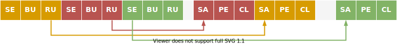

==========================
How ReFrame Executes Tests
==========================

A ReFrame test will be normally tried for different programming environments and different partitions within the same ReFrame run.
These can be defined in the test's class body, in a post-init hook or in its :func:`__init__` method, but it is not this original test object that is scheduled for execution.
The following figure explains in more detail the process:

.. figure:: _static/img/reframe-test-cases.svg
  :align: center
  :alt: How ReFrame loads and schedules tests for execution.

  :sub:`How ReFrame loads and schedules tests for execution.`

When ReFrame loads a test from the disk it unconditionally constructs it executing its :func:`__init__` method.
The practical implication of this is that your test will be instantiated even if it will not run on the current system.
After all the tests are loaded, they are filtered based on the current system and any other criteria (such as programming environment, test attributes etc.) specified by the user (see `Test Filtering <manpage.html#test-filtering>`__ for more details).
After the tests are filtered, ReFrame creates the actual `test cases` to be run. A test case is essentially a tuple consisting of the test, the system partition and the programming environment to try.
The test that goes into a test case is essentially a `clone` of the original test that was instantiated upon loading.
This ensures that the test case's state is not shared and may not be reused in any case.
Finally, the generated test cases are passed to a `runner` that is responsible for scheduling them for execution based on the selected execution policy.

The Regression Test Pipeline
----------------------------

Each ReFrame test case goes through a pipeline with clearly defined stages.
ReFrame tests can customize their operation as they execute by attaching hooks to the pipeline stages.
The following figure shows the different pipeline stages.

.. figure:: _static/img/pipeline.svg
  :align: center
  :alt: The regression test pipeline

  :sub:`The regression test pipeline.`

All tests will go through every stage one after the other.
However, some types of tests implement some stages as no-ops, whereas the sanity or performance check phases may be skipped on demand (see :option:`--skip-sanity-check` and :option:`--skip-performance-check` options).
In the following we describe in more detail what happens in every stage.

---------------
The Setup Phase
---------------

During this phase the test will be set up for the currently selected system partition and programming environment.
The :attr:`current_partition` and :attr:`current_environ` test attributes will be set and the paths associated to this test case (stage, output and performance log directories) will be created.
A `job descriptor <regression_test_api.html#reframe.core.pipeline.RegressionTest.job>`__ will also be created for the test case containing information about the job to be submitted later in the pipeline.

-----------------
The Compile Phase
-----------------

During this phase a job script for the compilation of the test will be created and it will be submitted for execution.
The source code associated with the test is compiled using the current programming environment.
If the test is `"run-only," <regression_test_api.html#reframe.core.pipeline.RunOnlyRegressionTest>`__ this phase is a no-op.

Before building the test, all the `resources <regression_test_api.html#reframe.core.pipeline.RegressionTest.sourcesdir>`__ associated with it are copied to the test case's stage directory.
ReFrame then temporarily switches to that directory and builds the test.

-------------
The Run Phase
-------------

During this phase a job script associated with the test case will be created and it will be submitted for execution.
If the test is `"run-only," <regression_test_api.html#reframe.core.pipeline.RunOnlyRegressionTest>`__ its `resources <regression_test_api.html#reframe.core.pipeline.RegressionTest.sourcesdir>`__ will be first copied to the test case's stage directory.
ReFrame will temporarily switch to that directory and spawn the test's job from there.
This phase is executed asynchronously (either a batch job is spawned or a local process is started) and it is up to the selected `execution policy <#execution-policies>`__ to block or not until the associated job finishes.

----------------
The Sanity Phase
----------------

During this phase, the sanity of the test's output is checked.
ReFrame makes no assumption as of what a successful test is; it does not even look into its exit code.
This is entirely up to the test to define.
ReFrame provides a flexible and expressive way for specifying complex patterns and operations to be performed on the test's output in order to determine the outcome of the test.

---------------------
The Performance Phase
---------------------

During this phase, the performance metrics reported by the test (if it is performance test) are collected, logged and compared to their reference values.
The mechanism for extracting performance metrics from the test's output is the same used by the sanity checking phase for extracting patterns from the test's output.

-----------------
The Cleanup Phase
-----------------

During this final stage of the pipeline, the test's resources are cleaned up.
More specifically, if the test has finished successfully, all interesting test files (build/job scripts, build/job script output and any user-specified files) are copied to ReFrame's output directory and the stage directory of the test is deleted.

.. note::
   This phase might be deferred in case a test has dependents (see :ref:`cleaning-up-stage-files` for more details).

Execution Policies
------------------

All regression tests in ReFrame will execute the pipeline stages described above.
However, how exactly this pipeline will be executed is responsibility of the test execution policy.
There are two execution policies in ReFrame: the serial and the asynchronous execution policy.

In the serial execution policy, a new test gets into the pipeline after the previous one has exited.
As the figure below shows, this can lead to long idling times in the build and run phases, since the execution blocks until the associated test job finishes.

.. figure:: _static/img/serial-exec-policy.svg
  :align: center
  :alt: The serial execution policy.

  :sub:`The serial execution policy.`

In the asynchronous execution policy, multiple tests can be simultaneously on-the-fly.
When a test enters the build or run phase, ReFrame does not block, but continues by picking the next test case to run.
This continues until no more test cases are left for execution or until a maximum concurrency limit is reached.
At the end, ReFrame enters a busy-wait loop monitoring the spawned test cases.
As soon as test case finishes, it resumes its pipeline and runs it to completion.
The following figure shows how the asynchronous execution policy works.

  :sub:`The asynchronous execution policy.`

ReFrame tries to keep concurrency high by maintaining as many test cases as possible simultaneously active.
When the `concurrency limit <config_reference.html#.systems[].partitions[].max_jobs>`__ is reached, ReFrame will first try to free up execution slots by checking if any of the spawned jobs have finished, and it will fill that slots first before throttling execution.

ReFrame uses polling to check the status of the spawned jobs, but it does so in a dynamic way, in order to ensure both responsiveness and avoid overloading the system job scheduler with excessive polling.

ReFrame's runtime internally encapsulates each test in a task, which is scheduled for execution.
This task can be in different states and is responsible for executing the test's pipeline.
The following state diagram shows how test tasks are scheduled, as well as when the various test pipeline stages are executed.

.. figure:: _static/img/regression-task-state-machine.svg
  :align: center
  :alt: State diagram of the execution of test tasks.

  :sub:`State diagram of the execution of test tasks with annotations for the execution of the actual pipeline stages.`

There are a number of things to notice in this diagram:

- If a test encounters an exception it is marked as a failure.
  Even normal failures, such as dependency failures and sanity or performance failures are also exceptions raised explicitly by the framework during a pipeline stage.
- The pipeline stages that are executed asynchronously, namely the ``compile`` and ``run`` stages, are split in sub-stages for submitting the corresponding job and for checking or waiting its completion.
  This is why in ReFrame error messages you may see ``compile_complete``  or ``run_complete`` being reported as the failing stage.
- The execution of a test may be stalled if there are not enough execution slots available for submitting compile or run jobs on the target partition.
- Although a test is officially marked as "completed" only when its cleanup phase is executed, it is reported as success or failure as soon as it is "retired," i.e., as soon as its performance stage has passed successfully.
- For successful tests, the ``cleanup`` stage is executed *after* the test is reported as a "success," since a test may not clean up its resources until all of its immediate dependencies finish also successfully.
  If the ``cleanup`` phase fails, the test is not marked as a failure, but this condition is marked as an error.

.. versionchanged:: 3.10.0
   The ``compile`` stage is now also executed asynchronously.

.. _execution-contexts:

--------------------------------------
Where each pipeline stage is executed?
--------------------------------------

There are two executions contexts where a pipeline stage can be executed: the ReFrame execution context and the partition execution context.
The *ReFrame execution context* is where ReFrame executes.
This is always the local host.
The *partition execution context* can either be local or remote depending on how the partition is configured.
The following table show in which context each pipeline stage executes:

.. table::
   :align: center

   ============== =================
   Pipeline Stage Execution Context
   ============== =================
   *Setup*        ReFrame
   *Compile*      ReFrame if :attr:`~reframe.core.pipeline.RegressionTest.build_locally` or :attr:`~reframe.core.pipeline.RegressionTest.local` is :obj:`True`, partition otherwise.
   *Run*          ReFrame if :attr:`~reframe.core.pipeline.RegressionTest.local` is :obj:`True`, partition otherwise.
   *Sanity*       ReFrame
   *Performance*  ReFrame
   *Cleanup*      ReFrame
   ============== =================

It should be noted that even if the partition execution context is local, it is treated differently from the ReFrame execution context.
For example, a test executing in the ReFrame context will not respect the :attr:`~config.systems.partitions.max_jobs` partition configuration option, even if the partition is local.
To control the concurrency of the ReFrame execution context, users should set the :attr:`~config.systems.max_local_jobs` option instead.

.. versionchanged:: 3.10.0

   Execution contexts were formalized.

Timing the Test Pipeline
------------------------

.. versionadded:: 3.0

ReFrame keeps track of the time a test spends in every pipeline stage and reports that after each test finishes.
However, it does so from its own perspective and not from that of the scheduler backend used.
This has some practical implications:
As soon as a test enters the "run" phase, ReFrame's timer for that phase starts ticking regardless if the associated job is pending.
Similarly, the "run" phase ends as soon as ReFrame realizes it.
This will happen after the associated job has finished.
For this reason, the time spent in the pipeline's "run" phase should *not* be interpreted as the actual runtime of the test, especially if a non-local scheduler backend is used.

Finally, the execution time of the "cleanup" phase is not reported when a test finishes, since it may be deferred in case that there exist tests that depend on that one.
See :doc:`dependencies` for more information on how ReFrame treats tests with dependencies.
