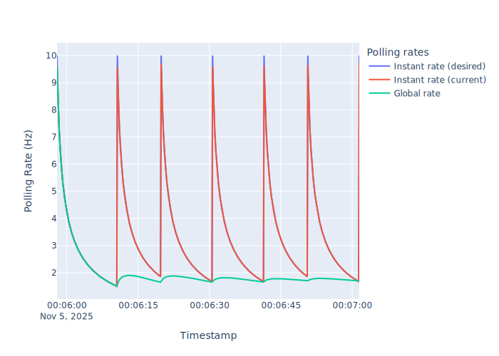
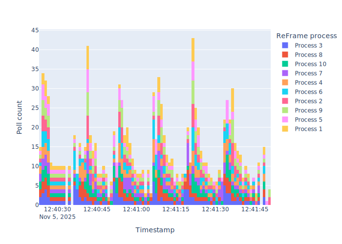
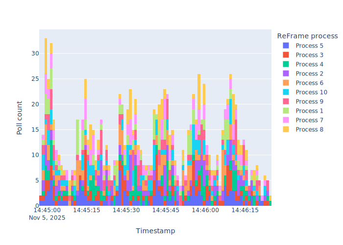

.. _poll-control:

===================================
Undestanding job polling in ReFrame
===================================

ReFrame executes the "compile" and "run" phases of the :doc:`test pipeline <pipeline>` by spawning "jobs" that will build and execute the test, respectively.
A job may be a simple local process or a batch job submitted to a job scheduler, such as Slurm.

ReFrame monitors the progress of its spawned jobs through polling.
It does so in a careful way to avoid overloading the software infrastructure of the job scheduler.
For example, it will try to poll the status of all its pending jobs at once using a single job scheduler command.

ReFrame adjusts its polling rate dynamically using an exponential decay function to ensure both high interactivity and low load.
Polling starts at a high rate and -- in absence of any job status changes -- it gradually decays to a minimum value.
After this point the polling rate remains constant.
However, whenever a job completes, ReFrame resets its polling rate to the maximum, so as to quickly reap any jobs that are finishing at a close time.

The following figure shows the instant polling rates (desired and current) as well as the global one from the beginning of the run loop.
The workload is a series of 6 tests, where the i-th test sleeps for ``10*i`` seconds.

    :sub:`Instant and global polling rates of ReFrame as it executes a workload of six tests that sleep different amount of time. The default polling settings are used (poll_rate_max=10, poll_rate_min=0.1, poll_rate_decay=0.1)`

Note how ReFrame resets the instant polling rate whenever a test job finishes.

Users can control the maximum and minimum instant polling rates as well as the polling rate decay through either :ref:`environment variables <polling_envvars>` or :ref:`configuration parameters <polling_config>`.

Polling randomization
---------------------

If multiple ReFrame processes execute the same workload at the same time, then the aggregated poll rate can be quite high, potentially stressing the batch scheduler infrastructure.
The following picture shows the histogram of polls when running concurrently 10 ReFrame processes, each one of them executing a series of 6 tests with varying sleep times (see above):

    :sub:`Poll count histogram of 10 ReFrame processes running concurrently the same workload. Each histogram bin corresponds to a second.`

Note how the total polling rate can significantly exceed the maximum polling rate set in each reframe process.

One option would be to reduce the maximum polling rate of every process, so that their aggregation falls below a certain threshold.
Alternatively, you can instruct ReFrame to randomize the polling interval duration.
This has a less drastic effect compared to reducing the maximum polling rate, but it keeps the original polling characteristics, smoothening out the spikes.

The following figure shows poll histogram by setting ``RFM_POLL_RANDOMIZE=-500,1500``.
This allows ReFrame to reduce randomly the polling interval up to 500ms or extend it up to 1500ms.

    :sub:`Poll count histogram of 10 ReFrame processes executing the same workload using polling interval randomization. Each histogram bin corresponds to a second.`

Note how the spikes are now not so pronounced and polls are better distributed across time.