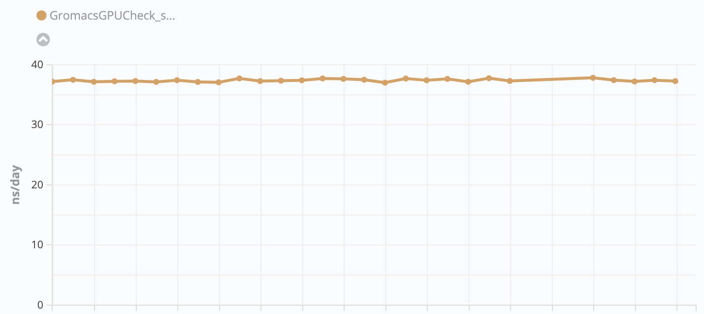

===============
Running ReFrame
===============

Before getting into any details, the simplest way to invoke ReFrame is the following:

.. code-block:: bash

  ./bin/reframe -c /path/to/checks -R -r

This will search recursively for test files in ``/path/to/checks`` and will start running them on the current system.

ReFrame's front-end goes through three phases:

1. Load tests
2. Filter tests
3. Act on tests

In the following, we will elaborate on these phases and the key command-line options controlling them.
A detailed listing of all the command-line options grouped by phase is given by ``./bin/reframe -h``.

Supported Actions
-----------------

Even though an action is the last phase that the front-end goes through, we are listing it first since an action is always required.
Currently there are only two available actions:

1. Listing of the selected checks
2. Execution of the selected checks

-------------------------------
Listing of the regression tests
-------------------------------

To retrieve a listing of the selected checks, you must specify the ``-l`` or ``--list`` options.
This will provide a list with a brief description for each test containing only its name and the path to the file where it is defined.
An example listing of checks is the following that lists all the tests found under the ``tutorial/`` folder:

.. code-block:: bash

  ./bin/reframe -c tutorial -l

The output looks like:

.. code-block:: none

   Command line: ./bin/reframe -c tutorial/ -l
   Reframe version: 2.15-dev1
   Launched by user: USER
   Launched on host: daint103
   Reframe paths
   =============
       Check prefix      :
       Check search path : 'tutorial/'
       Stage dir prefix  : /path/to/reframe/stage/
       Output dir prefix : /path/to/reframe/output/
       Logging dir       : /path/to/reframe/logs
   List of matched checks
   ======================
     * Example5Test (found in /path/to/reframe/tutorial/example5.py)
     * Example1Test (found in /path/to/reframe/tutorial/example1.py)
     * Example4Test (found in /path/to/reframe/tutorial/example4.py)
     * SerialTest (found in /path/to/reframe/tutorial/example8.py)
     * OpenMPTest (found in /path/to/reframe/tutorial/example8.py)
     * MPITest (found in /path/to/reframe/tutorial/example8.py)
     * OpenACCTest (found in /path/to/reframe/tutorial/example8.py)
     * CudaTest (found in /path/to/reframe/tutorial/example8.py)
     * Example3Test (found in /path/to/reframe/tutorial/example3.py)
     * Example7Test (found in /path/to/reframe/tutorial/example7.py)
     * Example6Test (found in /path/to/reframe/tutorial/example6.py)
     * Example2aTest (found in /path/to/reframe/tutorial/example2.py)
     * Example2bTest (found in /path/to/reframe/tutorial/example2.py)
   Found 13 check(s).

You may also retrieve a listing with detailed information about the each check using the option ``-L`` or ``--list-detailed``.
The following example lists detailed information about the tutorial check:

.. code-block:: none

   Command line: ./bin/reframe -c tutorial/ -L
   Reframe version: 2.18-dev2
   Launched by user: USER
   Launched on host: daint103
   Reframe paths
   =============
       Check prefix      :
       Check search path : 'tutorial/'
       Stage dir prefix  : /path/to/reframe/stage/
       Output dir prefix : /path/to/reframe/output/
       Logging dir       : /path/to/reframe/logs
   List of matched checks
   ======================
     * Example5Test (found in /path/to/reframe/tutorial/example5.py)
         - description: Matrix-vector multiplication example with CUDA
         - systems: daint:gpu
         - environments: PrgEnv-cray, PrgEnv-gnu, PrgEnv-pgi
         - modules: cudatoolkit
         - task allocation: standard
         - tags: tutorial
         - maintainers: you-can-type-your-email-here
     * Example1Test (found in /path/to/reframe/tutorial/example1.py)
         - description: Simple matrix-vector multiplication example
         - systems: *
         - environments: *
         - modules:
         - task allocation: standard
         - tags: tutorial
         - maintainers: you-can-type-your-email-here
     * Example4Test (found in /path/to/reframe/tutorial/example4.py)
         - description: Matrix-vector multiplication example with OpenACC
         - systems: daint:gpu
         - environments: PrgEnv-cray, PrgEnv-pgi
         - modules: craype-accel-nvidia60
         - task allocation: standard
         - tags: tutorial
         - maintainers: you-can-type-your-email-here
     * SerialTest (found in /path/to/reframe/tutorial/example8.py)
         - description: Serial matrix-vector multiplication
         - systems: *
         - environments: *
         - modules:
         - task allocation: standard
         - tags: tutorial
         - maintainers: you-can-type-your-email-here
     * OpenMPTest (found in /path/to/reframe/tutorial/example8.py)
         - description: OpenMP matrix-vector multiplication
         - systems: *
         - environments: PrgEnv-cray, PrgEnv-gnu, PrgEnv-intel, PrgEnv-pgi
         - modules:
         - task allocation: standard
         - tags: tutorial
         - maintainers: you-can-type-your-email-here
     * MPITest (found in /path/to/reframe/tutorial/example8.py)
         - description: MPI matrix-vector multiplication
         - systems: daint:gpu, daint:mc
         - environments: PrgEnv-cray, PrgEnv-gnu, PrgEnv-intel, PrgEnv-pgi
         - modules:
         - task allocation: standard
         - tags: tutorial
         - maintainers: you-can-type-your-email-here
     * OpenACCTest (found in /path/to/reframe/tutorial/example8.py)
         - description: OpenACC matrix-vector multiplication
         - systems: daint:gpu
         - environments: PrgEnv-cray, PrgEnv-pgi
         - modules: craype-accel-nvidia60
         - task allocation: standard
         - tags: tutorial
         - maintainers: you-can-type-your-email-here
     * CudaTest (found in /path/to/reframe/tutorial/example8.py)
         - description: CUDA matrix-vector multiplication
         - systems: daint:gpu
         - environments: PrgEnv-gnu, PrgEnv-cray, PrgEnv-pgi
         - modules: cudatoolkit
         - task allocation: standard
         - tags: tutorial
         - maintainers: you-can-type-your-email-here
     * Example3Test (found in /path/to/reframe/tutorial/example3.py)
         - description: Matrix-vector multiplication example with MPI
         - systems: daint:gpu, daint:mc
         - environments: PrgEnv-cray, PrgEnv-gnu, PrgEnv-intel, PrgEnv-pgi
         - modules:
         - task allocation: standard
         - tags: tutorial
         - maintainers: you-can-type-your-email-here
     * Example7Test (found in /path/to/reframe/tutorial/example7.py)
         - description: Matrix-vector multiplication (CUDA performance test)
         - systems: daint:gpu
         - environments: PrgEnv-gnu, PrgEnv-cray, PrgEnv-pgi
         - modules: cudatoolkit
         - task allocation: standard
         - tags: tutorial
         - maintainers: you-can-type-your-email-here
     * Example6Test (found in /path/to/reframe/tutorial/example6.py)
         - description: Matrix-vector multiplication with L2 norm check
         - systems: *
         - environments: *
         - modules:
         - task allocation: standard
         - tags: tutorial
         - maintainers: you-can-type-your-email-here
     * Example2aTest (found in /path/to/reframe/tutorial/example2.py)
         - description: Matrix-vector multiplication example with OpenMP
         - systems: *
         - environments: PrgEnv-cray, PrgEnv-gnu, PrgEnv-intel, PrgEnv-pgi
         - modules:
         - task allocation: standard
         - tags: tutorial
         - maintainers: you-can-type-your-email-here
     * Example2bTest (found in /path/to/reframe/tutorial/example2.py)
         - description: Matrix-vector multiplication example with OpenMP
         - systems: *
         - environments: PrgEnv-cray, PrgEnv-gnu, PrgEnv-intel, PrgEnv-pgi
         - modules:
         - task allocation: standard
         - tags: tutorial
         - maintainers: you-can-type-your-email-here
   Found 13 check(s).

The detailed listing shows the description of the test, its supported systems and programming environments (``*`` stands for any system or programming environment), the environment modules that it loads, its tags and its maintainers.

.. warning::
   The list of modules showed in the detailed listing may not correspond to actual modules loaded by test, if the test customizes its behavior during the setup stage.

.. note::
   .. versionadded:: 2.15

      Support for detailed listings.
      Standard listing using the ``-l`` option is now shorter.

.. note::
   .. versionchanged:: 2.15

      Test listing lists only tests supported by the current system.
      Previous versions were showing all the tests found.

---------------------------------
Execution of the regression tests
---------------------------------

To run the regression tests you should specify the *run* action though the ``-r`` or ``--run`` options.

.. note:: The listing action takes precedence over the execution, meaning that if you specify both ``-l -r``, only the listing action will be performed.

.. code-block:: bash

  ./reframe.py -C tutorial/config/settings.py -c tutorial/example1.py -r

The output of the regression run looks like the following:

.. code-block:: none

  Command line: ./reframe.py -C tutorial/config/settings.py -c tutorial/example1.py -r
  Reframe version: 3.0-dev3 (rev: 0c62d00c)
  Launched by user: USER
  Launched on host: daint105
  Reframe paths
  =============
      Check prefix      :
      Check search path : '/path/to/reframe/tutorial/example1.py'
      Current working dir  : /path/to/reframe
      Stage dir prefix     : /path/to/reframe/stage/
      Output dir prefix    : /path/to/reframe/output/
      Perf. logging prefix : /path/to/reframe/perflogs
  [==========] Running 1 check(s)
  [==========] Started on Wed Mar 25 10:13:13 2020

  [----------] started processing Example1Test (Simple matrix-vector multiplication example)
  [ RUN      ] Example1Test on daint:login using PrgEnv-cray
  [ RUN      ] Example1Test on daint:login using PrgEnv-gnu
  [ RUN      ] Example1Test on daint:login using PrgEnv-intel
  [ RUN      ] Example1Test on daint:login using PrgEnv-pgi
  [ RUN      ] Example1Test on daint:gpu using PrgEnv-cray
  [ RUN      ] Example1Test on daint:gpu using PrgEnv-gnu
  [ RUN      ] Example1Test on daint:gpu using PrgEnv-intel
  [ RUN      ] Example1Test on daint:gpu using PrgEnv-pgi
  [ RUN      ] Example1Test on daint:mc using PrgEnv-cray
  [ RUN      ] Example1Test on daint:mc using PrgEnv-gnu
  [ RUN      ] Example1Test on daint:mc using PrgEnv-intel
  [ RUN      ] Example1Test on daint:mc using PrgEnv-pgi
  [----------] finished processing Example1Test (Simple matrix-vector multiplication example)

  [----------] waiting for spawned checks to finish
  [       OK ] ( 1/12) Example1Test on daint:login using PrgEnv-intel
  [       OK ] ( 2/12) Example1Test on daint:login using PrgEnv-cray
  [       OK ] ( 3/12) Example1Test on daint:login using PrgEnv-gnu
  [       OK ] ( 4/12) Example1Test on daint:login using PrgEnv-pgi
  [       OK ] ( 5/12) Example1Test on daint:mc using PrgEnv-gnu
  [       OK ] ( 6/12) Example1Test on daint:mc using PrgEnv-pgi
  [       OK ] ( 7/12) Example1Test on daint:mc using PrgEnv-cray
  [       OK ] ( 8/12) Example1Test on daint:mc using PrgEnv-intel
  [       OK ] ( 9/12) Example1Test on daint:gpu using PrgEnv-intel
  [       OK ] (10/12) Example1Test on daint:gpu using PrgEnv-cray
  [       OK ] (11/12) Example1Test on daint:gpu using PrgEnv-gnu
  [       OK ] (12/12) Example1Test on daint:gpu using PrgEnv-pgi
  [----------] all spawned checks have finished

  [  PASSED  ] Ran 12 test case(s) from 1 check(s) (0 failure(s))
  [==========] Finished on Wed Mar 25 10:21:08 2020

Discovery of Regression Tests
-----------------------------

When ReFrame is invoked, it tries to locate regression tests in a predefined path.
By default, this path is the ``<reframe-install-dir>/checks``.
You can also retrieve this path as follows:

.. code-block:: bash

  ./bin/reframe -l | grep 'Check search path'

If the path line is prefixed with ``(R)``, every directory in that path will be searched recursively for regression tests.

As described extensively in the `"ReFrame Tutorial" <tutorial.html>`__, regression tests in ReFrame are essentially Python source files that provide a special function, which returns the actual regression test instances.
A single source file may also provide multiple regression tests.
ReFrame loads the python source files and tries to call this special function;
if this function cannot be found, the source file will be ignored.
At the end of this phase, the front-end will have instantiated all the tests found in the path.

You can override the default search path for tests by specifying the ``-c`` or ``--checkpath`` options.
We have already done that already when listing all the tutorial tests:

.. code-block:: bash

  ./bin/reframe -c tutorial/ -l

ReFrame the does not search recursively into directories specified with the ``-c`` option, unless you explicitly specify the ``-R`` or ``--recurse`` options.

The ``-c`` option completely overrides the default path.
Currently, there is no option to prepend or append to the default regression path.
However, you can build your own check path by specifying multiple times the ``-c`` option.
The ``-c`` option accepts also regular files.
This is very useful when you are implementing new regression tests, since it allows you to run only your test:

.. code-block:: bash

  ./bin/reframe -c /path/to/my/new/test.py -r

.. important::
   The names of the loaded tests must be unique.
   Trying to load two or more tests with the same name will produce an error.
   You may ignore the error by using the ``--ignore-check-conflicts`` option.
   In this case, any conflicting test will not be loaded and a warning will be issued.

   .. versionadded:: 2.12

Filtering of Regression Tests
-----------------------------

At this phase you can select which regression tests should be run or listed.
There are several ways to select regression tests, which we describe in more detail here:

-------------------------
Selecting tests by system
-------------------------

.. versionadded:: 2.15

By default, ReFrame always selects the tests that are supported by the current system.
If you want to list the tests supported by a different system, you may achieve that by passing the ``--system`` option:

.. code-block:: bash

  ./bin/reframe --system=kesch -l

This example lists all the tests that are supported by the system named ``kesch``.
It is also possible to list only the tests that are supported by a specific system partition.
The following example will list only the tests suported by the ``login`` partition of the ``kesch`` system:

.. code-block:: bash

  ./bin/reframe --system=kesch:login -l

Finally, in order to list all the tests found regardless of their supported systems, you should pass the ``--skip-system-check`` option:

.. code-block:: bash

  ./bin/reframe --skip-system-check -l

------------------------------------------
Selecting tests by programming environment
------------------------------------------

To select tests by the programming environment, use the ``-p`` or ``--prgenv`` options:

.. code-block:: bash

  ./bin/reframe -p PrgEnv-gnu -l

This will select all the checks that support the ``PrgEnv-gnu`` environment.

You can also specify multiple times the ``-p`` option, in which case a test will be selected if it support all the programming environments specified in the command line.
For example the following will select all the checks that can run with both ``PrgEnv-cray`` and ``PrgEnv-gnu`` on the current system:

.. code-block:: bash

  ./bin/reframe -p PrgEnv-gnu -p PrgEnv-cray -l

If you are going to run a set of tests selected by programming environment, they will run only for the selected programming environment(s).

The ``-p`` option accepts also the Python `regular expression syntax <https://docs.python.org/3.6/library/re.html#regular-expression-syntax>`__.
In fact, the argument to ``-p`` option is treated as a regular expression always. This means that the ``-p PrgEnv-gnu`` will match also tests that support a ``PrgEnv-gnuXX`` environment.
If you would like to stricly select tests that support ``PrgEnv-gnu`` only and not ``PrgEnv-gnuXX``, you should write ``-p PrgEnv-gnu$``.
As described above multiple ``-p`` options are AND-ed.
Combining that with regular expressions can be quite powerful.
For example, the following will select all tests that support programming environment ``foo`` and either ``PrgEnv-gnu`` or ``PrgEnv-pgi``:

.. code-block:: bash

   ./bin/reframe -p foo -p 'PrgEnv-(gnu|pgi)' -l

.. note::
   .. versionadded:: 2.17

   The ``-p`` option recognizes regular expressions as arguments.

-----------------------
Selecting tests by tags
-----------------------

As we have seen in the `"ReFrame tutorial" <tutorial.html>`__, every regression test may be associated with a set of tags.
Using the ``-t`` or ``--tag`` option you can select the regression tests associated with a specific tag.
For example the following will list all the tests that have a ``maintenance`` tag and can run on the current system:

.. code-block:: bash

  ./bin/reframe -t maintenance -l

Similarly to the ``-p`` option, you can chain multiple ``-t`` options together, in which case a regression test will be selected if it is associated with all the tags specified in the command line.
The list of tags associated with a check can be viewed in the listing output when specifying the ``-l`` option.

.. note::
   .. versionadded:: 2.17

   The ``-t`` option recognizes regular expressions as arguments.

-----------------------
Selecting tests by name
-----------------------

It is possible to select or exclude tests by name through the ``--name`` or ``-n`` and ``--exclude`` or ``-x`` options.
For example, you can select only the ``Example7Test`` from the tutorial as follows:

.. code-block:: bash

  ./bin/reframe -c tutorial/ -n Example7Test -l

.. code-block:: none

  Command line: ./bin/reframe -c tutorial/ -n Example7Test -l
  Reframe version: 2.15-dev1
  Launched by user: USER
  Launched on host: daint103
  Reframe paths
  =============
      Check prefix      :
      Check search path : 'tutorial'
      Stage dir prefix  : /path/to/reframe/stage/
      Output dir prefix : /path/to/reframe/output/
      Logging dir       : /path/to/reframe/logs
  List of matched checks
  ======================
    * Example7Test (found in /path/to/reframe/tutorial/example7.py)
  Found 1 check(s).

Similarly, you can exclude this test by passing the ``-x Example7Test`` option:

.. code-block:: none

  Command line: ./bin/reframe -c tutorial -x Example7Test -l
  Reframe version: 2.15-dev1
  Launched by user: USER
  Launched on host: daint103
  Reframe paths
  =============
      Check prefix      :
      Check search path : 'tutorial'
      Stage dir prefix  : /path/to/reframe/stage/
      Output dir prefix : /path/to/reframe/output/
      Logging dir       : /path/to/reframe/logs
  List of matched checks
  ======================
    * Example5Test (found in /path/to/reframe/tutorial/example5.py)
    * Example1Test (found in /path/to/reframe/tutorial/example1.py)
    * Example4Test (found in /path/to/reframe/tutorial/example4.py)
    * SerialTest (found in /path/to/reframe/tutorial/example8.py)
    * OpenMPTest (found in /path/to/reframe/tutorial/example8.py)
    * MPITest (found in /path/to/reframe/tutorial/example8.py)
    * OpenACCTest (found in /path/to/reframe/tutorial/example8.py)
    * CudaTest (found in /path/to/reframe/tutorial/example8.py)
    * Example3Test (found in /path/to/reframe/tutorial/example3.py)
    * Example6Test (found in /path/to/reframe/tutorial/example6.py)
    * Example2aTest (found in /path/to/reframe/tutorial/example2.py)
    * Example2bTest (found in /path/to/reframe/tutorial/example2.py)
  Found 12 check(s).

Both ``-n`` and ``-x`` options can be chained, in which case either the tests that have any of the specified names are selected or excluded from running.
They may also accept regular expressions as arguments.

.. note::
   .. versionadded:: 2.17

      The ``-n`` and ``-x`` options recognize regular expressions as arguments.
      Chaining these options, e.g., ``-n A -n B``, is equivalent to a regular expression that applies OR to the individual arguments, i.e., equivalent to ``-n 'A|B'``.

Controlling the Execution of Regression Tests
---------------------------------------------

There are several options for controlling the execution of regression tests.
Keep in mind that these options will affect all the tests that will run with the current invocation.
They are summarized below:

* ``-A ACCOUNT``, ``--account ACCOUNT``: Submit regression test jobs using ``ACCOUNT``.
* ``-P PART``, ``--partition PART``: Submit regression test jobs in the *scheduler partition* ``PART``.
* ``--reservation RES``: Submit regression test jobs in reservation ``RES``.
* ``--nodelist NODELIST``: Run regression test jobs on the nodes specified in ``NODELIST``.
* ``--exclude-nodes NODELIST``: Do not run the regression test jobs on any of the nodes specified in ``NODELIST``.
* ``--job-option OPT``: Pass option ``OPT`` directly to the back-end job scheduler. This option *must* be used with care, since you may break the submission mechanism.
  All of the above job submission related options could be expressed with this option.
  For example, the ``-n NODELIST`` is equivalent to ``--job-option='--nodelist=NODELIST'`` for a Slurm job scheduler.
  If you pass an option that is already defined by the framework, the framework will *not* explicitly override it; this is up to scheduler.
  All extra options defined from the command line are appended to the automatically generated options in the generated batch script file.
  So if you redefine one of them, e.g., ``--output`` for the Slurm scheduler, it is up the job scheduler on how to interpret multiple definitions of the same options.
  In this example, Slurm's policy is that later definitions of options override previous ones.
  So, in this case, way you would override the standard output for all the submitted jobs!

* ``--flex-alloc-tasks {all|idle|NUM}``: (Deprecated) Please use ``--flex-alloc-nodes`` instead.
* ``--flex-alloc-nodes {all|idle|NUM}``: Automatically determine the number of nodes allocated for each test.
* ``--force-local``: Force the local execution of the selected tests.
  No jobs will be submitted.
* ``--skip-sanity-check``: Skip sanity checking phase.
* ``--skip-performance-check``: Skip performance verification phase.
* ``--strict``: Force strict performance checking. Some tests may set their :attr:`strict_check <reframe.core.pipeline.RegressionTest.strick_check>` attribute to :class:`False` (see `"Reference Guide" <running.html#controlling-the-execution-of-regression-tests>`__) in order to just let their performance recorded but not yield an error.
  This option overrides this behavior and forces all tests to be strict.
* ``--skip-system-check``: Skips the system check and run the selected tests even if they do not support the current system.
  This option is sometimes useful when you need to quickly verify if a regression test supports a new system.
* ``--skip-prgenv-check``: Skips programming environment check and run the selected tests for even if they do not support a programming environment.
  This option is useful when you need to quickly verify if a regression check supports another programming environment.
  For example, if you know that a tests supports only ``PrgEnv-cray`` and you need to check if it also works with ``PrgEnv-gnu``, you can test is as follows:

  .. code-block:: bash

    ./bin/reframe -c /path/to/my/check.py -p PrgEnv-gnu --skip-prgenv-check -r

* ``--max-retries NUM``: Specify the maximum number of times a failed regression test may be retried (default: 0).

Generating a Performance Report
-------------------------------

If you are running performance tests, you may instruct ReFrame to produce a performance report at the end using the `--performance-report` command-line options.
The performance report is printed after the output of the regression tests and has the following format:

.. code-block:: none

  PERFORMANCE REPORT
  ------------------------------------------------------------------------------
  Check1
  - system:partition
      - PrgEnv1
          * num_tasks: <num_tasks>
          * perf_variable1: <value> <units>
          * perf_variable2: <value> <units>
          * ...
      - PrgEnv2
          * num_tasks: <num_tasks>
          * perf_variable1: <value> <units>
          * perf_variable2: <value> <units>
          * ...
  ------------------------------------------------------------------------------
  Check2
  - system:partition
      - PrgEnv1
          * num_tasks: <num_tasks>
          * perf_variable1: <value> <units>
          * perf_variable2: <value> <units>
          * ...
      - PrgEnv2
          * num_tasks: <num_tasks>
          * perf_variable1: <value> <units>
          * perf_variable2: <value> <units>
          * ...
  ------------------------------------------------------------------------------

The number of tasks and the achieved performance values are listed by system partition and programming environment for each performance test that has run.
Performance variables are the variables collected through the :attr:`reframe.core.pipeline.RegressionTest.perf_patterns` attribute.

The following command will run the CUDA matrix-vector multiplication example from the `tutorial <tutorial.html>`__ and will produce a performance report:

.. code-block:: bash

  ./bin/reframe -C tutorial/config/settings.py -c tutorial/example7.py -r --performance-report

.. code-block:: none

  Command line: ./bin/reframe -C tutorial/config/settings.py -c tutorial/example7.py -r --performance-report
  Reframe version: 3.0-dev3 (rev: 0c62d00c)
  Launched by user: USER
  Launched on host: daint105
  Reframe paths
  =============
      Check prefix      :
      Check search path : '/path/to/reframe/tutorial/example7.py'
      Current working dir  : /path/to/reframe
      Stage dir prefix     : /path/to/reframe/stage/
      Output dir prefix    : /path/to/reframe/output/
      Perf. logging prefix : /path/to/reframe/perflogs
  [==========] Running 1 check(s)
  [==========] Started on Wed Mar 25 10:40:25 2020

  [----------] started processing Example7Test (Matrix-vector multiplication (CUDA performance test))
  [ RUN      ] Example7Test on daint:gpu using PrgEnv-cray
  [ RUN      ] Example7Test on daint:gpu using PrgEnv-gnu
  [ RUN      ] Example7Test on daint:gpu using PrgEnv-pgi
  [----------] finished processing Example7Test (Matrix-vector multiplication (CUDA performance test))

  [----------] waiting for spawned checks to finish
  [       OK ] (1/3) Example7Test on daint:gpu using PrgEnv-gnu
  [       OK ] (2/3) Example7Test on daint:gpu using PrgEnv-cray
  [       OK ] (3/3) Example7Test on daint:gpu using PrgEnv-pgi
  [----------] all spawned checks have finished

  [  PASSED  ] Ran 3 test case(s) from 1 check(s) (0 failure(s))
  [==========] Finished on Wed Mar 25 10:43:53 2020
  ==============================================================================
  PERFORMANCE REPORT
  ------------------------------------------------------------------------------
  Example7Test
  - daint:gpu
    - PrgEnv-cray
        * num_tasks: 1
        * perf: 50.184982 Gflop/s
    - PrgEnv-gnu
        * num_tasks: 1
        * perf: 50.205857 Gflop/s
    - PrgEnv-pgi
        * num_tasks: 1
        * perf: 49.691865 Gflop/s
  ------------------------------------------------------------------------------

For completeness, we show here the corresponding section from the ``Example7Test``, so that the connection between the test's code and the output becomes clear:

.. literalinclude:: ../tutorial/example7.py
  :lines: 19-27
  :dedent: 8

If you are writing a benchmark, it is often the case that you will run it in an unknown system, where you don't have any reference value.
Normally, if ReFrame cannot find a reference for the system it is running on, it will complain and mark the test as a failure.
However, you may right your test in such a way, that it allows it to run successfully on any new system.
To achieve this, simply insert a "catch-all" ``*`` entry in the :attr:`reframe.core.pipeline.RegressionTest.reference` attribute:

.. code-block:: python

  self.reference = {
      '*': {
          'perf_var1': (0, None, None, 'units'),
          'perf_var2': (0, None, None, 'units')
          ...
      }
  }

The performance test will always pass on new systems and you may use the ``--performance-report`` option for getting the actual performance values.

.. note::

   The performance report should not be confused with `performance logging <#performance-logging>`__.
   It is simply a way of quickly visualizing the performance results and is useful for interactive testing.
   Performance logging, if configured, occurs independently of the performance report and is meant for keeping performance data over time.
   Its formatting facilitates parsing and it should be used for later analysis of the performance data obtained.

Configuring ReFrame Directories
-------------------------------

ReFrame uses two basic directories during the execution of tests:

1. The stage directory

  * Each regression test is executed in a "sandbox";
    all of its resources (source files, input data etc.) are copied over to a stage directory (if the directory preexists, it will be wiped out) and executed from there.
    This will also be the working directory for the test.

2. The output directory

  * After a regression test finishes some important files will be copied from the stage directory to the output directory (if the directory preexists, it will be wiped out).
    By default these are the standard output, standard error and the generated job script file.
    A regression test may also specify to keep additional files.

By default, these directories are placed under a common prefix, which defaults to ``.``.
The rest of the directories are organized as follows:

* Stage directory: ``${prefix}/stage/<timestamp>``
* Output directory: ``${prefix}/output/<timestamp>``

You can optionally append a timestamp directory component to the above paths (except the logs directory), by using the ``--timestamp`` option.
This options takes an optional argument to specify the timestamp format.
The default `time format <http://man7.org/linux/man-pages/man3/strftime.3.html>`__ is ``%FT%T``, which results into timestamps of the form ``2017-10-24T21:10:29``.

You can override either the default global prefix or any of the default individual directories using the corresponding options.

* ``--prefix DIR``: set prefix to ``DIR``.
* ``--output DIR``: set output directory to ``DIR``.
* ``--stage DIR``: set stage directory to ``DIR``.

The stage and output directories are created only when you run a regression test.
However you can view the directories that will be created even when you do a listing of the available checks with the ``-l`` option.
This is useful if you want to check the directories that ReFrame will create.

.. code-block:: bash

  ./bin/reframe -C tutorial/config/settings.py --prefix /foo -l

.. code-block:: none

  Command line: ./bin/reframe -C tutorial/config/settings.py --prefix /foo -l
  Reframe version: 2.13-dev0
  Launched by user: USER
  Launched on host: daint103
  Reframe paths
  =============
      Check prefix      : /path/to/reframe
  (R) Check search path : 'checks/'
      Stage dir prefix     : /foo/stage/
      Output dir prefix    : /foo/output/
      Perf. logging prefix : /Users/karakasv/Repositories/reframe/logs
  List of matched checks
  ======================
  Found 0 check(s).

You can also define different default directories per system by specifying them in the `site configuration <configure.html#the-configuration-file>`__ settings file.
The command line options, though, take always precedence over any default directory.

Logging
-------

From version 2.4 onward, ReFrame not only supports logging of its actions, but its normal output is also fully configurable.
All output of ReFrame is handled by logging handlers, which can send information to multiple channels at once filtering it independently based on severity levels.
By default, using its generic configuration, ReFrame sends informational data to its standard output and debug data to ``reframe.log``.
The debug information in ``reframe.log`` looks like the following:

.. code-block:: none

  [2020-03-25T10:42:57] info: reframe: [       OK ] (1/3) Example7Test on daint:gpu using PrgEnv-gnu
  [2020-03-25T10:42:57] debug: Example7Test: entering stage: cleanup
  [2020-03-25T10:42:57] debug: Example7Test: copying interesting files to output directory
  [2020-03-25T10:42:57] debug: Example7Test: removing stage directory
  [2020-03-25T10:42:57] debug: reframe: polling rate (real): 0.614 polls/sec
  [2020-03-25T10:42:57] debug: reframe: polling rate (desired): 0.200
  [2020-03-25T10:42:57] debug: reframe: sleeping: 10.000s
  [2020-03-25T10:43:07] debug: reframe: running tasks: 2
  [2020-03-25T10:43:07] debug: reframe: updating counts for running test cases
  [2020-03-25T10:43:07] debug: reframe: polling 2 task(s)
  [2020-03-25T10:43:07] debug: Example7Test: entering stage: run
  [2020-03-25T10:43:07] debug: Example7Test: executing OS command: sacct -S 2020-03-25 -P -j 21424988 -o jobid,state,ex
  itcode,nodelist
  [2020-03-25T10:43:07] debug: Example7Test: entering stage: run
  [2020-03-25T10:43:07] debug: Example7Test: executing OS command: sacct -S 2020-03-25 -P -j 21424991 -o jobid,state,ex
  itcode,nodelist
  [2020-03-25T10:43:07] debug: reframe: finalizing tasks: 0
  [2020-03-25T10:43:07] debug: reframe: polling rate (real): 0.586 polls/sec
  [2020-03-25T10:43:07] debug: reframe: polling rate (desired): 0.200
  [2020-03-25T10:43:07] debug: reframe: sleeping: 10.000s
  [2020-03-25T10:43:17] debug: reframe: running tasks: 2
  [2020-03-25T10:43:17] debug: reframe: updating counts for running test cases
  [2020-03-25T10:43:17] debug: reframe: polling 2 task(s)
  [2020-03-25T10:43:17] debug: Example7Test: entering stage: run
  [2020-03-25T10:43:17] debug: Example7Test: executing OS command: sacct -S 2020-03-25 -P -j 21424988 -o jobid,state,ex
  itcode,nodelist
  [2020-03-25T10:43:17] debug: Example7Test: entering stage: wait
  [2020-03-25T10:43:17] debug: Example7Test: spawned job finished
  [2020-03-25T10:43:17] debug: reframe: removing task from running list: Example7Test on daint:gpu using PrgEnv-cray
  [2020-03-25T10:43:17] debug: reframe: finalizing tasks: 1
  [2020-03-25T10:43:17] debug: reframe: finalizing task: Example7Test on daint:gpu using PrgEnv-cray
  [2020-03-25T10:43:17] debug: Example7Test: entering stage: sanity
  [2020-03-25T10:43:17] debug: Example7Test: entering stage: performance
  [2020-03-25T10:43:17] info: reframe: [       OK ] (2/3) Example7Test on daint:gpu using PrgEnv-cray

Each line starts with a timestamp, the level of the message (``info``, ``debug`` etc.), the context in which the framework is currently executing (either ``reframe`` or the name of the current test and, finally, the actual message.

Every time ReFrame is run, the ``reframe.log`` files will be rewritten.
However, you can ask ReFrame to copy it to the output directory before exiting by passing it the ``--save-log-files`` option.

Users have full control over what is being logged, where it is send and how log records are formatted.
The `configuration guide <configure.html#logging-configuration>`__ gives an overview of the logging configuration, whereas a complete description of the available options can be found in the `configuration reference <config_reference.html#logging-configuration>`__.

-------------------
Performance Logging
-------------------

Performance testing is an essential part of ReFrame and performance data from tests is handled specially.
ReFrame allows you to send performance data to multiple channels, such as files, log servers and system logs.
By default, performance data is sent to files organized per system, per partition and per test as follows:

  .. code-block:: none

    {perflog_basedir}/
       system1/
           partition1/
               test_name.log
           partition2/
               test_name.log
           ...
       system2/
       ...

Whenever a test executes on a specific system/partition combination, the obtained performance data will be appended to a file.
A performance log record has the following format by default:

.. code-block:: none

    2019-10-23T13:46:05|reframe 2.20-dev2|Example7Test on daint:gpu using PrgEnv-cray|jobid=813559|num_tasks=1|perf=49.681565|ref=50.0 (l=-0.1, u=0.1)|Gflop/s
    2019-10-23T13:46:27|reframe 2.20-dev2|Example7Test on daint:gpu using PrgEnv-gnu|jobid=813560|num_tasks=1|perf=50.737651|ref=50.0 (l=-0.1, u=0.1)|Gflop/s
    2019-10-23T13:46:48|reframe 2.20-dev2|Example7Test on daint:gpu using PrgEnv-pgi|jobid=813561|num_tasks=1|perf=50.720164|ref=50.0 (l=-0.1, u=0.1)|Gflop/s

There is information about the actual test run and the performance data obtained for the different performance variables.
The log record format is fully configurable as well as the directory structure.
More information can be found in the `configuration reference <config_reference.html#the-filelog-log-handler>`__.

More Advanced Performance Logging
=================================

ReFrame offers additional capabilities for performance logging.
You can instruct it to send data to a log management server, which provides a dedicated service for handling large amount of logs.
These services are usually combined with log analysis tools, such `Grafana <https://grafana.com/>`__ and `Kibana <https://www.elastic.co/kibana>`__, which offer specialized functionality for log analysis.
If your site uses a centralized log management, you could feed the ReFrame performance logs, create dashboards and correlate it with other events on the system.

There are two ways to achieve this in ReFrame, either through the `graylog <config_reference.html#the-graylog-log-handler>`__ log handler or the `syslog <config_reference.html#the-syslog-log-handler>`__ log  handler.
The first one sends data to a `Graylog <https://www.graylog.org/>`__ server, whereas the second one sends data to a Syslog server.
A usual setup for centers is to feed all the syslog data to a centralized log management system, where the logs can be visualized and analyzed.

The following image is a snapshot of an actual dashboard visualizing `GROMACS <http://www.gromacs.org/>`__ performance data from ReFrame over time.

-----------------------------
Adjusting verbosity of output
-----------------------------

As discussed in the `configuration guide <configure.html#configure-logging>`__, ReFrame's output is handled also by its logging  mechanism.
Increasing or decreasing the verbosity of its output can be achieved by adjusting the level of the log handler that sends data to standard output.
Alternatively, you may increase the verbosity level from the command line by chaining the ``-v`` or ``--verbose`` option.
Every time ``-v`` is specified, the next verbosity level will be selected for the output.
For example, if the initial level of the output log handler is set to ``info`` (in the configuration file), specifying ``-v`` twice will make ReFrame spit out all ``debug`` messages.

.. note::

  .. versionadded:: 2.16

  The ``--verbose`` option was added.

Asynchronous Execution of Regression Checks
-------------------------------------------

From version `2.4 <https://github.com/eth-cscs/reframe/releases/tag/v2.4>`__, ReFrame supports asynchronous execution of regression tests.
This execution policy is the default one.
To enforce a sequential execution of the regression tests the ``serial`` execution policy can be enabled by passing the option ``--exec-policy=serial`` to the command line.
The asynchronous execution policy parallelizes only the `running phase <pipeline.html#the-run-phase>`__ of the tests.
The rest of the phases remain sequential.

A limit of concurrent jobs (pending and running) may be `configured <configure.html#partition-configuration>`__ for each virtual system partition.
As soon as the concurrency limit of a partition is reached, ReFrame will hold the execution of new regression tests until a slot is released in that partition.

When executing in asynchronous mode, ReFrame's output differs from the sequential execution.
The final result of the tests will be printed at the end and additional messages may be printed to indicate that a test is held.
Here is an example output of ReFrame using asynchronous execution policy:

.. code-block:: none

  Command line: ./bin/reframe -C tutorial/config/settings.py -c tutorial/ --exec-policy=async -r
  Reframe version: 3.0-dev3 (rev: 0c62d00c)
  Launched by user: USER
  Launched on host: daint105
  Reframe paths
  =============
      Check prefix      :
      Check search path : '/path/to/reframe/tutorial'
      Current working dir  : /path/to/reframe
      Stage dir prefix     : /path/to/reframe/stage/
      Output dir prefix    : /path/to/reframe/output/
      Perf. logging prefix : /path/to/reframe/perflogs
  [==========] Running 13 check(s)
  [==========] Started on Wed Mar 25 10:55:35 2020

  [----------] started processing Example1Test (Simple matrix-vector multiplication example)
  [ RUN      ] Example1Test on daint:login using PrgEnv-cray
  [ RUN      ] Example1Test on daint:login using PrgEnv-gnu
  [ RUN      ] Example1Test on daint:login using PrgEnv-intel
  [ RUN      ] Example1Test on daint:login using PrgEnv-pgi
  [ RUN      ] Example1Test on daint:gpu using PrgEnv-cray
  [ RUN      ] Example1Test on daint:gpu using PrgEnv-gnu
  [ RUN      ] Example1Test on daint:gpu using PrgEnv-intel
  [ RUN      ] Example1Test on daint:gpu using PrgEnv-pgi
  [ RUN      ] Example1Test on daint:mc using PrgEnv-cray
  [ RUN      ] Example1Test on daint:mc using PrgEnv-gnu
  [ RUN      ] Example1Test on daint:mc using PrgEnv-intel
  [ RUN      ] Example1Test on daint:mc using PrgEnv-pgi
  [----------] finished processing Example1Test (Simple matrix-vector multiplication example)

  [----------] started processing Example2aTest (Matrix-vector multiplication example with OpenMP)
  [ RUN      ] Example2aTest on daint:login using PrgEnv-cray
  [ RUN      ] Example2aTest on daint:login using PrgEnv-gnu
  [ RUN      ] Example2aTest on daint:login using PrgEnv-intel
  [ RUN      ] Example2aTest on daint:login using PrgEnv-pgi
  [ RUN      ] Example2aTest on daint:gpu using PrgEnv-cray
  [ RUN      ] Example2aTest on daint:gpu using PrgEnv-gnu
  [ RUN      ] Example2aTest on daint:gpu using PrgEnv-intel
  [ RUN      ] Example2aTest on daint:gpu using PrgEnv-pgi
  [ RUN      ] Example2aTest on daint:mc using PrgEnv-cray
  [ RUN      ] Example2aTest on daint:mc using PrgEnv-gnu
  [ RUN      ] Example2aTest on daint:mc using PrgEnv-intel
  [ RUN      ] Example2aTest on daint:mc using PrgEnv-pgi
  [----------] finished processing Example2aTest (Matrix-vector multiplication example with OpenMP)
  <output omitted>
  [----------] waiting for spawned checks to finish
  [       OK ] (  1/101) Example1Test on daint:login using PrgEnv-pgi
  [       OK ] (  2/101) Example1Test on daint:login using PrgEnv-gnu
  [       OK ] (  3/101) OpenMPTest on daint:login using PrgEnv-pgi
  [       OK ] (  4/101) SerialTest on daint:mc using PrgEnv-gnu
  [       OK ] (  5/101) Example6Test on daint:mc using PrgEnv-gnu
  [       OK ] (  6/101) Example1Test on daint:login using PrgEnv-cray
  <output omitted>
  [       OK ] ( 84/101) SerialTest on daint:gpu using PrgEnv-cray
  [       OK ] ( 85/101) MPITest on daint:gpu using PrgEnv-gnu
  [       OK ] ( 86/101) OpenMPTest on daint:gpu using PrgEnv-pgi
  [       OK ] ( 87/101) OpenMPTest on daint:gpu using PrgEnv-gnu
  [       OK ] ( 88/101) MPITest on daint:gpu using PrgEnv-cray
  [       OK ] ( 89/101) OpenMPTest on daint:gpu using PrgEnv-cray
  [       OK ] ( 90/101) OpenMPTest on daint:gpu using PrgEnv-intel
  [       OK ] ( 91/101) MPITest on daint:gpu using PrgEnv-intel
  [       OK ] ( 92/101) OpenACCTest on daint:gpu using PrgEnv-pgi
  [       OK ] ( 93/101) Example1Test on daint:gpu using PrgEnv-cray
  [       OK ] ( 94/101) CudaTest on daint:gpu using PrgEnv-gnu
  [       OK ] ( 95/101) MPITest on daint:gpu using PrgEnv-pgi
  [       OK ] ( 96/101) CudaTest on daint:gpu using PrgEnv-pgi
  [       OK ] ( 97/101) Example1Test on daint:gpu using PrgEnv-intel
  [       OK ] ( 98/101) CudaTest on daint:gpu using PrgEnv-cray
  [       OK ] ( 99/101) Example1Test on daint:gpu using PrgEnv-pgi
  [       OK ] (100/101) OpenACCTest on daint:gpu using PrgEnv-cray
  [       OK ] (101/101) Example1Test on daint:gpu using PrgEnv-gnu
  [----------] all spawned checks have finished

  [  PASSED  ] Ran 101 test case(s) from 13 check(s) (0 failure(s))
  [==========] Finished on Wed Mar 25 13:40:48 2020

The asynchronous execution policy may provide significant overall performance benefits for run-only regression tests.
For compile-only and normal tests that require a compilation, the execution time will be bound by the total compilation time of the test.

.. note::
   .. versionchanged:: 3.0

      The asynchronous execution policy has become the default.

Manipulating modules
--------------------

.. versionadded:: 2.11

.. note::
   .. versionchanged:: 2.19
      Module self loops are now allowed in *module mappings*.

ReFrame allows you to change the modules loaded by a regression test on-the-fly without having to edit the regression test file.
This feature is extremely useful when you need to quickly test a newer version of a module, but it also allows you to completely decouple the module names used in your regression tests from the real module names in a system, thus making your test even more portable.
This is achieved by defining *module mappings*.

There are two ways to pass module mappings to ReFrame.
The first is to use the ``--map-module`` command-line option, which accepts a module mapping.
For example, the following line maps the module ``test_module`` to the module ``real_module``:

.. code-block:: none

  --map-module='test_module: real_module'

In this case, whenever ReFrame is asked to load ``test_module``, it will load ``real_module``.
Any string without spaces may be accepted in place of ``test_module`` and ``real_module``.
You can also define multiple module mappings at once by repeating the ``--map-module``.
If more than one mapping is specified for the same module, then the last mapping will take precedence.
It is also possible to map a single module to more than one target.
This can be done by listing the target modules separated by spaces in the order that they should be loaded.
In the following example, ReFrame will load ``real_module0`` and ``real_module1`` whenever the ``test_module`` is encountered:

.. code-block:: none

  --map-module 'test_module: real_module0 real_module1'

The second way of defining mappings is by listing them on a file, which you can then pass to ReFrame through the command-line option ``--module-mappings``.
Each line on the file corresponds to the definition of a mapping for a single module.
The syntax of the individual mappings in the file is the same as with the option ``--map-module`` and the same rules apply regarding repeated definitions.
Text starting with ``#`` is considered a comment and is ignored until the end of line is encountered.
Empty lines are ignored.
The following block shows an example of module mapping file:

.. code-block:: none

  module-1: module-1a  # an inline comment
  module-2: module-2a module-2b module-2c

  # This is a full line comment
  module-4: module-4a module-4b

If both ``--map-module`` and ``--module-mappings`` are passed, ReFrame will first create a mapping from the definitions on the file and it will then process the definitions passed with the ``--map-module`` options.
As usual, later definitions will override the former.

A final note on module mappings.
Module mappings can be arbitrarily deep as long as they do not form a cycle.
In this case, ReFrame will issue an error (denoting the offending cyclic dependency).
For example, suppose having the following mapping file:

.. code-block:: none

   cudatoolkit: foo
   foo: bar
   bar: foobar
   foobar: cudatoolkit

If you now try to run a test that loads the module `cudatoolkit`, the following error will be yielded:

.. code-block:: none

   ------------------------------------------------------------------------------
   FAILURE INFO for Example7Test
     * System partition: daint:gpu
     * Environment: PrgEnv-gnu
     * Stage directory: None
     * Job type: batch job (id=-1)
     * Maintainers: ['you-can-type-your-email-here']
     * Failing phase: setup
     * Reason: caught framework exception: module cyclic dependency: cudatoolkit->foo->bar->foobar->cudatoolkit
   ------------------------------------------------------------------------------

On the other hand, module mappings containing self loops are allowed.
In the following example, ReFrame will load both ``module-1`` and ``module-2`` whenever the ``module-1`` is encountered:

.. code-block:: none

  --map-module 'module-1: module-1 module-2'

Controlling the Flexible Node Allocation
----------------------------------------

.. versionadded:: 2.15

.. note::
   .. versionchanged:: 2.21
      Flexible task allocation is now based on number of nodes.

.. warning::
      The command line option ``--flex-alloc-tasks`` is now deprecated, you should use ``--flex-alloc-nodes`` instead.

ReFrame can automatically set the number of tasks of a particular test, if its :attr:`num_tasks <reframe.core.pipeline.RegressionTest.num_tasks>` attribute is set to a value ``<=0``.
By default, ReFrame will spawn such a test on all the idle nodes of the current system partition.
This behavior can be adjusted using the ``--flex-alloc-nodes`` command line option.
This option accepts three values:

  1. ``idle``: (default) In this case, ReFrame will set the number of tasks to the number of idle nodes of the current logical partition multiplied by the :attr:`num_tasks_per_node <reframe.core.pipeline.RegressionTest.num_tasks_per_node>` attribute of the particular test.
  2. ``all``: In this case, ReFrame will set the number of tasks to the number of all the nodes of the current logical partition multiplied by the :attr:`num_tasks_per_node <reframe.core.pipeline.RegressionTest.num_tasks_per_node>` attribute of the particular test.

  3. Any positive integer: In this case, ReFrame will set the number of tasks to the given value multiplied by the :attr:`num_tasks_per_node <reframe.core.pipeline.RegressionTest.num_tasks_per_node>` attribute of the particular test.

The flexible allocation of number of nodes takes into account any additional logical constraint imposed by the command line options affecting the job allocation, such as ``--partition``, ``--reservation``, ``--nodelist``, ``--exclude-nodes`` and ``--job-option`` (if the scheduler option passed to the latter imposes a restriction).
Notice that ReFrame will issue an error if the resulting number of nodes is zero.

For example, using the following options would run a flexible test on all the nodes of reservation ``foo`` except the nodes ``n0[1-5]``:

.. code-block:: bash

  --flex-alloc-nodes=all --reservation=foo --exclude-nodes=n0[1-5]

.. note::
   Flexible node allocation is supported only for the Slurm scheduler backend.

.. warning::
   Test cases resulting from flexible ReFrame tests may not be run using the asynchronous execution policy, because the nodes satisfying the required criteria will be allocated for the first test case, causing all subsequent ones to fail.

Testing non-default Cray Programming Environments
-------------------------------------------------

.. versionadded:: 2.20

Cray machines provide a set of compilers, scientific software libraries and an MPI implementation that is optimized for the Cray hardware.
These comprise the Cray Programming Environment (PE).
All the functionality of the PE is structured around the default versions (or modules) of the libraries.
If a non-default library or a non-default PE are to be tested, users have to do the following after having loaded all of their Cray modules:

.. code:: bash

   export LD_LIBRARY_PATH=$CRAY_LD_LIBRARY_PATH:$LD_LIBRARY_PATH

In order to test a non-default Cray Programming Environment with ReFrame you have to pass the ``--non-default-craype``.
This will cause ReFrame to export ``LD_LIBRARY_PATH`` as shown above.
Here is an example that shows how to test a non-default Cray PE with ReFrame:

.. code:: bash

   module load cdt/19.08
   reframe <options> --non-default-craype  -r

Since CDT 19.11 you can load the CDT module from within ReFrame as follows:

.. code:: bash

   reframe <options> -m cdt/20.03 --non-default-craype  -r
