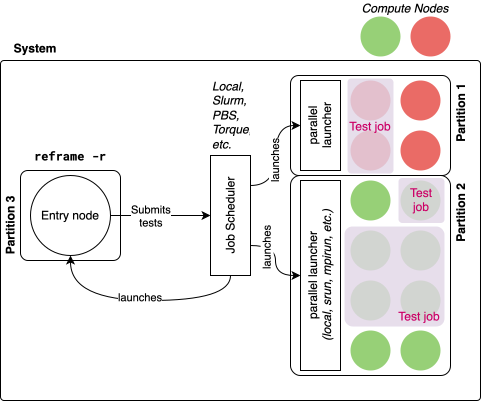
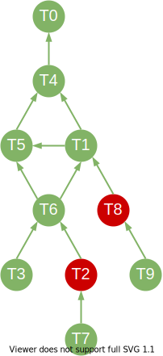

.. currentmodule:: reframe.core.pipeline.RegressionTest

================
ReFrame Tutorial
================

This tutorial will cover the basic concepts of ReFrame and will get you started with the framework.
For more specific topics, you should refer to ":doc:`howto`" as well as to the ":doc:`topics`" for an in-depth understanding of some of the framework's concepts.

.. contents:: Table of Contents
   :local:
   :depth: 3

Requirements
============

To run this tutorial you need ``docker`` for the local examples and ``docker compose`` for the examples emulating a Slurm cluster.
Note, that the Docker daemon must be running.

The tutorial container images provide already the latest ReFrame version installed.
For installing a stand-alone version of ReFrame, please refer to the ":doc:`started`" guide.

All tutorial examples are located under the ``reframe-examples`` directory inside the container's working directory.

Running the local examples
--------------------------

To run the local examples, launch the single-node tutorial container by binding mounting the examples:

.. code-block:: bash

   git clone https://github.com/reframe-hpc/reframe.git
   cd reframe
   docker build -t reframe-tut-singlenode:latest -f examples/tutorial/dockerfiles/singlenode.Dockerfile .
   docker run -h myhost -it --mount type=bind,source=$(pwd)/examples/,target=/home/user/reframe-examples reframe-tut-singlenode:latest /bin/bash

.. _multi-node-setup:

Running the multi-node examples
-------------------------------

To run the multi-node examples you need first to launch a Slurm pseudo cluster using the provided Docker compose file:

.. code-block:: bash

   git clone https://github.com/reframe-hpc/reframe.git
   cd reframe
   docker compose --project-directory=$(pwd) -f examples/tutorial/dockerfiles/slurm-cluster/docker-compose.yml up --abort-on-container-exit --exit-code-from frontend

Once the Docker compose stack is up, you execute the following from a different terminal window in order to "log in" in the frontend container:

.. code-block::

   docker exec -it $(docker ps -f name=frontend -q) /bin/bash

   # Inside the container
   cd reframe-examples/tutorial/

Once done, press Ctl-D in the frontend container and Ctl-C in the Docker compose console window.

.. note::

   All examples use the single-node container unless it is otherwise noted.

Modifying the examples
----------------------

In both cases, the tutorial examples are bind mounted in the container, so you could make changes directly from your host and these will be reflected inside the container and vice versa.

.. _writing-your-first-test:

Writing your first test
=======================

We will start with the `STREAM benchmark <https://www.cs.virginia.edu/stream/>`__.
This is a standard benchmark for measuring the DRAM bandwidth.
The tutorial container already contains a pre-compiled OpenMP version of the benchmark.
Our test will run the STREAM executable, validate the output and extract the figure of merits.
Here is the full ReFrame test:

.. literalinclude:: ../examples/tutorial/stream/stream_runonly.py
   :caption:
   :lines: 5-

ReFrame tests are specially decorated classes that ultimately derive from the :class:`~reframe.core.pipeline.RegressionTest` class.
Since we only want to run an executable in this first test, we derive from the :class:`~reframe.core.pipeline.RunOnlyRegressionTest` class, which essentially short-circuits the "compile" stage of the test.
The :func:`@simple_test <reframe.core.decorators.simple_test>` decorator registers a test class with the framework and makes it available for running.

Every ReFrame test must define the :attr:`valid_systems` and :attr:`valid_prog_environs` variables.
These describe the test's constraints and the framework will automatically filter out tests on systems and environments that do not match the constraints.
We will describe the system and environments abstractions later in this tutorial.
For this first example, the ``*`` symbol denotes that this test is valid for any system or environment.
A :class:`~reframe.core.pipeline.RunOnlyRegressionTest` must also define an :attr:`executable` to run.

A test must also define a validation function which is decorated with the :func:`@sanity_function<reframe.core.builtins.sanity_function>` decorator.
This function will be used to validate the test's output after it is finished.
ReFrame, by default, makes no assumption about whether a test is successful or not;
it is the test's responsibility to define its validation.
The framework provides a rich set of :doc:`utility functions <deferrable_functions_reference>` that help matching patterns and extract values from the test's output.
The :attr:`stdout` here refers to the name of the file where the test's standard output is stored.

Finally, a test may optionally define a set of *performance functions* that will extract *figures of merit* for the test.
These are simple test methods decorated with the :func:`@performance_function <reframe.core.builtins.performance_function>` decorator that return the figure of merit.
In this example, we extract the ``Copy`` and ``Triad`` bandwidth values and convert them to ``float``.
These figures of merit or *performance variables* as they are called in ReFrame's nomenclature have a special treatment:
they are logged in the test's performance logs and a reference value per system may also be assigned to them.
If that reference value is not met within some user-defined thresholds, the test will fail.

Running a test
==============

Running our test is very straightforward:

.. code-block:: bash
   :caption: Run in the single-node container.

   cd reframe-examples/tutorial
   reframe -c stream/stream_runonly.py -r

The :option:`-c` option defines the *check path* and it can be specified multiple times.
It specifies the locations, directories or files, where ReFrame will try to look for tests.
In this case, we simply pass the path to our test file.
The :option:`-r` option instructs ReFrame to run the selected tests:

.. code-block:: console

   [ReFrame Setup]
     version:           4.5.0-dev.1
     command:           '/usr/local/share/reframe/bin/reframe -c stream/stream_runonly.py -r'
     launched by:       user@myhost
     working directory: '/home/user'
     settings files:    '<builtin>'
     check search path: '/home/user/reframe-examples/tutorial/stream/stream_runonly.py'
     stage directory:   '/home/user/stage'
     output directory:  '/home/user/output'
     log files:         '/tmp/rfm-mzynqhye.log'

   [==========] Running 1 check(s)
   [==========] Started on Mon Nov 27 20:55:17 2023

   [----------] start processing checks
   [ RUN      ] stream_test /2e15a047 @generic:default+builtin
   [       OK ] (1/1) stream_test /2e15a047 @generic:default+builtin
   P: copy_bw: 19538.4 MB/s (r:0, l:None, u:None)
   P: triad_bw: 14883.4 MB/s (r:0, l:None, u:None)
   [----------] all spawned checks have finished

   [  PASSED  ] Ran 1/1 test case(s) from 1 check(s) (0 failure(s), 0 skipped, 0 aborted)
   [==========] Finished on Mon Nov 27 20:55:25 2023
   Log file(s) saved in '/tmp/rfm-mzynqhye.log'

The verbosity of the output can be increasing using the :option:`-v` option or decreased using the :option:`-q` option.
By default, a log file is generated in the system's temporary directory that contains detailed debug information.
The :ref:`logging` section article describes how logging can be configured in more detail.
Once a performance test finishes, its figures of merit are printed immediately using the ``P:`` prefix.
This can be suppressed by increasing the level at which this information is logged using the :envvar:`RFM_PERF_INFO_LEVEL` environment variable.

.. _run-reports-and-performance-logging:

Run reports and performance logging
-----------------------------------

Once a test session finishes, ReFrame stores the detailed session information in a database file located under ``$HOME/.reframe/reports``.
Past performance data can be retrieved from this database and compared with the current or another run.
We explain in detail the handling of the results database in section :ref:`inspecting-past-results`.

By default, the session information is also saved in a JSON report file under ``$HOME/.reframe/reports``.
The latest report is always symlinked by the ``latest.json`` name, unless the :option:`--report-file` option is given.

For performance tests, in particular, an additional CSV file is generated with all the relevant information.
These files are located by default under ``perflogs/<system>/<partition>/<testname>.log``.
In our example, this translates to ``perflogs/generic/default/stream_test.log``.
The information that is being logged is fully configurable and we will cover this in the :ref:`logging` section.

Finally, you can use also the :option:`--performance-report` option, which will print a summary of the results of the performance tests that have run in the current session and compare them (by default) to their last obtained performance.

.. code-block:: console

   ┍━━━━━━━━━━━━━┯━━━━━━━━━━━━━━━━━━━━━━━━━┯━━━━━━━━━━┯━━━━━━━━━┯━━━━━━━━━┯━━━━━━━━━┯━━━━━━━━━━━━━━━━┯━━━━━━━━━━┑
   │ name        │ sysenv                  │ pvar     │    pval │ punit   │ pdiff   │ job_nodelist   │ result   │
   ┝━━━━━━━━━━━━━┿━━━━━━━━━━━━━━━━━━━━━━━━━┿━━━━━━━━━━┿━━━━━━━━━┿━━━━━━━━━┿━━━━━━━━━┿━━━━━━━━━━━━━━━━┿━━━━━━━━━━┥
   │ stream_test │ generic:default+builtin │ copy_bw  │ 40292.1 │ MB/s    │ -0.04%  │ myhost         │ pass     │
   │ stream_test │ generic:default+builtin │ triad_bw │ 30564.7 │ MB/s    │ +0.12%  │ myhost         │ pass     │
   ┕━━━━━━━━━━━━━┷━━━━━━━━━━━━━━━━━━━━━━━━━┷━━━━━━━━━━┷━━━━━━━━━┷━━━━━━━━━┷━━━━━━━━━┷━━━━━━━━━━━━━━━━┷━━━━━━━━━━┙

Inspecting the test artifacts
-----------------------------

When ReFrame executes tests, it first copies over all of the test resources (if any) to a *stage directory*, from which it executes the test.
Upon successful execution, the test artifacts will be copied over to the *output directory* for archiving.
The default artifacts for every test are the generated test script as well as the test's standard output and standard error.
The default location for the stage and output directories are the ``./stage`` and ``./output`` directories.
These can be changed with the :option:`--stage` and :option:`--output` options or the more general :option:`--prefix` option.
The test artifacts of our first example can be found in the following location:

.. code-block:: bash
   :caption: Run in the single-node container.

   ls output/generic/default/builtin/stream_test/

.. code-block:: console

   rfm_job.err  rfm_job.out  rfm_job.sh

The ``rfm_job.sh`` is the actual test script that was generated and executed and, as you can see, it was pretty simple for this case:

.. code-block:: bash

   #!/bin/bash
   stream.x

Inspecting test failures
-------------------------

When a test fails, ReFrame will not move its artifacts to the output directory and will keep everything inside the stage directory.
For each failed test, a summary will be printed at the end that contains details about the reason of the failure and the location of the test's stage directory.
Here is an example failure that we induced artificially by changing the validation regular expression:

.. code-block:: console

   FAILURE INFO for stream_test (run: 1/1)
     * Description:
     * System partition: generic:default
     * Environment: builtin
     * Stage directory: /home/user/stage/generic/default/builtin/stream_test
     * Node list: myhost
     * Job type: local (id=19)
     * Dependencies (conceptual): []
     * Dependencies (actual): []
     * Maintainers: []
     * Failing phase: sanity
     * Rerun with '-n /2e15a047 -p builtin --system generic:default -r'
     * Reason: sanity error: pattern 'Slution Validates' not found in 'rfm_job.out'
   --- rfm_job.out (first 10 lines) ---
   -------------------------------------------------------------
   STREAM version $Revision: 5.10 $
   -------------------------------------------------------------
   This system uses 8 bytes per array element.
   -------------------------------------------------------------
   Array size = 100000000 (elements), Offset = 0 (elements)
   Memory per array = 762.9 MiB (= 0.7 GiB).
   Total memory required = 2288.8 MiB (= 2.2 GiB).
   Each kernel will be executed 10 times.
    The *best* time for each kernel (excluding the first iteration)
   --- rfm_job.out ---
   --- rfm_job.err (first 10 lines) ---
   --- rfm_job.err ---

Adding performance references
-----------------------------

For each performance variable defined in the test, we can add a reference value and set thresholds of acceptable variations.
Here is an example for our STREAM benchmark:

.. code-block:: python

    @rfm.simple_test
    class stream_test(rfm.RunOnlyRegressionTest):
        ...
        reference = {
            'generic:default': {
                'copy_bw': (23_890, -0.10, 0.30, 'MB/s'),
                'triad_bw': (17_064, -0.05, 0.50, 'MB/s'),
            }
        }

The :attr:`reference` test variable is a multi-level dictionary that defines the expected performance for each of the test's performance variables on all supported systems (here, ``generic``) and partitions (here, ``default``).
We explain more about this pre-defined system later in :ref:`systems-and-environments`.
It is not necessary that all performance variables and all systems have a reference.
If a reference value is not found, then the obtained performance will be logged, but no performance validation will be performed.
The reference value is essentially a three or four element tuple of the form: ``(target_perf, lower_thres, upper_thres, unit)``. The ``unit`` is optional as it is already defined in the :func:`@performance_function <reframe.core.builtins.performance_function>` definitions.
The lower and upper thresholds are deviations from the target reference expressed as fractional numbers.
In our example, we allow the ``copy_bw`` to be 10% lower than the target reference and no more than 30% higher.
Sometimes, especially in microbenchmarks, it is a good practice to set an upper threshold to denote the absolute maximum that cannot be exceeded.

Dry-run mode
------------

ReFrame provides also a dry-run mode for the tests, which can be enabled by passing :option:`--dry-run` as the action option (instead of :option:`-r` that runs the tests).
In this mode, ReFrame will generate the test script to be executed in the stage directory, but it will not run the test and will not perform the sanity and performance checking, neither will it attempt to extract any of the figures of merit.
Tests can also modify their behaviour if run in dry-run mode by calling the :meth:`is_dry_run` method.
Here is an example dry-run of our first version of the STREAM benchmark:

.. code-block:: bash
   :caption: Run in the single-node container.

   reframe -c stream/stream_runonly.py --dry-run

.. code-block:: console

   [==========] Running 1 check(s)
   [==========] Started on Wed Jan 10 22:45:49 2024+0000

   [----------] start processing checks
   [ DRY      ] stream_test /2e15a047 @generic:default+builtin
   [       OK ] (1/1) stream_test /2e15a047 @generic:default+builtin
   [----------] all spawned checks have finished

   [  PASSED  ] Ran 1/1 test case(s) from 1 check(s) (0 failure(s), 0 skipped, 0 aborted)
   [==========] Finished on Wed Jan 10 22:45:49 2024+0000

Note that the ``RUN`` message is replaced by ``DRY`` in the dry-run mode.
You can also check the generated test script in ``stage/generic/default/builtin/stream_test/rfm_job.sh``.

.. _systems-and-environments:

Systems and environments
========================

The first version of our STREAM test assumes that the environment it runs in already provides the benchmark executable.
This is totally fine if we want to run a set of run-only tests in a single environment, but it can become a maintenance burden if we want to run our test on different systems and environments.
In this section, we will introduce how we can define system and environment configurations in ReFrame and match them to tests.

For ReFrame, a *system* is an abstraction of an HPC system that is managed by a workload manager.
A system can comprise multiple *partitions*, which are collection of nodes with similar characteristics.
This is entirely up to the user on how to define the system partitions.

An *environment* is an abstraction of the environment where a test will run and it is a collection of environment variables, environment modules and compiler definitions.
The following picture depicts this architecture.

   :sub:`ReFrame's system architecture`

Tests are associated with systems and environments through their :attr:`valid_systems` and :attr:`valid_prog_environs` variables.

Let's limit the scope of our test by making it require a specific environment, since in order to run it we require an environment that provides STREAM.
We could do that simply by setting the :attr:`valid_prog_environs` as follows:

.. code-block:: python

   self.valid_prog_environs = ['+stream']

This tells ReFrame that this test is valid only for environments that define the ``stream`` feature (the ``+`` prefix requests a feature; we will explain the syntax later in this section).
If we try to run the test now, nothing will be run:

.. code-block:: bash
   :caption: Run in the single-node container.

   reframe -c stream/stream_runonly.py -r

.. code-block:: console

   [  PASSED  ] Ran 0/0 test case(s) from 0 check(s) (0 failure(s), 0 skipped, 0 aborted)

This happens because ReFrame by default defines a generic system and environment.
You may have noticed in our first run the ``@generic:default+builtin`` notation printed after test name.
This is the system partition name (``generic:default``) and the environment name (``builtin``) where the test is being run in.
The ``generic`` system and the ``builtin`` environment come as predefined in ReFrame.
They make the minimum possible assumptions:

- The ``generic`` system defines a single partition, named ``default`` which launches test jobs locally.
- The ``builtin`` environment assumes only that the ``cc`` compiler is available.

.. note::
   ReFrame will not complain if a compiler is not installed until your test tries to build something.

Let's define our own system and baseline environment in a ReFrame configuration file (``reframe-examples/tutorial/config/baseline.py``):

.. literalinclude:: ../examples/tutorial/config/baseline.py
   :caption:
   :lines: 5-

This configuration defines a system named ``tutorialsys`` with a single partition named ``default`` and an environment named ``baseline``.
Let's look at some key elements of the configuration:

* Each system, partition and environment require a unique name.
  The name must contain only alphanumeric characters, underscores or dashes.
* The :attr:`~config.systems.hostnames` option defines a set of hostname patterns which ReFrame will try to match against the current system's hostname.
  The first matching system will become the current system and ReFrame will load the corresponding configuration.
* The :attr:`~config.systems.partitions.scheduler` partition option defines the job scheduler backend to use on this partition.
  ReFrame supports many `job schedulers <config_reference.html#config.systems.partitions.scheduler>`__.
  The ``local`` scheduler that we use here is the simplest one and it practically spawns a process executing the generated test script.
* The :attr:`~config.systems.partitions.launcher` partition option defines the parallel launcher to use for spawning parallel programs.
  ReFrame supports all the major `parallel launchers <config_reference.html#config.systems.partitions.launcher>`__.
* The :attr:`~config.systems.partitions.environs` partition option is a list of environments to test on this partition.
  Their definitions are resolved in the :attr:`~config.environments` section.
* Every partition and environment can define a set of arbitrary features or key/value pairs in the :attr:`~config.environments.features` and :attr:`~config.environments.extras` options respectively.
  ReFrame will try to match system partitions and environments to a test based on the test's specification in :attr:`valid_systems` and :attr:`valid_prog_environs`.
  More specifically, a feature is requested with the ``+feat`` and excluded with ``-feat``, whereas an extra is requested with ``%key=val``.
  Multiple features or extras can be ANDed if specified in the same :attr:`valid_systems` or :attr:`valid_prog_environs` elements or otherwise ORed if specified in different elements:

  .. code-block:: python

     # Valid only for system partitions that define `feat0` and `key0=val` but not `feat1`
     valid_systems = [r'+feat0 -feat1 %key0=val']

     # Valid only for environments with either feature `A` or `B`
     valid_prog_environs = ['+A', '+B']

  Finally, a system or system partition name can be specified in :attr:`valid_systems` and similarly an environment name in :attr:`valid_prog_environs`, in which case the test is bound to those specific system partitions and/or environments.

There are many options that we can be define for systems, partitions and environments.
We will cover several of them as we go through the tutorial, but for the complete reference you should refer to :doc:`config_reference`.

.. note::

   ReFrame supports splitting the configuration in multiple files that can be loaded simultaneously.
   In fact the builtin configuration is always loaded, therefore the ``generic`` system as well as the ``builtin`` environment are always defined.
   Additionally, the builtin configuration provides a baseline logging configuration that should cover a wide range of use cases.
   See :ref:`managing-the-configuration` for more details.

Let's try running the constrained version of our STREAM test with the configuration file that we have just created:

.. code-block:: bash
   :caption: Run in the single-node container.

   reframe -C config/baseline.py -c stream/stream_runonly.py -r

.. code-block:: console

   [ReFrame Setup]
     version:           4.5.0-dev.1
     command:           '/usr/local/share/reframe/bin/reframe -C config/baseline.py -c stream/stream_runonly.py -r'
     launched by:       user@myhost
     working directory: '/home/user'
     settings files:    '<builtin>', 'reframe-examples/tutorial/config/baseline.py'
     check search path: '/home/user/reframe-examples/tutorial/stream/stream_runonly.py'
     stage directory:   '/home/user/stage'
     output directory:  '/home/user/output'
     log files:         '/tmp/rfm-dz8m5nfz.log'

   <...>

   [----------] start processing checks
   [ RUN      ] stream_test /2e15a047 @tutorialsys:default+baseline
   [       OK ] (1/1) stream_test /2e15a047 @tutorialsys:default+baseline
   P: copy_bw: 23135.4 MB/s (r:0, l:None, u:None)
   P: triad_bw: 16600.5 MB/s (r:0, l:None, u:None)
   [----------] all spawned checks have finished

   [  PASSED  ] Ran 1/1 test case(s) from 1 check(s) (0 failure(s), 0 skipped, 0 aborted)

The :option:`-C` option specifies the configuration file that ReFrame should load.
Note that ReFrame has loaded two configuration files: first the ``<builtin>`` and then the one we supplied.

Note also that the system and environment specification in the test run output is now ``@tutorialsys:default+baseline``.
ReFrame has determined that the ``default`` partition and the ``baseline`` environment satisfy the test constraints and thus it has run the test with this partition/environment combination.

.. _compiling-the-test-code:

Compiling the test code
=======================

You can also use ReFrame to compile the test's code.
To demonstrate this, we will write a different test version of the STREAM benchmark that will also compile the benchmark's source code.

.. literalinclude:: ../examples/tutorial/stream/stream_build_run.py
   :caption:
   :pyobject: stream_build_test

The key difference of this test is that it derives from the :class:`~reframe.core.pipeline.RegressionTest` instead of the :class:`~reframe.core.pipeline.RunOnlyRegressionTest` and it specifies how the test's code should be built.
ReFrame uses a *build system* abstraction for building source code.
Based on the build system backend used, it will emit the appropriate build instructions.
All the major build systems are supported as well as the `EasyBuild <https://easybuild.io/>`__ build automation tool and the `Spack <https://spack.io/>`__ package manager.

In this case, we use the :class:`~reframe.core.build_systems.SingleSource` build system, which is suitable for compiling a single source file.
The :attr:`sourcepath` variable is used to specify the source file to compile.
The path is relative to the test's *resource directory*.

Test resources
--------------

The resource directory is a directory associated to the test where its static resources are stored.
During execution the contents of this directory will be copied to the test's stage directory and the test will execute from that directory.
Here is the directory structure:

.. code::

   stream
   ├── stream_build_run.py
   └── src
       └── stream.c

By default, the test's resources directory is named ``src/`` and is located next to the test's file.
It can be set to a different location inside the test using the :attr:`sourcesdir` variable.

Pipeline hooks
--------------

The :func:`prepare_build` test method in our example is a *pipeline hook* that will execute just before the compilation phase and will set the compilation flags based on the current environment.
Pipeline hooks are a fundamental tool in ReFrame for customizing the test execution.
Let's explain the concept in more detail.

When executed, every test in ReFrame goes through the following stages:
(a) *setup*,
(b) *compile*,
(c) *run*,
(d) *sanity*,
(e) *performance* and
(f) *cleanup*.
This is the *test pipeline* and a test can assign arbitrary functions to run before or after any of these stages using the :func:`@run_before <reframe.core.builtins.run_before>` and :func:`@run_after <reframe.core.builtins.run_after>` decorators.
There is also a pseudo-stage called *init* that denotes the instantiation/initialization of the test.
The :doc:`pipeline` page describes in detail every stage, but the most important stages in terms of the test's lifetime are the "init" and the "setup" stages.

The "init" stage is where the test object is actually instantiated and for this reason you cannot define a pre-init hooks.
At this stage, the system partition and the environment where the test will run are not yet determined, therefore the :attr:`current_partition` and :attr:`current_environ` variables are not set.
This happens during the "setup" stage, where also all the test's dependencies (if any) have been executed and their resources can be safely accessed (we will cover test dependencies later in this tutorial).
Technically, all pipeline hooks could be attached to those two stages, but it's a good programming practice to attach them close to the phase that they manipulate as it makes clearer their intent.

For a detailed description of the pipeline hook API, you may refer to the :ref:`pipeline-hooks` guide.

Disabling pipeline hooks
^^^^^^^^^^^^^^^^^^^^^^^^

.. versionadded:: 3.2

Any pipeline hook can be disabled from the command line using the :option:`--disable-hook` command line option.
This can be useful to temporarily disable a functionality of the test, e.g., a workaround.

You can view the list of all the hooks of a test using the :option:`--describe` option:

.. code-block:: bash
   :caption: Run in the single-node container.

   reframe -C config/baseline_environs.py -c stream/stream_variables.py --describe | jq .[].pipeline_hooks

.. code-block:: json

    {
      "post_setup": [
        "set_executable"
      ],
      "pre_run": [
        "set_num_threads"
      ]
    }

We could disable the :obj:`set_num_threads` hook by passing ``--disable-hook=set_num_threads``:

.. code-block:: bash
   :caption: Run in the single-node container.

   reframe -C config/baseline_environs.py -c stream/stream_variables.py --disable-hook=set_num_threads --describe | jq .[].pipeline_hooks

.. code-block:: json

    {
      "post_setup": [
        "set_executable"
      ]
    }

The :option:`--disable-hook` option can be passed multiple times to disable multiple hooks at the same time.

Environment features and extras
-------------------------------

We have shown already in the first example the use of *features* in system partition and environment definitions in the configuration file.
These can be used in the :attr:`valid_systems` and :attr:`valid_prog_environs` specifications to help ReFrame pick the right system/environment combinations to run the test.

In addition to features, the configuration of a system partition or environment can include extra properties that can be accessed from the test and also be used as constraints in the :attr:`valid_systems` and :attr:`valid_prog_environs`.
The following shows the use of extras in the ``baseline_environs.py`` file for defining the compiler flag that enables OpenMP compilation:

.. literalinclude:: ../examples/tutorial/config/baseline_environs.py
   :caption:
   :lines: 23-42

The :attr:`~config.environments.extras` is a simple key/value dictionary, where the values can have any type and are accessible in the test through the :attr:`current_environ` property as shown in the example above.

Execution policies
------------------

Having explained the key concepts behind compiled tests as well as the test pipeline, it's time to run our updated test.
However, there is still a small tweak that we need to introduce.

ReFrame executes tests concurrently.
More precisely, the "compile" and "run" stages of a test execute asynchronously and ReFrame will schedule other tests for running.
Once any of those stages finishes, it will resume execution of the test.
However, this is problematic for our local benchmarks since ReFrame would schedule the GNU-based and the Clang-based tests concurrently and therefore the tests would exhibit lower performance.
For this reason, we will force ReFrame to execute the tests serially with ``--exec-policy=serial``:

.. code-block:: bash
   :caption: Run in the single-node container.

   reframe -C config/baseline_environs.py -c stream/stream_build_run.py --exec-policy=serial -r

.. code-block:: console

   [----------] start processing checks
   [ RUN      ] stream_build_test /6c084d40 @tutorialsys:default+gnu-11.4.0
   [       OK ] (1/2) stream_build_test /6c084d40 @tutorialsys:default+gnu-11.4.0
   P: copy_bw: 22273.9 MB/s (r:0, l:None, u:None)
   P: triad_bw: 16492.8 MB/s (r:0, l:None, u:None)
   [ RUN      ] stream_build_test /6c084d40 @tutorialsys:default+clang-14.0.0
   [       OK ] (2/2) stream_build_test /6c084d40 @tutorialsys:default+clang-14.0.0
   P: copy_bw: 22747.9 MB/s (r:0, l:None, u:None)
   P: triad_bw: 16541.7 MB/s (r:0, l:None, u:None)
   [----------] all spawned checks have finished

   [  PASSED  ] Ran 2/2 test case(s) from 1 check(s) (0 failure(s), 0 skipped, 0 aborted)

.. _test-fixtures:

Test fixtures
=============

Often a test needs some preparation to be done before it runs, but this preparation may need to be run only once per system partition or environment and not every time the test is run.
A typical example is when we want to build the code of the test once per environment and reuse the executable in multiple different tests.
We can achieve this in ReFrame using *test fixtures*.
Test fixtures are normal ReFrame tests as any other, but they have a scope associated with them and can be fully accessed by the tests that define them.
When test ``A`` is a fixture of test ``B``, then ``A`` will run before ``B`` and ``B`` will have access not only to anything that ``A`` produced, but also to every of its attributes.

Let's see fixtures in practice by separating our compile-and-run STREAM version into two tests:
a compile-only test that simply builds the benchmark and a run-only version that uses the former as a fixture.

.. literalinclude:: ../examples/tutorial/stream/stream_fixtures.py
   :caption:
   :lines: 5-

A test fixture is defined with the :func:`~reframe.core.builtins.fixture` builtin:

.. literalinclude:: ../examples/tutorial/stream/stream_fixtures.py
   :caption:
   :lines: 25

The first argument is a standard ReFrame test which encompasses the fixture logic and will be executed before the current test.
Note that there is no need to decorate a fixture with :func:`@simple_test <reframe.core.decorators.simple_test>` as it will run anyway as part of the test that is using it.
You could still decorate it, though, if you would like to run it independently.

Each fixture is associated with a scope, which will determine when it will run.
There are the following scopes available:

- ``session``: The fixture will run once for the whole run session.
- ``partition``: The fixture will run once per system partition.
- ``environment``: The fixture will run once per system partition and environment combination.
- ``test``: The fixture will run every time that the calling test is run.

Finally, the :func:`~reframe.core.builtins.fixture` builtin returns a handle which can be used to access the target test once it has finished.
This can only be done after the "setup" stage of the current test.
Any attribute of the target test can be accessed through the fixture handle and, in our example, we use the target's test :attr:`stagedir` to construct the final executable.

.. note::

   Compile-only tests do not require a validation check, since the test will fail anyway if the compilation fails.
   But if one is provided, it will be used.

Before running the new test, let's try to list it first:

.. code-block:: bash
   :caption: Run in the single-node container.

   reframe -C config/baseline_environs.py -c stream/stream_fixtures.py -l

.. code-block:: console

   [List of matched checks]
   - stream_test /2e15a047
       ^build_stream ~tutorialsys:default+gnu-11.4.0 'stream_binary /2ed36672
       ^build_stream ~tutorialsys:default+clang-14.0.0 'stream_binary /d19d2d86
   Found 1 check(s)

We will describe in more detail the listing output later in this tutorial, but at the moment it is enough to show that it gives us all the essential information about the test fixtures: their scope and the test variable that they are bound to.
Note also that due to the ``environment`` scope, a separate fixture is created for every environment that will be tested.

We can now run the benchmarks in parallel to demonstrate that the execution order of the fixtures is respected:

.. code-block:: bash
   :caption: Run in the single-node container.

   reframe -C config/baseline_environs.py -c stream/stream_fixtures.py -r

.. code-block:: console

   [----------] start processing checks
   [ RUN      ] build_stream ~tutorialsys:default+gnu-11.4.0 /2ed36672 @tutorialsys:default+gnu-11.4.0
   [ RUN      ] build_stream ~tutorialsys:default+clang-14.0.0 /d19d2d86 @tutorialsys:default+clang-14.0.0
   [       OK ] (1/4) build_stream ~tutorialsys:default+gnu-11.4.0 /2ed36672 @tutorialsys:default+gnu-11.4.0
   [       OK ] (2/4) build_stream ~tutorialsys:default+clang-14.0.0 /d19d2d86 @tutorialsys:default+clang-14.0.0
   [ RUN      ] stream_test /2e15a047 @tutorialsys:default+gnu-11.4.0
   [ RUN      ] stream_test /2e15a047 @tutorialsys:default+clang-14.0.0
   [       OK ] (3/4) stream_test /2e15a047 @tutorialsys:default+gnu-11.4.0
   P: copy_bw: 8182.4 MB/s (r:0, l:None, u:None)
   P: triad_bw: 9174.3 MB/s (r:0, l:None, u:None)
   [       OK ] (4/4) stream_test /2e15a047 @tutorialsys:default+clang-14.0.0
   P: copy_bw: 7974.4 MB/s (r:0, l:None, u:None)
   P: triad_bw: 18494.1 MB/s (r:0, l:None, u:None)
   [----------] all spawned checks have finished

   [  PASSED  ] Ran 4/4 test case(s) from 3 check(s) (0 failure(s), 0 skipped, 0 aborted)

Note that the two STREAM tests are still independent to each other, so they run in parallel and thus the lower performance.

We will cover more aspects of the fixtures in the following sections, but you are advised to read the API docs of :func:`~reframe.core.builtins.fixture` for a detailed description of all their capabilities.

Test variables
==============

Tests can define *variables* that can be set from the command line.
These are essentially knobs that allow you to change the test's behaviour on-the-fly.
All the test's pre-defined attributes that we have seen so far are defined as variables.
A test variable is defined with the :func:`~reframe.core.builtins.variable` builtin.
Let's augment our STREAM example by adding a variable to control the number of threads to use.

.. literalinclude:: ../examples/tutorial/stream/stream_variables.py
   :caption:
   :lines: 5-

We define a new test variable with the following line:

.. literalinclude:: ../examples/tutorial/stream/stream_variables.py
   :caption:
   :lines: 26

Variables are typed and any attempt to assign them a value of different type will cause a :class:`TypeError`.
Variables can also have a default value as in this case, which is set to ``0``.
If a variable is not given a value is considered undefined.
Any attempt to read an undefined variable will cause an error.
It is not necessary for a variable to be assigned a value along with its declaration;
this can happen anytime before it is accessed.
Variables are also inherited, that's why we can set the standard variables of a ReFrame test, such as the :attr:`valid_systems`, :attr:`valid_prog_environs` etc., in our subclasses.

Variables are accessed inside the test as normal class attributes.
In our example, we use the :attr:`num_threads` variable to set the ``OMP_NUM_THREADS`` environment variable accordingly.

.. literalinclude:: ../examples/tutorial/stream/stream_variables.py
   :caption:
   :lines: 32-35

Variables can be set from the command-line using the :option:`-S` option as ``-S var=value``:

.. code-block:: bash
   :caption: Run in the single-node container.

   reframe -C config/baseline_environs.py -c stream/stream_variables.py -S num_threads=2 -r

We will not list the command output here, but you could verify that the variable was set by inspecting the generated run script:

.. code-block:: bash
   :caption: Run in the single-node container.

   cat output/tutorialsys/default/clang-14.0.0/stream_test/rfm_job.sh

.. code-block:: bash

   #!/bin/bash
   export OMP_NUM_THREADS=2
   /home/user/reframe-examples/tutorial/stage/tutorialsys/default/clang-14.0.0/build_stream_d19d2d86/stream.x

Another thing to notice in the output is the following warning:

.. code-block:: console

   WARNING: test 'build_stream': the following variables were not set: 'num_threads'

When setting a variable as ``-S var=value``, ReFrame will try to set it on all the selected tests, including any fixtures.
If the requested variable is not part of the test, the above warning will be issued.
You can scope the variable assignment in the command line by prefixing the variable name with test's name as follows: ``-S stream_test.num_threads=2``.
In this case, the :attr:`num_threads` variable will be set only in the :class:`stream_test` test.

Setting variables in fixtures
-----------------------------

As we have already mentioned, fixtures are normal ReFrame tests, so they can also define their own variables.
In our example, it makes sense to define a variable in the :class:`build_stream` fixture to control the size of the arrays involved in the computation.
Here is the updated :class:`build_stream` fixture:

.. literalinclude:: ../examples/tutorial/stream/stream_variables_fixtures.py
   :caption:
   :pyobject: build_stream

.. note::
   The :attr:`~reframe.core.buildsystems.BuildSystem.cppflags` attribute of build system refers to the preprocessor flags and not the C++ flags, which are :attr:`~reframe.core.buildsystems.BuildSystem.cxxflags` instead.

We can set the :attr:`array_size` variable inside the build fixture of our final test through the fixture handle (remember that the fixture handle name is printed in the test listing).
Here is an example:

.. code-block:: bash
   :caption: Run in the single-node container.

   reframe -C config/baseline_environs.py -c stream/stream_variables_fixtures.py --exec-policy=serial -S stream_test.stream_binary.array_size=50000000 -r

If you check the generated build script, you will notice the emitted ``-D`` flag:

.. code-block:: bash
   :caption: Run in the single-node container.

   cat output/tutorialsys/default/clang-14.0.0/build_stream_d19d2d86/rfm_build.sh

.. code-block:: bash

   #!/bin/bash

   _onerror()
   {
       exitcode=$?
       echo "-reframe: command \`$BASH_COMMAND' failed (exit code: $exitcode)"
       exit $exitcode
   }

   trap _onerror ERR

   clang -DARRAY_SIZE=50000000 -O3 -fopenmp stream.c -o ./stream.x

Test parameterization
=====================

It is often the case that we want to test different variants of the same test, such as varying the number of tasks in order to perform a scaling analysis on a parallel program.
ReFrame offers a powerful multi-dimensional test parameterization mechanism that automatically generate variants of your tests with different parameter values.
Let's elaborate on this using the STREAM example.
Suppose we want to scale over the number of threads and also try different thread placements.
Here is the updated parameterized :class:`stream_test`:

.. literalinclude:: ../examples/tutorial/stream/stream_parameters.py
   :caption:
   :pyobject: stream_test

Parameters are defined in ReFrame using the :func:`~reframe.core.builtins.parameter` builtin.
This builtin takes simply a list of values for the parameter being defined.
Each parameter is independent and defines a new dimension in the parameterization space.
Parameters can also be inherit and filtered from base classes.
For each point in the final parameterization space, ReFrame will instantiate a different test.
In our example, we expect 12 :class:`stream_test` variants.
Given that we have two valid programming environments and a build fixture with an environment scope, we expect ReFrame to generate and run 26 tests in total (including the fixtures):

.. code-block:: bash
   :caption: Run in the single-node container.

   reframe -C config/baseline_environs.py -c stream/stream_parameters.py --exec-policy=serial -r

.. code-block:: console

   [----------] start processing checks
   [ RUN      ] build_stream ~tutorialsys:default+gnu-11.4.0 /2ed36672 @tutorialsys:default+gnu-11.4.0
   [       OK ] ( 1/26) build_stream ~tutorialsys:default+gnu-11.4.0 /2ed36672 @tutorialsys:default+gnu-11.4.0
   [ RUN      ] build_stream ~tutorialsys:default+clang-14.0.0 /d19d2d86 @tutorialsys:default+clang-14.0.0
   [       OK ] ( 2/26) build_stream ~tutorialsys:default+clang-14.0.0 /d19d2d86 @tutorialsys:default+clang-14.0.0
   [ RUN      ] stream_test %num_threads=8 %thread_placement=spread /3c8af82c @tutorialsys:default+gnu-11.4.0
   [       OK ] ( 3/26) stream_test %num_threads=8 %thread_placement=spread /3c8af82c @tutorialsys:default+gnu-11.4.0
   P: copy_bw: 24020.6 MB/s (r:0, l:None, u:None)
   P: triad_bw: 15453.1 MB/s (r:0, l:None, u:None)
   <...omitted...>
   [----------] all spawned checks have finished

   [  PASSED  ] Ran 26/26 test case(s) from 14 check(s) (0 failure(s), 0 skipped, 0 aborted)

Note how the fixture mechanism of ReFrame prevents the recompilation of the STREAM's source code in every test variant:
The source code is only compiled once per toolchain.

Parameterizing existing test variables
--------------------------------------

We can also parameterize a test on any of its existing variables directly from the command line using the :option:`-P` option.
For example, we could parameterize the STREAM version in ``stream_variables_fixtures.py`` on :attr:`num_threads` as follows:

.. code-block:: bash
   :caption: Run in the single-node container.

   reframe -C config/baseline_environs.py -c stream/stream_variables_fixtures.py -P num_threads=1,2,4,8 --exec-policy=serial -r

Parameterizing a fixture
------------------------

Fixtures can also be parameterized.
In this case the tests that use them are also parameterized implicitly.
Let's see an example, by parameterizing the build fixture of the STREAM benchmark by adding parameter about the element type (``float`` or ``double``):

.. literalinclude:: ../examples/tutorial/stream/stream_parameters_fixtures.py
   :caption:
   :pyobject: build_stream

As expected, parameters in fixtures are no different than parameters in normal test.
The difference is when you try to list/run the final :class:`stream_test`, where now we have twice as many variants:

.. code-block:: bash
   :caption: Run in the single-node container.

   reframe -C config/baseline_environs.py -c stream/stream_parameters_fixtures.py -l

.. code-block:: console

   - stream_test %num_threads=8 %thread_placement=spread %stream_binary.elem_type=double /ffbd00f1
       ^build_stream %elem_type=double ~tutorialsys:default+gnu-11.4.0 'stream_binary /099a4f75
       ^build_stream %elem_type=double ~tutorialsys:default+clang-14.0.0 'stream_binary /7bd4e3bb
       <...omitted...>
   - stream_test %num_threads=1 %thread_placement=close %stream_binary.elem_type=float /bc1f32c2
       ^build_stream %elem_type=float ~tutorialsys:default+gnu-11.4.0 'stream_binary /2ed36672
       ^build_stream %elem_type=float ~tutorialsys:default+clang-14.0.0 'stream_binary /d19d2d86
   Found 24 check(s)

Note, that the test variant name now contains the parameter coming from the fixture.
In total, 52 test cases (24 tests x 2 environments + 2 fixtures x 2 environments) will be run from this simple combination of parameterized tests!

Pruning the parameterization space
----------------------------------

Sometimes parameters are not independent of each other, as a result some parameter combination may be invalid for the test at hand.
There are two ways to overcome this:

a. Skip the test if the parameter combination is invalid.
b. Use *parameter packs*.

Let's see those two methods in practice with a fictitious test.
The first method define two parameters and uses the :func:`skip_if` test method to skip the test if the two parameters have the same value.
The test will be skipped just after it is initialized and the message supplied will be printed as a warning.

.. literalinclude:: ../examples/tutorial/dummy/params.py
   :caption:
   :pyobject: echo_test_v0

The second method uses a single parameter that packs the valid combinations of the ``x`` and ``y`` parameters.
Note that we also use the optional ``fmt`` argument to provide a more compact formatting for the combined parameter.
Instead of the skip hook, we simply unpack the combined parameters in the :func:`set_executable_opts` hook.

.. literalinclude:: ../examples/tutorial/dummy/params.py
   :caption:
   :pyobject: echo_test_v1

The advantage of using parameter packs instead of skipping explicitly the test is that we do not get a warning message and the test is more compact.

.. note::

   In these tests, we also introduced two more utility functions used in sanity checking, the :func:`~reframe.utility.sanity.and_`, which performs a logical AND of its arguments, and the :func:`~reframe.utility.sanity.assert_eq`, which asserts that its both arguments are equal.
   We could have simply written ``return x == self.x and y == self.y`` and the test would still validate, but the utility functions provide more context in case of validation errors.
   In fact, we could also provide a custom message to be printed in case of errors, which can be helpful in real case scenarios.

Mastering sanity and performance checking
=========================================

The sanity and performance checking in our STREAM example are simple, but they do represent the most commonly used patterns.
There are cases, however, where we would need a more elaborate sanity checking or extracting the performance measure would not be so straightforward.
The sanity and performance functions (see :func:`@sanity_function <reframe.core.builtins.sanity_function>` and :func:`@performance_function <reframe.core.builtins.performance_function>`) allow us to write arbitrary code to perform the task at hand, but there are a couple of things to keep in mind:

- Both sanity and performance functions execute from the test's stage directory.
  All relative paths will be resolved against it.
- A sanity function must return a boolean or raise a :class:`~reframe.core.exceptions.SanityError` with a  message.
  Raising a :class:`~reframe.core.exceptions.SanityError` is the preferred way to denote sanity error and this is exactly what the utility :doc:`sanity functions <deferrable_functions_reference>` do.
- A performance function must return the value of the extracted figure of merit or raise a :class:`~reframe.core.exceptions.SanityError` in case this is not possible.

Understanding the builtin sanity functions
------------------------------------------

All the utility functions provided by the framework for sanity checking and the :attr:`stdout` and :attr:`stderr` test attributes are lazily evaluated:
when you call these functions or access these attributes, you are not getting their final value, but instead a special object, named *deferred expression*, which is similar in concept to a *future* or *promise*.
You can include these objects in arbitrary expressions and a new deferred expression will be produced.
In fact, both sanity and performance functions can return a deferred expression, which would return a boolean when evaluated.
And this is what our STREAM sanity and performance functions actually return.

A deferred expression can be evaluated explicitly by calling its :func:`evaluate` method or pass it to the :func:`~reframe.core.utility.sanity.evaluate` utility function.
For example, to retrieve the actual :attr:`stdout` value, we should do ``self.stdout.evaluate()`` or ``sn.evaluate(self.stdout)``.
Deferred expressions are evaluated implicitly in the following situations:

1. When trying to iterate over them in ``for`` loop.
2. When trying to include them in an ``if`` expression.
3. When calling :func:`str` on them.

The ":doc:`deferrables`"  page contains details about the underlying mechanism of deferred expressions and gives also concrete examples.

.. tip::

   If you are in doubt about the evaluation of a deferred expression, always call :func:`evaluate()` on it.
   At the point where the test's :func:`@sanity_function <reframe.core.builtins.sanity_function>`  is called, all test's attributes are safe to access.

.. note::

   Why deferred expressions?

   In ReFrame versions prior to 3.7, the sanity and performance checking were defined using the :attr:`sanity_patterns` :attr:`perf_patterns` expressions at test's initialization.
   In this case, a lazily evaluated expression was necessary since the test has not yet been executed.
   The use of :attr:`sanity_patterns` and :attr:`perf_patterns` attributes is still valid today, but it may be deprecated in the future.

Interacting with workload managers
==================================

ReFrame integrates with many HPC workload managers (batch job schedulers), including Slurm, PBS Pro, Torque and others.
The complete list of scheduler backend can be found `here <config_reference.html#config.systems.partitions.scheduler>`__.
Tests in ReFrame are scheduler-agnostic in that they do not need to include any scheduler-specific information.
Instead, schedulers are associated to system partitions.
Each system partition in the configuration file defines the scheduler backend to use along with any scheduler-specific options that are needed to grant access to the desired nodes.

HPC systems also come with parallel program launchers which are responsible for launching parallel programs onto multiple nodes.
ReFrame supports all major `parallel launchers <config_reference.html#config.systems.partitions.launcher>`__ and allows users to easily define their own custom ones.
Similarly to the batch job schedulers, each system partition is associated to a parallel launcher, which will be used to launch the test's :attr:`executable`.

In the following, we define a configuration for the Slurm-based pseudo cluster of the tutorial.
We will focus only on the new system configuration as the rest of the configuration remains the same.

.. literalinclude:: ../examples/tutorial/config/cluster.py
   :caption:
   :lines: 22-43

We define two partitions, one named ``login`` where we are running tests locally (emulating the login nodes of an HPC cluster) and another one named ``compute`` (emulating the compute nodes of an HPC cluster), where we will be submitting test jobs with Slurm and ``srun``.
We use the ``squeue`` scheduler backend, because our Slurm installation does not have job accounting, so we instruct ReFrame to use the ``squeue`` command for querying the job state.
If your Slurm installation has job accounting enabled, you should prefer the ``slurm`` backend, which uses the ``sacct`` for retrieving the job state, which is more reliable.

Another important parameter is :attr:`~config.systems.partitions.access`, which denotes the job scheduler options needed to access the desired nodes.
In our example, it is redundant to define it as the ``all`` partition is the default, but in most real cases, you will have to define the :attr:`~config.systems.partitions.access` options.

Let's run our STREAM example with the new configuration:

.. code-block:: bash
   :caption: Run with the Docker compose setup.

   reframe --prefix=/scratch/rfm-stage/ -C config/cluster.py -c stream/stream_variables_fixtures.py -r

.. code-block:: console

   [----------] start processing checks
   [ RUN      ] build_stream ~pseudo-cluster:login+gnu /c5e9e6a0 @pseudo-cluster:login+gnu
   [ RUN      ] build_stream ~pseudo-cluster:login+clang /d0622327 @pseudo-cluster:login+clang
   [ RUN      ] build_stream ~pseudo-cluster:compute+gnu /3f5dbfe2 @pseudo-cluster:compute+gnu
   [ RUN      ] build_stream ~pseudo-cluster:compute+clang /78c4801e @pseudo-cluster:compute+clang
   [       OK ] (1/8) build_stream ~pseudo-cluster:login+gnu /c5e9e6a0 @pseudo-cluster:login+gnu
   [       OK ] (2/8) build_stream ~pseudo-cluster:login+clang /d0622327 @pseudo-cluster:login+clang
   [       OK ] (3/8) build_stream ~pseudo-cluster:compute+gnu /3f5dbfe2 @pseudo-cluster:compute+gnu
   [       OK ] (4/8) build_stream ~pseudo-cluster:compute+clang /78c4801e @pseudo-cluster:compute+clang
   [ RUN      ] stream_test /2e15a047 @pseudo-cluster:login+gnu
   [ RUN      ] stream_test /2e15a047 @pseudo-cluster:login+clang
   [ RUN      ] stream_test /2e15a047 @pseudo-cluster:compute+gnu
   [ RUN      ] stream_test /2e15a047 @pseudo-cluster:compute+clang
   [       OK ] (5/8) stream_test /2e15a047 @pseudo-cluster:login+gnu
   P: copy_bw: 9062.2 MB/s (r:0, l:None, u:None)
   P: triad_bw: 8344.9 MB/s (r:0, l:None, u:None)
   [       OK ] (6/8) stream_test /2e15a047 @pseudo-cluster:login+clang
   P: copy_bw: 25823.0 MB/s (r:0, l:None, u:None)
   P: triad_bw: 12732.2 MB/s (r:0, l:None, u:None)
   [       OK ] (7/8) stream_test /2e15a047 @pseudo-cluster:compute+clang
   P: copy_bw: 11215.5 MB/s (r:0, l:None, u:None)
   P: triad_bw: 7960.5 MB/s (r:0, l:None, u:None)
   [       OK ] (8/8) stream_test /2e15a047 @pseudo-cluster:compute+gnu
   P: copy_bw: 10300.7 MB/s (r:0, l:None, u:None)
   P: triad_bw: 9647.1 MB/s (r:0, l:None, u:None)
   [----------] all spawned checks have finished

   [  PASSED  ] Ran 8/8 test case(s) from 5 check(s) (0 failure(s), 0 skipped, 0 aborted)

Note how the test runs every each partition and environment combination.
For the ``login`` partition the generated script is the same as for the local execution, whereas for the ``compute`` partition ReFrame generates a job script, which submits with ``sbatch``:

.. code-block:: bash
   :caption: Run with the Docker compose setup.

   cat /scratch/rfm-stage/output/pseudo-cluster/compute/gnu/stream_test/rfm_job.sh

.. code-block:: bash

   #!/bin/bash
   #SBATCH --job-name="rfm_stream_test"
   #SBATCH --ntasks=1
   #SBATCH --output=rfm_job.out
   #SBATCH --error=rfm_job.err
   #SBATCH -p all
   srun /scratch/rfm-stage/stage/pseudo-cluster/compute/gnu/build_stream_3f5dbfe2/stream.x

You may have noticed that we use the :option:`--prefix` option when running ReFrame this time.
This option changes the prefix of the stage and output directory.
All scheduler backends, except ``ssh``, require the test's stage directory to be shared across the local and remote nodes, therefore set it to point under the shared ``/scratch`` volume.

.. note::
   For running the Slurm-based examples, make sure to follow the instructions in :ref:`multi-node-setup` for bringing up and accessing this cluster.

Selecting specific partitions or environments to run
----------------------------------------------------

ReFrame can generated many test cases if have many partitions and environments and you will most likely need to scope down the test space.
You could use the :option:`--system` and :option:`-p` options to restrict a test to a single partition and/or a single environment.
To run only the GCC tests on the compute partition you could do the following:

.. code-block:: bash
   :caption: Run with the Docker compose setup.

   reframe --prefix=/scratch/rfm-stage/ -C config/cluster.py -c stream/stream_variables_fixtures.py \
           --system=pseudo-cluster:compute -p gnu -r

Compiling remotely
------------------

By default, ReFrame compiles the test's source code locally on the node that it runs.
This may be problematic in cases that cross-compilation is not possible and the test's code needs to be compiled on the remote nodes.
This can be achieved by settings the test's :attr:`build_locally` attribute to :obj:`False` with ``-S build_locally=0``.
In this case, ReFrame will generate a job script also for the compilation job and submit it for execution.

Passing additional scheduler options
------------------------------------

There are two ways to pass additional options to the backend scheduler: either by modifying the :attr:`~reframe.core.schedulers.Job` instance associated to the test or by defining an extra resource at the partition configuration requesting this from the test.
Let's see both methods:

Modifying the test job's options
^^^^^^^^^^^^^^^^^^^^^^^^^^^^^^^^

This method is quite straightforward:
you need simply to define a pre-run hook and set the ``self.job.options``.
For example, to pass the ``--mem`` Slurm option to the job submitted by the test, you could do the following:

.. code-block:: python

    @run_before('run')
    def set_mem_constraint(self):
        self.job.options = ['--mem=1000']

The advantage of this method is its simplicity, but it injects system-specific information to the test tying it to the system scheduler.
You could make the test more robust, however, by restricting it to system partitions with Slurm by setting the :attr:`valid_systems` accordingly:

.. code-block:: python

   valid_systems = [r'%scheduler=slurm', r'%scheduler=squeue']

Defining extra scheduler resources
^^^^^^^^^^^^^^^^^^^^^^^^^^^^^^^^^^

This method comprises two steps.
First, we need to define a `resource <config_reference.html#config.systems.partitions.resources>`__ in the partition configuration:

.. literalinclude:: ../examples/tutorial/config/cluster_resources.py
   :caption:
   :lines: 41-46

Each resource has a name and a list of scheduler options that will be emitted in the job script when this resource will be requested by the test.
The scheduler options specification can contain placeholders that will be filled from the test.

Now we can use this resource very in the test by settings its :attr:`extra_resources`:

.. code-block:: python

    extra_resources = {
        'memory': {'size': '1000'}
    }

The advantage of this method is that it is completely scheduler-agnostic.
If the system partition where the test is running on does not define a resource, the request will be ignored.

Both methods of setting addition job options are valid and you may use whichever of the two fits best your use case.

Modifying the launch command
----------------------------

Sometimes it's useful to modify the launch command itself by prepending another program, such as debugger or profiler.
You can achieve this by setting the :attr:`~reframe.core.launchers.JobLauncher.modifier` and :attr:`~reframe.core.launchers.JobLauncher.modifier_options` of the test job's launcher:

.. code-block:: python

    @run_before('run')
    def run_with_gdb(self):
        self.job.launcher.modifier = 'gdb'
        self.job.launcher.modifier_options = ['-batch', '-ex run', '-ex bt', '--args']

Replacing the launch command
----------------------------

Sometimes you may want to replace completely the launcher associated with the partition that the test will run.
You can do that with the following hook:

.. code-block:: python

   from reframe.core.backends import getlauncher
   ...

   @run_before('run')
   def replace_launcher(self):
       self.job.launcher = getlauncher('local')()

The :func:`~reframe.core.backends.getlauncher` utility function returns the type the implements the launcher with the given name.
The supported launcher names are those registered with the framework, i.e., all the names listed
`here <config_reference.html#systems.partitions.launcher>`__ as well as any :ref:`user-registered <custom-launchers>` launcher.
Once we have the launcher type, we instantiate it and replace the job's launcher.

Multiple job steps
------------------

A job step is a command launched with the parallel launcher.
ReFrame will only launch the :attr:`executable` as a job step.
You can launch multiple job steps by leveraging the :attr:`prerun_cmds` or :attr:`postrun_cmds` test attributes.
These are commands to be executed before or after the main :attr:`executable` and, normally, they are not job steps: they are simple Bash commands.
However, you can use the :attr:`reframe.core.launcher.JobLauncher` API to emit the parallel launch command and convert them to a job step as shown in the following example:

.. literalinclude:: ../examples/tutorial/stream/stream_multistep.py
   :caption:
   :lines: 37-40

Here we invoke the job launcher's :func:`~reframe.core.launchers.JobLauncher.run_command` method, which is responsible for emitting the launcher prefix based on the current partition.

Generally, ReFrame generates the job shell scripts using the following pattern:

.. code-block:: bash

   #!/bin/bash -l
   {job_scheduler_preamble}
   {prepare_cmds}
   {env_load_cmds}
   {prerun_cmds}
   {parallel_launcher} {executable} {executable_opts}
   {postrun_cmds}

The ``job_scheduler_preamble`` contains the backend job scheduler directives that control the job allocation.
The ``prepare_cmds`` are commands that can be emitted before the test environment commands.
These can be specified with the :attr:`~config.systems.partitions.prepare_cmds` partition configuration option.
The ``env_load_cmds`` are the necessary commands for setting up the environment of the test.
These include any modules or environment variables set at the `system partition level <config_reference.html#system-partition-configuration>`__ or any `modules <regression_test_api.html#reframe.core.pipeline.RegressionTest.modules>`__ or `environment variables <regression_test_api.html#reframe.core.pipeline.RegressionTest.variables>`__ set at the test level.
Then the commands specified in :attr:`prerun_cmds` follow, while those specified in the :attr:`postrun_cmds` come after the launch of the parallel job.
The parallel launch itself consists of three parts:

#. The parallel launcher program (e.g., ``srun``, ``mpirun`` etc.) with its options,
#. the test executable as specified in the :attr:`~reframe.core.pipeline.executable` attribute and
#. the options to be passed to the executable as specified in the :attr:`executable_opts` attribute.

Accessing CPU topology information
==================================

.. versionadded:: 3.7

Sometimes a test may need to access processor topology information for the partition it runs so as to better set up the run.
Of course, you could hard code the information in the test, but it wouldn't be so portable.
ReFrame auto-detects the local host topology and it can also auto-detect the topology of remote hosts.
It makes available this information to the test through the :attr:`current_partition`'s :attr:`~reframe.core.systems.SystemPartition.processor` attribute.

Let's use this feature to set the number of threads of our STREAM benchmark to the host's number of cores, if it is not defined otherwise.

.. literalinclude:: ../examples/tutorial/stream/stream_cpuinfo.py
   :caption:
   :lines: 32-39

Note also the use of the :func:`skip_if_no_procinfo()` function which will cause ReFrame to skip the test if there is no processor information available.

Let's try running the test on our pseudo-cluster:

.. code-block:: bash
   :caption: Run with the Docker compose setup.

   reframe --prefix=/scratch/rfm-stage/ -C config/cluster.py -c stream/stream_cpuinfo.py -p gnu -r

.. code-block:: console

    [==========] Running 3 check(s)
    [==========] Started on Mon Feb 12 21:55:54 2024+0000

    [----------] start processing checks
    [ RUN      ] build_stream ~pseudo-cluster:login+gnu /c5e9e6a0 @pseudo-cluster:login+gnu
    [ RUN      ] build_stream ~pseudo-cluster:compute+gnu /3f5dbfe2 @pseudo-cluster:compute+gnu
    [       OK ] (1/4) build_stream ~pseudo-cluster:login+gnu /c5e9e6a0 @pseudo-cluster:login+gnu
    [       OK ] (2/4) build_stream ~pseudo-cluster:compute+gnu /3f5dbfe2 @pseudo-cluster:compute+gnu
    [ RUN      ] stream_test /2e15a047 @pseudo-cluster:login+gnu
    [ RUN      ] stream_test /2e15a047 @pseudo-cluster:compute+gnu
    [     SKIP ] (3/4) no topology information found for partition 'pseudo-cluster:compute'
    [       OK ] (4/4) stream_test /2e15a047 @pseudo-cluster:login+gnu
    P: copy_bw: 36840.6 MB/s (r:0, l:None, u:None)
    P: triad_bw: 18338.8 MB/s (r:0, l:None, u:None)
    [----------] all spawned checks have finished

    [  PASSED  ] Ran 3/4 test case(s) from 3 check(s) (0 failure(s), 1 skipped, 0 aborted)

Indeed, for the ``login`` partition, the generated script contains the correct number of threads:

.. code-block:: bash
   :caption: Run with the Docker compose setup.

    cat /scratch/rfm-stage/output/pseudo-cluster/login/gnu/stream_test/rfm_job.sh

.. code-block:: bash

    #!/bin/bash
    export OMP_NUM_THREADS=8
    /scratch/rfm-stage/stage/pseudo-cluster/login/gnu/build_stream_c5e9e6a0/stream.x

However, if you noticed, the ``compute`` partition was skipped as no topology information was found.
ReFrame by default does not try to auto-detect remote partitions, because this could be time consuming.
To enable remote host auto-detection, we should set the :envvar:`RFM_REMOTE_DETECT` or the equivalent :attr:`~config.general.remote_detect` configuration option.

.. code-block:: bash
   :caption: Run with the Docker compose setup.

   RFM_REMOTE_WORKDIR=/scratch/rfm-stage RFM_REMOTE_DETECT=1 reframe --prefix=/scratch/rfm-stage/ -C config/cluster.py -c stream/stream_cpuinfo.py -p gnu -r

.. code-block:: console

    ...
    Detecting topology of remote partition 'pseudo-cluster:compute': this may take some time...
    ...
    [       OK ] (3/4) stream_test /2e15a047 @pseudo-cluster:compute+gnu
    P: copy_bw: 19288.6 MB/s (r:0, l:None, u:None)
    P: triad_bw: 15243.0 MB/s (r:0, l:None, u:None)
    ...

.. note::

    In our setup we need to set also the :envvar:`RFM_REMOTE_WORKDIR` since the current volume (``/home``) is not shared with the head node.

ReFrame caches the result of host auto-detection, so that it avoids re-detecting the topology every time.
For a detailed description of the process, refer to the documentation of the :attr:`~config.system.partitions.processor` configuration option.

Device information
------------------

ReFrame cannot auto-detect at the moment device information, such as attached accelerators, NICs etc.
You can however add manually in the configuration any interesting device and this will be accessible from inside the test through the :attr:`current_partition`.
For more information check the documentation of the :attr:`~config.systems.partitions.devices` configuration parameter.

.. _multi-node-tests:

Multi-node tests
================

Multi-node tests are quite straightforward in ReFrame.
All you need is to specify the task setup and the scheduler backend and parallel launcher will emit the right options.

The following tests run download, compile and launch the `OSU benchmarks <https://mvapich.cse.ohio-state.edu/benchmarks/>`__.

.. literalinclude:: ../examples/tutorial/mpi/osu.py
   :caption:
   :lines: 5-

Notice the assignment of :attr:`num_tasks` and :attr:`num_tasks_per_node` in the base test class :class:`osu_base_test`.
The :class:`RegressionTest` base class offers many more attributes for specifying the placement of tasks on the nodes.

Unrelated to their multi-node nature, these examples showcase some other interesting aspects of ReFrame tests:

- Fixtures can use other fixtures.
- The ``session`` scope of the :attr:`osu_benchmarks` fixture will make the :class:`fetch_osu_benchmarks` test that downloads the benchmarks to run only once at the beginning of the session.
  Similarly, the ``environment`` scope of the :attr:`osu_binaries` fixture will make the :class:`build_osu_benchmarks` test execute once per partition and environment combination.
- Instead of using the :func:`@performance_function <reframe.core.builtins.performance_function>` decorator to define performance variables, we could directly set the :attr:`perf_variables` test attribute.
  This is useful when we want to programmatically generate test's performance variables.

Here is how to execute the tests.
Note that we are using another configuration file, which defines an MPI-enabled environment so that we can compile the OSU benchmarks:

.. code-block:: bash
   :caption: Run with the Docker compose setup.

   reframe --prefix=/scratch/rfm-stage/ -C config/cluster_mpi.py -c mpi/osu.py --exec-policy=serial -r

.. code-block:: console

    [----------] start processing checks
    [ RUN      ] fetch_osu_benchmarks ~pseudo-cluster /d20db00e @pseudo-cluster:compute+gnu-mpi
    [       OK ] (1/5) fetch_osu_benchmarks ~pseudo-cluster /d20db00e @pseudo-cluster:compute+gnu-mpi
    [ RUN      ] build_osu_benchmarks ~pseudo-cluster:compute+gnu-mpi /be044b23 @pseudo-cluster:compute+gnu-mpi
    [       OK ] (2/5) build_osu_benchmarks ~pseudo-cluster:compute+gnu-mpi /be044b23 @pseudo-cluster:compute+gnu-mpi
    [ RUN      ] osu_allreduce_test /63dd518c @pseudo-cluster:compute+gnu-mpi
    [       OK ] (3/5) osu_allreduce_test /63dd518c @pseudo-cluster:compute+gnu-mpi
    P: bandwidth: 38618.05 MB/s (r:0, l:None, u:None)
    [ RUN      ] osu_bandwidth_test /026711a1 @pseudo-cluster:compute+gnu-mpi
    [       OK ] (4/5) osu_bandwidth_test /026711a1 @pseudo-cluster:compute+gnu-mpi
    P: bandwidth: 144.96 MB/s (r:0, l:None, u:None)
    [ RUN      ] osu_latency_test /d2c978ad @pseudo-cluster:compute+gnu-mpi
    [       OK ] (5/5) osu_latency_test /d2c978ad @pseudo-cluster:compute+gnu-mpi
    P: latency: 12977.31 us (r:0, l:None, u:None)
    [----------] all spawned checks have finished

    [  PASSED  ] Ran 5/5 test case(s) from 5 check(s) (0 failure(s), 0 skipped, 0 aborted)

.. note::

   The parameters passed to the OSU benchmarks are adapted for the purposes of the tutorial.
   You should adapt them if running on an actual parallel cluster.

Managing the run session
========================

ReFrame offers a rich command line interface that allows users to manage and execute their test suite.
In this section, we will briefly discuss the most important command line options.
For a complete reference, users are referred to the :doc:`manpage`.

Test listing
------------

This is probably the most important action after the test execution.
We have seen already the :option:`-l` option that performs the listing of the tests to be executed.
It is always a good practice to first list the tests to run before executing them in order to avoid surprises.
By default, the :option:`-l` lists only the tests to be executed:

.. code-block:: bash
   :caption: Run with the Docker compose setup.

   reframe -C config/cluster.py -c stream/stream_build_run.py -l

.. code-block:: console

    [List of matched checks]
    - stream_build_test /6c084d40
    Found 1 check(s)

However, on a system with multiple partitions and environments, the test will run on all the supported combinations.
In ReFrame's terminology, these are called *test cases*.
You can instruct the :option:`-l` to list the actual (concretized) test cases that will eventually run with ``-lC``:

.. code-block:: bash
   :caption: Run with the Docker compose setup.

   reframe -C config/cluster.py -c stream/stream_build_run.py -lC

.. code-block:: console

    [List of matched checks]
    - stream_build_test /6c084d40 @pseudo-cluster:login+gnu
    - stream_build_test /6c084d40 @pseudo-cluster:login+clang
    - stream_build_test /6c084d40 @pseudo-cluster:compute+gnu
    - stream_build_test /6c084d40 @pseudo-cluster:compute+clang
    Concretized 4 test case(s)

Notice the ``@pseudo-cluster:login+gnu`` notation that is appended to each test case:
this is the exact combination of partition and environment that the test will run for.

You can also opt for a detailed listing with the :option:`-L` option, which also accepts the ``C`` argument for producing the concretized test cases.

.. code-block:: bash
   :caption: Run with the Docker compose setup.

   reframe -C config/cluster.py -c stream/stream_build_run.py -LC

.. code-block:: console

    [List of matched checks]
    - stream_build_test /6c084d40 @pseudo-cluster:login+gnu [variant: 0, file: '/home/admin/reframe-examples/tutorial/stream/stream_build_run.py']
    - stream_build_test /6c084d40 @pseudo-cluster:login+clang [variant: 0, file: '/home/admin/reframe-examples/tutorial/stream/stream_build_run.py']
    - stream_build_test /6c084d40 @pseudo-cluster:compute+gnu [variant: 0, file: '/home/admin/reframe-examples/tutorial/stream/stream_build_run.py']
    - stream_build_test /6c084d40 @pseudo-cluster:compute+clang [variant: 0, file: '/home/admin/reframe-examples/tutorial/stream/stream_build_run.py']
    Concretized 4 test case(s)

This listing prints the test variant (each parameter value in a parameterized test generates a new variant) and the file from where this test was loaded.

There are several parts and symbols in a full test case listing.
The following figure explains them all in detail.

  :sub:`Test naming scheme.`

Test discovery
--------------

This is the phase that ReFrame looks for tests and loads them.
By default, it looks inside the ``./checks`` directory unless the :option:`-c` is specified.
We have used already this option to load the tests from specific files.
The :option:`-c` can be used multiple times to load more files or its argument may be a directory, in which case all the ReFrame test files found will be loaded.
Note that ReFrame will refuse to load test with the same name.
Finally, this option may be combined with the :option:`-R` to recursively descend inside a directory.

Test filtering
--------------

ReFrame offers several options for filtering the tests loaded during test discovery.
We have seen already the :option:`-p` option to select tests that support a specific environment.

Perhaps the most important filtering option is the :option:`-n` option, which filters tests by name.
Its argument can take different forms that help in different scenarios:

- It can be a regular expression that will be searched inside the full test's name, including the parameters.
  For example, in order to select only the test variants that have the ``num_threads`` parameter set to ``1`` in the ``stream/stream_parameters_fixtures.py``, we can do the following:

  .. code-block:: bash
   :caption: Run with the Docker compose setup.

     reframe -C config/cluster.py -c stream/stream_parameters_fixtures.py -l -n '%num_threads=1'

- It can be of the form ``/<hash>`` in which case the exact test with the specified hash will be selected

- It can be of the form ``test_name@<variant_num>`` in which case a specific variant of a parameterized test will be selected.

Another useful filtering option is the :option:`-t` option, which selects tests by tag.
You can assign multiple tags to a test by settings its :attr:`tags` attribute.
You can use tags to effectively categorize tests.

Finally, a powerful selection option is :option:`-E`.
This allows you to filter tests by evaluating an expression over their variables or parameters.
For example, we could select all tests with 4 threads and a ``spread`` placement as follows:

.. code-block:: bash
   :caption: Run with the Docker compose setup.

   reframe -C config/cluster.py -c stream/stream_parameters_fixtures.py -l -E 'num_threads==4 and thread_placement=="spread"'

The syntax of the expression must be valid Python.

Execution modes
---------------

ReFrame allows you to group command-line options into so called *execution modes*.
Execution mode are defined in the :attr:`~config.modes` configuration section and are merely a collection of command-line options that will be passed to ReFrame when the mode is selected with the :option:`--mode` option.
Here is an example:

.. literalinclude:: ../examples/tutorial/config/cluster.py
   :caption:
   :lines: 65-70

We can now select this mode with ``--mode=singlethread`` and get only the tests where ``num_threads=1``.
Obviously, modes become more useful when we need to abbreviate many options.

.. code-block:: bash
   :caption: Run with the Docker compose setup.

   reframe -C config/cluster.py -c stream/stream_parameters_fixtures.py --mode=singlethread -l

You can use any ReFrame option in an execution mode except the :option:`-C` and :option:`--system` options, since these determine the configuration file and the system configuration to load.

Retrying tests
--------------

You can instruct ReFrame to retry the failing tests with the :option:`--max-retries` option.
The retries will happen at the end of the session and not immediately after the test fails.
Each retried test will be staged in a separate directory.
If the test passed in retries, its result is "success" with a mention that it has passed in retries.

The :option:`--max-retries` has an effect only in the current run session.
However, in order to rerun the failed tests of a previous session, you should use the :option:`--restore-session`  :option:`--failed` options.
This is particularly useful when a failed test has long-running dependencies that have succeeded in the previous run.
In this case, the dependencies will be restored and only the failed tests will be rerun.

Let's see an artificial example that uses the following test dependency graph.

.. _fig-deps-complex:

   :sub:`Complex test dependency graph. Nodes in red are set to fail.`

Tests :class:`T2` and :class:`T8` are set to fail.
Let's run the whole test DAG:

.. code-block:: bash
   :caption: Run in the single-node container.

   cd reframe-examples/tutorial/
   reframe -c deps/deps_complex.py -r

.. Literalinclude:: listings/deps_complex_run.txt
   :Language: console

You can restore the run session and run only the failed test cases as follows:

.. code-block:: bash
   :caption: Run in the single-node container.

   reframe --restore-session --failed -r

Of course, as expected, the run will fail again, since these tests were designed to fail.

Instead of running the failed test cases of a previous run, you might simply want to rerun a specific test.
This has little meaning if you don't use dependencies, because it would be equivalent to running it separately using the :option:`-n` option.
However, if a test was part of a dependency chain, using :option:`--restore-session` will not rerun its dependencies, but it will rather restore them.
This is useful in cases where the test that we want to rerun depends on time-consuming tests.
There is a little tweak, though, for this to work:
you need to have run with :option:`--keep-stage-files` in order to keep the stage directory even for tests that have passed.
This is due to two reasons:
(a) if a test needs resources from its parents, it will look into their stage directories and
(b) ReFrame stores the state of a finished test case inside its stage directory and it will need that state information in order to restore a test case.

Let's try to rerun the :class:`T6` test from the previous test dependency chain:

.. code-block:: bash
   :caption: Run in the single-node container.

   reframe -c deps/deps_complex.py --keep-stage-files -r
   reframe --restore-session --keep-stage-files -n T6 -r

Notice how only the :class:`T6` test was rerun and none of its dependencies, since they were simply restored:

.. literalinclude:: listings/deps_rerun_t6.txt
   :language: console

If we tried to run :class:`T6` without restoring the session, we would have to rerun also the whole dependency chain, i.e., also :class:`T5`, :class:`T1`, :class:`T4` and :class:`T0`.

.. code-block:: bash
   :caption: Run in the single-node container.

   reframe -c deps/deps_complex.py -n T6 -r

.. literalinclude:: listings/deps_run_t6.txt
   :language: console

Running continuously
--------------------

You can instruct ReFrame to rerun the whole test session multiple times or for a specific duration, using the :option:`--reruns`  or :option:`--duration` options.
These options will repeat the session once the first round of tests has finished.
For example, the following command will run the STREAM benchmark repeatedly for 30 minutes:

.. code-block:: bash
   :caption: Run in the single-node container.

    reframe -c stream_runonly.py --duration=30m -r

Generating tests on-the-fly
---------------------------

ReFrame can generate new tests dynamically from the already :ref:`selected <test-filtering>` tests.
We have seen already the :option:`-P` option that parameterizes the selected tests on a specific variable.

Another very useful test generation option for Slurm-based partitions is the :option:`--distribute` option.
This will distribute the selected tests on all the available idle nodes of their valid system partitions.
A separate test variant will be created for every available node and it will be pinned to it.
It also accepts an optional argument distribute the tests either on all the nodes of the partition regardless of their state or only on the nodes that are in a specific state.
It can be combined with the :option:`-J` option to further restrict the node selection, e.g., ``-J reservation=maint`` to submit to all the nodes in the ``main`` reservation.
The following example will run our STREAM test on all the nodes of our pseudo-cluster:

.. code-block:: bash
   :caption: Run with the Docker compose setup.

   reframe --prefix=/scratch/rfm-stage/ -C config/cluster.py -c stream/stream_fixtures.py -p gnu --system=pseudo-cluster:compute --distribute=all -r

Note that similarly to the :option:`-P` option, :option:`--distribute` parameterizes the leaf tests and not their fixtures, so the build fixture of the STREAM benchmark will be executed once and only the binary will run on every node, which is the desired behavior in our case.

By inspecting the generated script files, you will notice that ReFrame emits the ``--nodelist`` to pin the tests to the cluster nodes:

.. code-block:: bash
   :caption: Run with the Docker compose setup.

   cat /scratch/rfm-stage/output/pseudo-cluster/compute/gnu/stream_test_584fea5f/rfm_job.sh

.. code-block:: bash

    #!/bin/bash
    #SBATCH --job-name="rfm_stream_test_pseudo-cluster_compute_8de19aca"
    #SBATCH --ntasks=1
    #SBATCH --output=rfm_job.out
    #SBATCH --error=rfm_job.err
    #SBATCH --nodelist=nid01
    #SBATCH -p all
    srun /scratch/rfm-stage/stage/pseudo-cluster/compute/gnu/build_stream_3f5dbfe2/stream.x

Another useful test generation option is :option:`--repeat`.
This will repeat the selected tests a specified number of times.
Conversely to the :option:`--reruns` option explained before, the repeated tests will be executed concurrently.
In practice, this option clones the selected tests ``N`` times and submits them at once unless the serial execution policy is used.

Aborting the test session
-------------------------

ReFrame does careful error handling.
If a test fails due to a programming error or even if a test tries to explicitly call :func:`sys.exit`, ReFrame will simply mark the test as failure and will continue with the rest of the session.

You can kill the current session gracefully by pressing Ctl-C or sending the ``SIGINT`` signal to the ReFrame process.
In this case, ReFrame will cancel all spawned jobs, either local or remote, so as to avoid spilling resources.

Another useful option that will finish the session prematurely is :option:`--maxfail`.
This will cause ReFrame to stop after a specified amount of failures.

.. _managing-the-configuration:

Managing the configuration
==========================

Adding more systems to the ReFrame configuration file will soon make it quite big.
ReFrame can build its final configuration by combining several smaller configuration files.
For example, you could maintain a configuration file per system and keep logging and general settings in a different file.
You can chain the configuration files by passing multiple times the :option:`-C` option.
Alternatively, you can set the :envvar:`RFM_CONFIG_PATH` variable to specify the directories where ReFrame will search for configuration files.
The configuration files in this case must be named as ``settings.py``.

In the following, we have split the ``cluster_perflogs.py`` in three different configuration files as follows:

.. code-block:: console

    config/multifile/
    ├── common
    │   └── settings.py
    ├── environments
    │   └── settings.py
    └── pseudo-cluster
        └── settings.py

Since the configuration file names are normalized, we could use the :envvar:`RFM_CONFIG_PATH` environment variable instead of the :option:`-C` option:

.. code-block:: bash
   :caption: Run with the Docker compose setup.

   export RFM_CONFIG_PATH=$(pwd)/config/multifile/common:$(pwd)/config/multifile/environments:$(pwd)/config/multifile/pseudo-cluster

Inspecting the loaded configuration
-----------------------------------

ReFrame offers the very convenient :option:`--show-config`, that allows you to inspect the actual loaded configuration or query configuration values.
Indeed having set the environment variable :envvar:`RFM_CONFIG_PATH`, running

.. code-block:: bash
   :caption: Run with the Docker compose setup.

   reframe --show-config

will show us the current configuration.
Note that the loaded configuration resolves to the auto-detected system.
Even if we load a configuration file with multiple files, the :option:`--show-config` option will show the configuration of the current system:

.. code-block:: bash
   :caption: Run with the Docker compose setup.

   reframe -C :config/baseline.py --show-config

Notice that the ``tutorialsys`` was not matched and therefore the current system is the ``generic``.

.. note::

   Using the ``:`` before the configuration filename passed to the :option:`-C` option, instructs ReFrame to drop any configuration built so far from the :envvar:`RFM_CONFIG_PATH`.

The :option:`--show-config` option takes also an optional argument which will allows you to select a specific configuration parameter:

.. code-block:: bash
   :caption: Run with the Docker compose setup.

   reframe --show-config=systems/0/name

.. code-block:: json

   "pseudo-cluster"

You can also use the :option:`--show-config` option to retrieve the default value of a configuration parameter, even if this is not defined in the configuration file:

.. code-block:: bash
   :caption: Run with the Docker compose setup.

   reframe --show-config=general/0/trap_job_errors

.. code-block:: json

   false

Scoping configuration options
-----------------------------

ReFrame allows you to limit the effect of configuration options only to certain systems.
Every top-level configuration object, except :attr:`~config.systems`, has an optional :attr:`config.environment.target_systems` that accepts a list of systems where this object is valid for.
For example, if we wanted to set :attr:`~general.trap_job_errors` only for the ``pseudo-cluster`` system, we could add the following in our configuration:

.. code-block:: python

    'general': [
        {
            'trap_job_errors': True,
            'target_systems': ['pseudo-cluster']
        }
    ]

.. code-block:: bash
   :caption: Run with the Docker compose setup.

   reframe -C :config/cluster.py --show-config=general/0/trap_job_errors

.. code-block:: json

   true

.. _Logging:

Logging
=======

There are two types of logs that ReFrame produces:

1. Activity logs, which log the activities of the framework and in their detailed version can be useful for debugging.
2. Performance logs, which is about recording the obtained performance metrics of performance tests.

Activity logging
----------------

By default, ReFrame generates a debug log file in the system's temporary directory.
This is quite a detailed log.
Logging can be configured in the :attr:`~config.logging` section of the configuration file.
Multiple logging handlers can be registered that will log messages to different sinks at different levels.
Let's see an example on how to setup ReFrame to save its output in a ``reframe_<timestamp>.out` and a detailed debug output in ``reframe_<timestamp>.log``:

.. literalinclude:: ../examples/tutorial/config/cluster_logging.py
   :caption:
   :lines: 71-93

Controlling output verbosity
----------------------------

You may control the output verbosity using :option:`-v` to increase it or :option:`-q` to decrease it.
Both options can be specified multiple times to further increase or decrease verbosity.

The following table shows the available verbosity levels and the effect of the above options:

.. csv-table:: ReFrame's verbosity levels
   :align: center
   :header: Option, Level

   ``-qq``, error
   ``-q``, warning
   *default*, info
   ``-v``, verbose
   ``-vv``, debug
   ``-vvv``, debug2

Performance logging
-------------------

We have talked briefly about performance logging in :ref:`run-reports-and-performance-logging` but here we will present in more detail the information displayed and how you can configure it.

By default, ReFrame stores the performance data obtained from *performance tests* in a CSV file.
A performance test is a test that defines at least one figure of merit (see :ref:`writing-your-first-test`).
The default location of the performance logs is ``<prefix>/perflogs/<system>/<partition>/<test_base_name>.log``, where ``<prefix>`` is the output prefix as specified by the :option:`--prefix` or :option:`--perflogdir` options and ``<test_base_name>`` refers to the test's class name.
Every time that a variant of the test is run, a new line will be appended to this file.
Here is the performance log file for the ``stream_test`` on our ``pseudo-cluster:compute`` partition:

.. code-block:: bash
   :caption: Run with the Docker compose setup.

   cat /scratch/rfm-stage/perflogs/pseudo-cluster/compute/stream_test.log

.. code-block:: console

    result|job_completion_time|descr|env_vars|environ|exclusive_access|extra_resources|job_completion_time_unix|job_exitcode|job_nodelist|job_submit_time|jobid|modules|name|num_cpus_per_task|num_gpus_per_node|num_tasks|num_tasks_per_core|num_tasks_per_node|num_tasks_per_socket|partition|copy_bw_value|copy_bw_unit|copy_bw_ref|copy_bw_lower_thres|copy_bw_upper_thres|triad_bw_value|triad_bw_unit|triad_bw_ref|triad_bw_lower_thres|triad_bw_upper_thres|short_name|system|unique_name|use_multithreading
    pass|2024-02-21T22:51:16||{}|gnu|false|{}|1708555876.746763|null|None|1708555874.6122677|65||stream_test|null|null|1|null|null|null|compute|21116.7|MB/s|0|None|None|14813.0|MB/s|0|None|None|stream_test|pseudo-cluster|stream_test|null
    pass|2024-02-21T22:51:19||{}|clang|false|{}|1708555879.4456542|null|None|1708555877.3607173|66||stream_test|null|null|1|null|null|null|compute|18405.7|MB/s|0|None|None|14997.1|MB/s|0|None|None|stream_test|pseudo-cluster|stream_test|null
    pass|2024-02-25T20:45:17||{}|gnu|false|{}|1708893917.8675761|null|None|1708893915.3461528|69||stream_test|null|null|1|null|null|null|compute|11429.4|MB/s|0|None|None|10674.8|MB/s|0|None|None|stream_test|pseudo-cluster|stream_test|null
    pass|2024-02-25T20:45:17||{}|clang|false|{}|1708893917.9110286|null|None|1708893915.4608803|70||stream_test|null|null|1|null|null|null|compute|11909.9|MB/s|0|None|None|8325.0|MB/s|0|None|None|stream_test|pseudo-cluster|stream_test|null

The first line serves as a header.
If ReFrame determines that the header must change due to a change in the test (e.g., new variables, new figure of merits, etc.), it will back up the existing file to ``<test_base_name>.log.h0`` and will create a new file to hold the current performance data.

You may have noticed that ReFrame logs a lot of information along with the test's performance.
The reason for that is to cover a wide range of usage, but you might not be interested in all that information, especially if your test's setup is fixed.
Let's see how we can change the perflogs format for our example:

.. literalinclude:: ../examples/tutorial/config/cluster_perflogs.py
   :caption:
   :lines: 71-89

The :attr:`~config.logging.handlers_perflog` configuration section defines a list of log handlers where the performance data for every test that finishes will be sent to.
The ``filelog`` handler manages the writing of performance data to files per test as described above.
Let's walk briefly through the most important parts of its configuration:

- The :attr:`~config.logging.handlers_perflog..filelog..prefix` is an additional directory prefix under the global prefix (see :option:`--prefix` option) where the perflogs will be saved.
  The formatting placeholders are described below.
- The :attr:`~config.logging.handlers_perflog.format` specifies how the log record will be formatted.
  Each placeholder of the form ``%(placeholder)s`` is replaced by the actual value during runtime.
  All placeholders starting with ``check_`` refer to test attributes.
  You can check the complete list of supported placeholders in the configuration :attr:`reference guide <config.logging.handlers.format>`.
  In this particular example, we will log only the test result, the (formatted) completion time, the list of nodes where the test was run and the obtained values of the test's performance variables.
- The :attr:`~config.logging.handlers_perflog.format_perfvars` specifies how the performance values (the ``%(check_perfvalues)s`` placeholder) will be formatted.
  In this case, we will only log the obtained value and its unit.
  Note that ReFrame will repeat this pattern for all the performance variables defined in the test and this is why we need to end the pattern with the separator, here the ``,``.

Let's rerun our STREAM example using the new configuration:

.. code-block:: bash
   :caption: Run with the Docker compose setup.

   reframe --prefix=/scratch/rfm-stage/ -C config/cluster_perflogs.py -c stream/stream_fixtures.py -r
   cat /scratch/rfm-stage/perflogs/pseudo-cluster/compute/stream_test.log

.. code-block:: console

    result,job_completion_time,system:partition,environ,copy_bw_value,copy_bw_unit,triad_bw_value,triad_bw_unit
    pass,2024-02-26T22:39:52,pseudo-cluster:compute,gnu,11527.4,MB/s,10110.8,MB/s
    pass,2024-02-26T22:39:52,pseudo-cluster:compute,clang,11798.5,MB/s,8370.0,MB/s

Sending performance data to an HTTP endpoint
--------------------------------------------

You can instruct ReFrame to send the performance logs directly to an HTTP endpoint.
An example is sending test performance records to `Elastic <https://www.elastic.co/>`__.
This is handled by the ``httpjson`` handler and an example configuration is the following:

.. literalinclude:: ../examples/tutorial/config/cluster_perflogs_httpjson.py
   :caption:
   :lines: 106-119

The :attr:`~config.logging.handlers_perflog..httpjson..url` key refers to the service endpoint, the :attr:`~config.logging.handlers_perflog..httpjson..extra_headers` are additional headers to be included in the POST request, whereas the :attr:`~config.logging.handlers_perflog..httpjson..extras` and the :attr:`~config.logging.handlers_perflog..httpjson..ignore_keys` are additional keys to send or keys to exclude, respectively.
Normally, ReFrame sends the whole log record, which contains all of the test's variables prefixed with ``check_``.

Note that in this example, we also set :attr:`~config.logging.handlers_perflog..httpjson..debug` to :obj:`True` so that ReFrame will simply dump the JSON record and will not attempt to send it.
Also, the :attr:`~config.logging.handlers_perflog..httpjson..json_formatter` Is optional and we will cover it in the next section.

Let's rerun our STREAM benchmark:

.. code-block:: bash
   :caption: Run with the Docker compose setup.

   reframe --prefix=/scratch/rfm-stage/ -C config/cluster_perflogs_httpjson.py -c stream/stream_fixtures.py -r

Notice that that there is one JSON file produced per test run named as ``httpjson_record_<timestamp>.json``.
You can inspect it to see the exact JSON record that ReFrame would send to the HTTP endpoint:

.. code-block:: bash
   :caption: Run with the Docker compose setup.

   jq . httpjson_record_<timestamp>.json

Customizing the JSON record
^^^^^^^^^^^^^^^^^^^^^^^^^^^

It might be the case that the remote endpoint imposes a schema on the incoming JSON blob.
In this case, ReFrame's record will most likely be rejected.
However, you can directly format the log record to be sent to the server by setting the :attr:`~config.logging.handlers_perflog..httpjson..json_formatter` configuration option to a callable that will generate the JSON payload from ReFrame's log record.
In the following example, we remove the ``check_`` prefix from the test's attributes.

.. literalinclude:: ../examples/tutorial/config/cluster_perflogs_httpjson.py
   :caption:
   :lines: 10-22

The format function takes the raw log record, the extras and the keys to ignore as specified in the handler configuration and returns a JSON string.
Since we can't know the exact log record attributes, we iterate over its :attr:`__dict__` items and format the record keys as we go.
Also note that we ignore all private field of the record starting with ``_``.
Rerunning the previous example with ``CUSTOM_JSON=1`` will generated the modified JSON record.

.. _inspecting-past-results:

Inspecting past results
=======================

.. versionadded:: 4.7

For every session that has run at least one test case, ReFrame stores all its details, including the test cases, in a database.
Essentially, the stored information is the same as the one found in the :ref:`report file <run-reports-and-performance-logging>`.

To list the stored sessions use the :option:`--list-stored-sessions` option:

.. code-block:: bash
   :caption: Run in the single-node container.

   reframe --list-stored-sessions

This produces a table where the most important information about a session is listed:
its unique identifier, its start and end time and how many test cases have run:

.. code-block:: console

   ┍━━━━━━━━━━━━━━━━━━━━━━━━━━━━━━━━━━━━━━┯━━━━━━━━━━━━━━━━━━━━━━┯━━━━━━━━━━━━━━━━━━━━━━┯━━━━━━━━━━━━┯━━━━━━━━━━━━━┑
   │ UUID                                 │ Start time           │ End time             │   Num runs │   Num cases │
   ┝━━━━━━━━━━━━━━━━━━━━━━━━━━━━━━━━━━━━━━┿━━━━━━━━━━━━━━━━━━━━━━┿━━━━━━━━━━━━━━━━━━━━━━┿━━━━━━━━━━━━┿━━━━━━━━━━━━━┥
   │ fedb2cf8-6efa-43d8-a6dc-e72c868deba6 │ 20240823T104554+0000 │ 20240823T104557+0000 │          1 │           1 │
   │ 4253d6b3-3926-4c4c-a7e8-3f7dffe9bf23 │ 20240823T104608+0000 │ 20240823T104612+0000 │          1 │           1 │
   │ 453e64a2-f941-49e2-b628-bf50883a6387 │ 20240823T104721+0000 │ 20240823T104725+0000 │          1 │           1 │
   │ d923cca2-a72b-43ca-aca1-de741b65088b │ 20240823T104753+0000 │ 20240823T104757+0000 │          1 │           1 │
   │ 300b973b-84a6-4932-89eb-577a832fe357 │ 20240823T104814+0000 │ 20240823T104815+0000 │          1 │           2 │
   │ 1fb8488e-c361-4355-b7df-c0dcf3cdcc1e │ 20240823T104834+0000 │ 20240823T104835+0000 │          1 │           4 │
   │ 2a00c55d-4492-498c-89f0-7cf821f308c1 │ 20240823T104843+0000 │ 20240823T104845+0000 │          1 │           4 │
   │ 98fe5a68-2582-49ca-9c3c-6bfd9b877143 │ 20240823T104902+0000 │ 20240823T104903+0000 │          1 │           4 │
   │ 4bbc27bc-be50-4cca-9d1b-c5fb4988a5c0 │ 20240823T104922+0000 │ 20240823T104933+0000 │          1 │          26 │
   │ 200ea28f-6c3a-4973-a2b7-aa08408dbeec │ 20240823T104939+0000 │ 20240823T104943+0000 │          1 │          10 │
   │ b756755b-3181-4bb4-9eaa-cc8c3a9d7a43 │ 20240823T104955+0000 │ 20240823T104956+0000 │          1 │          10 │
   │ a8a99808-c22d-4b9c-83bc-164289fe6aa7 │ 20240823T105007+0000 │ 20240823T105007+0000 │          1 │           4 │
   │ f9b63cdc-7dda-44c5-ab85-1e9752047834 │ 20240823T105019+0000 │ 20240823T105020+0000 │          1 │          10 │
   │ 271fc2e7-b550-4325-b8bb-57bdf95f1d0d │ 20240823T105020+0000 │ 20240823T105020+0000 │          1 │           1 │
   │ 50cdb774-f231-4f61-8472-7daaa5199d57 │ 20240823T105031+0000 │ 20240823T105032+0000 │          1 │           5 │
   ┕━━━━━━━━━━━━━━━━━━━━━━━━━━━━━━━━━━━━━━┷━━━━━━━━━━━━━━━━━━━━━━┷━━━━━━━━━━━━━━━━━━━━━━┷━━━━━━━━━━━━┷━━━━━━━━━━━━━┙

You can use the :option:`--list-stored-testcases` to list the test cases of a specific session or those that have run within a certain period of time:

.. code-block:: bash
   :caption: Run in the single-node container.

   reframe --list-stored-testcases=1fb8488e-c361-4355-b7df-c0dcf3cdcc1e

.. code-block:: console

   ┍━━━━━━━━━━━━━━━━━━━━━━━━━━━━━━━━━━━━━━━━━┯━━━━━━━━━━━━━━━━━━━━━━━━━━━┯━━━━━━━━━━━━┯━━━━━━━━━━━━━━━━━━━━━━┯━━━━━━━━━━┯━━━━━━━━━━━━━━━━━━━━━━━━━━━━━━━━━━━━━━━━━━┑
   │ Name                                    │ SysEnv                    │ Nodelist   │ Completion Time      │ Result   │ UUID                                     │
   ┝━━━━━━━━━━━━━━━━━━━━━━━━━━━━━━━━━━━━━━━━━┿━━━━━━━━━━━━━━━━━━━━━━━━━━━┿━━━━━━━━━━━━┿━━━━━━━━━━━━━━━━━━━━━━┿━━━━━━━━━━┿━━━━━━━━━━━━━━━━━━━━━━━━━━━━━━━━━━━━━━━━━━┥
   │ build_stream ~tutorialsys:default+gnu   │ tutorialsys:default+gnu   │            │ n/a                  │ pass     │ 1fb8488e-c361-4355-b7df-c0dcf3cdcc1e:0:0 │
   │ build_stream ~tutorialsys:default+clang │ tutorialsys:default+clang │            │ n/a                  │ pass     │ 1fb8488e-c361-4355-b7df-c0dcf3cdcc1e:0:1 │
   │ stream_test                             │ tutorialsys:default+gnu   │ myhost     │ 20240823T104835+0000 │ pass     │ 1fb8488e-c361-4355-b7df-c0dcf3cdcc1e:0:2 │
   │ stream_test                             │ tutorialsys:default+clang │ myhost     │ 20240823T104835+0000 │ pass     │ 1fb8488e-c361-4355-b7df-c0dcf3cdcc1e:0:3 │
   ┕━━━━━━━━━━━━━━━━━━━━━━━━━━━━━━━━━━━━━━━━━┷━━━━━━━━━━━━━━━━━━━━━━━━━━━┷━━━━━━━━━━━━┷━━━━━━━━━━━━━━━━━━━━━━┷━━━━━━━━━━┷━━━━━━━━━━━━━━━━━━━━━━━━━━━━━━━━━━━━━━━━━━┙

The test case UUID comprises the UUID of the session where this test case belongs to, its run index (which run inside the session) and its test case index inside the run.
A session may have multiple runs if it has retried some failed test cases (see :option:`--max-retries`) or if it has run its tests repeatedly (see :option:`--reruns` and :option:`--duration`).

You can also list the test cases that have run in a certain period of time use the :ref:`time period <time-period-syntax>` of :option:`--list-stored-testcases`:

.. code-block:: bash
   :caption: Run in the single-node container.

   reframe --list-stored-testcases=20240823T104835+0000:now

.. code-block:: console

   ┍━━━━━━━━━━━━━━━━━━━━━━━━━━━━━━━━━━━━━━━━━━━━━━━━━━━━━┯━━━━━━━━━━━━━━━━━━━━━━━━━━━┯━━━━━━━━━━━━┯━━━━━━━━━━━━━━━━━━━━━━┯━━━━━━━━━━┯━━━━━━━━━━━━━━━━━━━━━━━━━━━━━━━━━━━━━━━━━━━┑
   │ Name                                                │ SysEnv                    │ Nodelist   │ Completion Time      │ Result   │ UUID                                      │
   ┝━━━━━━━━━━━━━━━━━━━━━━━━━━━━━━━━━━━━━━━━━━━━━━━━━━━━━┿━━━━━━━━━━━━━━━━━━━━━━━━━━━┿━━━━━━━━━━━━┿━━━━━━━━━━━━━━━━━━━━━━┿━━━━━━━━━━┿━━━━━━━━━━━━━━━━━━━━━━━━━━━━━━━━━━━━━━━━━━━┥
   │ stream_test                                         │ tutorialsys:default+gnu   │ myhost     │ 20240823T104835+0000 │ pass     │ 1fb8488e-c361-4355-b7df-c0dcf3cdcc1e:0:2  │
   │ stream_test                                         │ tutorialsys:default+clang │ myhost     │ 20240823T104835+0000 │ pass     │ 1fb8488e-c361-4355-b7df-c0dcf3cdcc1e:0:3  │
   │ stream_test                                         │ tutorialsys:default+gnu   │ myhost     │ 20240823T104844+0000 │ pass     │ 2a00c55d-4492-498c-89f0-7cf821f308c1:0:2  │
   │ stream_test                                         │ tutorialsys:default+clang │ myhost     │ 20240823T104845+0000 │ pass     │ 2a00c55d-4492-498c-89f0-7cf821f308c1:0:3  │
   │ stream_test                                         │ tutorialsys:default+gnu   │ myhost     │ 20240823T104903+0000 │ pass     │ 98fe5a68-2582-49ca-9c3c-6bfd9b877143:0:2  │
   │ stream_test                                         │ tutorialsys:default+clang │ myhost     │ 20240823T104903+0000 │ pass     │ 98fe5a68-2582-49ca-9c3c-6bfd9b877143:0:3  │
   ...
   │ T6                                                  │ generic:default+builtin   │ myhost     │ 20240823T105020+0000 │ pass     │ 271fc2e7-b550-4325-b8bb-57bdf95f1d0d:0:0  │
   │ T0                                                  │ generic:default+builtin   │ myhost     │ 20240823T105031+0000 │ pass     │ 50cdb774-f231-4f61-8472-7daaa5199d57:0:0  │
   │ T4                                                  │ generic:default+builtin   │ myhost     │ 20240823T105031+0000 │ pass     │ 50cdb774-f231-4f61-8472-7daaa5199d57:0:1  │
   │ T5                                                  │ generic:default+builtin   │ myhost     │ 20240823T105031+0000 │ pass     │ 50cdb774-f231-4f61-8472-7daaa5199d57:0:2  │
   │ T1                                                  │ generic:default+builtin   │ myhost     │ 20240823T105031+0000 │ pass     │ 50cdb774-f231-4f61-8472-7daaa5199d57:0:3  │
   │ T6                                                  │ generic:default+builtin   │ myhost     │ 20240823T105032+0000 │ pass     │ 50cdb774-f231-4f61-8472-7daaa5199d57:0:4  │
   ┕━━━━━━━━━━━━━━━━━━━━━━━━━━━━━━━━━━━━━━━━━━━━━━━━━━━━━┷━━━━━━━━━━━━━━━━━━━━━━━━━━━┷━━━━━━━━━━━━┷━━━━━━━━━━━━━━━━━━━━━━┷━━━━━━━━━━┷━━━━━━━━━━━━━━━━━━━━━━━━━━━━━━━━━━━━━━━━━━━┙

To get all the details of a session or a set of test cases you can use the :option:`--describe-stored-session` and :option:`--describe-stored-testcases` options which will return a JSON record with all the details.

You can also combine the :option:`-n` option with the :option:`--list-stored-testcases` and :option:`--describe-stored-testcases` options in order to restrict the listing to specific tests only:

.. code-block:: bash
   :caption: Run in the single-node container.

   reframe --list-stored-testcases=20240823T104835+0000:now -n stream_test

Comparing performance of test cases
-----------------------------------

ReFrame can be used to compare the performance of the same test cases run in different time periods using the :option:`--performance-compare` option.
The following will compare the performance of the test cases of the session ``1fb8488e-c361-4355-b7df-c0dcf3cdcc1e`` with any other same test case that has run the last 24h:

.. code-block:: bash
   :caption: Run in the single-node container.

   reframe --performance-compare=1fb8488e-c361-4355-b7df-c0dcf3cdcc1e/now-1d:now/mean:/

.. code-block:: console

   ┍━━━━━━━━━━━━━┯━━━━━━━━━━━━━━━━━━━━━━━━━━━┯━━━━━━━━━━┯━━━━━━━━━┯━━━━━━━━━┯━━━━━━━━━┑
   │ name        │ sysenv                    │ pvar     │    pval │ punit   │ pdiff   │
   ┝━━━━━━━━━━━━━┿━━━━━━━━━━━━━━━━━━━━━━━━━━━┿━━━━━━━━━━┿━━━━━━━━━┿━━━━━━━━━┿━━━━━━━━━┥
   │ stream_test │ tutorialsys:default+gnu   │ copy_bw  │ 44139   │ MB/s    │ +11.14% │
   │ stream_test │ tutorialsys:default+gnu   │ triad_bw │ 39344.7 │ MB/s    │ +20.77% │
   │ stream_test │ tutorialsys:default+clang │ copy_bw  │ 44979.1 │ MB/s    │ +10.81% │
   │ stream_test │ tutorialsys:default+clang │ triad_bw │ 39330.8 │ MB/s    │ +8.28%  │
   ┕━━━━━━━━━━━━━┷━━━━━━━━━━━━━━━━━━━━━━━━━━━┷━━━━━━━━━━┷━━━━━━━━━┷━━━━━━━━━┷━━━━━━━━━┙

The :option:`-n` option can also be combined with :option:`--performance-compare` to restrict the test cases listed.
Similarly to the :option:`--performance-compare` option, the :option:`--performance-report` option can compare the performance of the current run with any arbitrary past session or past time period.

Finally, you can delete completely a stored session using the :option:`--delete-stored-session` option:

.. code-block:: bash

   reframe --delete-stored-session=1fb8488e-c361-4355-b7df-c0dcf3cdcc1e

Deleting a session will also delete all its test cases from the database.
