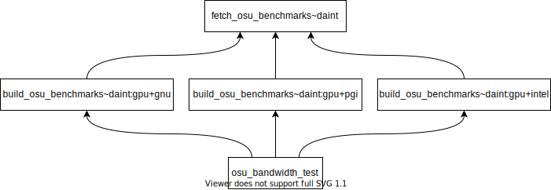
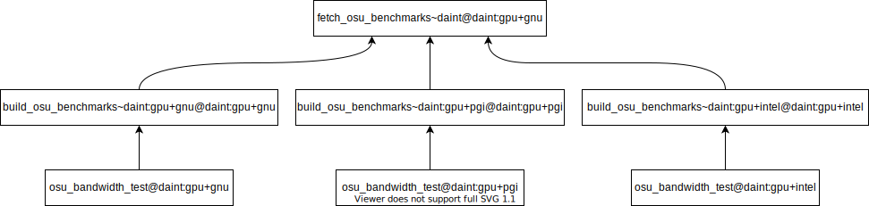
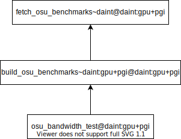

Tutorial 4: Using Test Fixtures
===============================

.. versionadded:: 3.9.0

A fixture in ReFrame is a test that manages a resource of another test.
Fixtures can be chained to create essentially a graph of dependencies.
Similarly to test dependencies, the test that uses the fixture will not execute until its fixture has executed.
In this tutorial, we will rewrite the OSU benchmarks example presented in :doc:`tutorial_deps` using fixtures.
We will cover only the basic concepts of fixtures that will allow you to start using them in your tests.
For the full documentation of the test fixtures, you should refer to the :doc:`regression_test_api` documentation.

The full example of the OSU benchmarks using test fixtures is shown below with the relevant parts highlighted:

.. literalinclude:: ../tutorials/fixtures/osu_benchmarks.py
   :start-at: import reframe

Let's start from the leaf tests, i.e. the tests that execute the benchmarks (:class:`osu_latency_test`, :class:`osu_bandwidth_test` and :class:`osu_allreduce_test`).
As in the dependencies example, all these tests derive from the :class:`OSUBenchmarkTestBase`, where we define a fixture that will take care of generating the binaries of the tests:

.. literalinclude:: ../tutorials/fixtures/osu_benchmarks.py
   :start-at: osu_binaries = fixture
   :end-at: osu_binaries = fixture

A test defines a fixture using the :func:`~reframe.core.pipeline.RegressionMixin.fixture` builtin and assigns it a name by assigning the return value of the builtin to a test variable, here ``osu_binaries``.
This name will be used later to access the resource managed by the fixture.

As stated previously, a fixture is another full-fledged ReFrame test, here the :class:`build_osu_benchmarks` which will take care of building the OSU benchmarks.
Each fixture is associated with a scope.
This practically indicates at which level a fixture is shared with other tests.
There are four fixture scopes, which are listed below in decreasing order of generality:

- ``session``: A fixture with this scope will be executed once per ReFrame run session and will be shared across the whole run.
- ``partition``: A fixture with this scope will be executed once per partition and will be shared across all tests that run in that partition.
- ``environment``: A fixture with this scope will be executed once per partition and environment combination and will be shared across all tests that run with this partition and environment combination.
- ``test``: A fixture with this scope is private to the test and will be executed for each test case.

In this example, we need to build once the OSU benchmarks for each partition and environment combination, so we use the ``environment`` scope.

Accessing the fixture is very straightforward.
The fixture's result is accessible after the *setup* pipeline stage through the corresponding variable in the test that is defining it.
Since a fixture is a standard ReFrame test, you can access any information of the test.
The individual benchmarks do exactly that:

.. literalinclude:: ../tutorials/fixtures/osu_benchmarks.py
   :pyobject: osu_latency_test.prepare_run
   :emphasize-lines: 4-5

Here we construct the final executable path by accessing the standard :attr:`~reframe.core.pipeline.RegressionTest.stagedir` attribute of the test as well as the custom-defined :attr:`build_prefix` variable of the :class:`build_osu_benchmarks` fixture.

Let's inspect now the :class:`build_osu_benchmarks` fixture:

.. literalinclude:: ../tutorials/fixtures/osu_benchmarks.py
   :pyobject: build_osu_benchmarks
   :emphasize-lines: 6,11,14

It is obvious that it is a normal ReFrame test except that it does not need to be decorated with the :func:`@simple_test <reframe.core.decorators.simple_test>` decorator.
This means that the test will only be executed if it is a fixture of another test.
If it was decorated, it would be executed both as a standalone test and as a fixture of another test.
Another detail is that this test does not define the :attr:`~reframe.core.pipeline.RegressionTest.valid_systems` and :attr:`~reframe.core.pipeline.RegressionTest.valid_prog_environs` variables.
Fixtures inherit those variables from the test that owns them depending on the scope.

Similarly to :class:`OSUBenchmarkTestBase`, this test uses a fixture that fetches the OSU benchmarks sources.
We could fetch the OSU benchmarks in this test, but we choose to separate the two primarily for demonstration purposes, but it would also make sense in cases that the data fetch is too slow.

The ``osu_benchmarks`` fixture is defined at session scope, since we only need to download the benchmarks once for the whole session:

.. literalinclude:: ../tutorials/fixtures/osu_benchmarks.py
   :start-at: osu_benchmarks = fixture
   :end-at: osu_benchmarks = fixture

The rest of the test is very straightforward.

Let's inspect the last fixture, the :class:`fetch_osu_benchmarks`:

.. literalinclude:: ../tutorials/fixtures/osu_benchmarks.py
   :pyobject: fetch_osu_benchmarks
   :emphasize-lines: 8

There is nothing special to this test -- it is just an ordinary test -- except that we force it to execute locally by setting its :attr:`~reframe.core.pipeline.RegressionTest.local` variable.
The reason for that is that a fixture at session scope can execute with any partition/environment combination, so ReFrame could have to spawn a job in case it has chosen a remote partition to launch this fixture on.
For this reason, we simply force it to execute locally regardless of the chosen partition.

It is now time to run the new tests, but let us first list them:

.. code-block:: bash

   reframe -c tutorials/fixtures/osu_benchmarks.py -l

.. literalinclude:: listings/osu_bench_fixtures_list.txt
   :language: console

Notice how the :class:`build_osu_benchmarks` fixture is populated three times, once for each partition and environment combination, and the :class:`fetch_osu_benchmarks` is generated only once.
The following figure shows visually the conceptual dependencies of the :class:`osu_bandwidth_test`.

  :sub:`Expanded fixtures and dependencies for the OSU benchmarks example.`

A *scope* part is added to the base name of the fixture, which in this figure is indicated with red color.

Under the hood, fixtures use the test dependency mechanism which is described in :doc:`dependencies`.
The dependencies listed by default and shown in the previous figure are conceptual.
Depending on the available partitions and environments, tests and fixtures can be concretized differently.
Fixtures in particular are also more flexible in the way they can be concretized depending on their scope.
The following listing and figure show the concretization of the :class:`osu_bandwidth_test`:

.. code-block:: bash

   reframe -c tutorials/fixtures/osu_benchmarks.py -n osu_bandwidth_test -lC

.. literalinclude:: listings/osu_bandwidth_concretized_daint.txt
   :language: console

  :sub:`The actual dependencies for the OSU benchmarks example using fixtures.`

The first thing to notice here is how the individual test cases of :class:`osu_bandwidth_test` depend only the specific fixtures for their scope:
when :class:`osu_bandwidth_test` runs on the ``daint:gpu`` partition using the ``gnu`` compiler it will only depend on the :class:`build_osu_benchmarks~daint:gpu+gnu` fixture.
The second thing to notice is where the :class:`fetch_osu_benchmarks~daint` fixture will run.
Since this is a *session* fixture, ReFrame has arbitrarily chosen to run it on ``daint:gpu`` using the ``gnu`` environment.
A session fixture can run on any combination of valid partitions and environments.
The following listing and figure show how the test dependency DAG is concretized when we scope the valid programming environments from the command line using ``-p nvidia``.

.. code-block:: bash

   reframe -c tutorials/fixtures/osu_benchmarks.py -n osu_bandwidth_test -lC -p nvidia

.. literalinclude:: listings/osu_bandwidth_concretized_daint_nvidia.txt
   :language: console

  :sub:`The dependency graph concretized for the 'nvidia' environment only.`

Notice how the :class:`fetch_osu_benchmarks~daint` fixture is selected to run in the only valid partition/environment combination.
This is an important difference compared to the same example written using raw dependencies in :doc:`dependencies`, in which case in order not to have unresolved dependencies, we would need to specify the valid programming environment of the test that fetches the sources.
Fixtures do not need that, since you can impose less strict constraints by setting their scope accordingly.

Finally, let's run all the benchmarks at once:

.. literalinclude:: listings/osu_bench_fixtures_run.txt
   :language: console

.. tip::
   A reasonable question is how to choose between fixtures and dependencies?

   The rule of thumb is use fixtures if your test needs to use any resource of the target test and use dependencies if you simply want to impose an order of execution for your tests.
