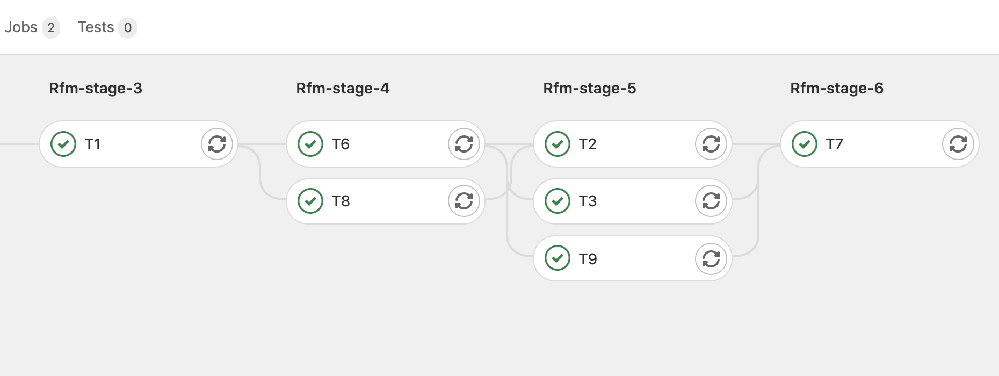

===========================
Tutorial 6: Tips and Tricks
===========================

.. versionadded:: 3.4

This tutorial focuses on some less known aspects of ReFrame's command line interface that can be helpful.

Debugging
---------

ReFrame tests are Python classes inside Python source files, so the usual debugging techniques for Python apply, but the ReFrame frontend will filter some errors and stack traces by default in order to keep the output clean.
Generally, ReFrame will not print the full stack trace for user programming errors and will not block the test loading process.
If a test has errors and cannot be loaded, an error message will be printed and the loading of the remaining tests will continue.
In the following, we have inserted a small typo in the ``hello2.py`` tutorial example:

.. code:: bash

   ./bin/reframe -c tutorials/basics/hello -R -l

.. literalinclude:: listings/hello2_typo.txt
   :language: console

Notice how ReFrame prints also the source code line that caused the error.
This is not always the case, however.
ReFrame cannot always track a user error back to its source and this is particularly true for the ReFrame-specific syntactic elements, such as the class `builtins <regression_test_api.html#builtins>`__.
In such cases, ReFrame will just print the error message but not the source code context.
In the following example, we introduce a typo in the argument of the :obj:`@run_before` decorator:

.. code-block:: none

   ./bin/reframe: skipping test file '/Users/user/Repositories/reframe/tutorials/basics/hello/hello2.py': reframe syntax error: invalid pipeline stage specified: 'compil' (rerun with '-v' for more information)
   [List of matched checks]
   - HelloTest (found in '/Users/user/Repositories/reframe/tutorials/basics/hello/hello1.py')
   Found 1 check(s)

As suggested by the warning message, passing :option:`-v` will give you the stack trace for each of the failing tests, as well as some more information about what is going on during the loading.

.. code:: bash

   ./bin/reframe -c tutorials/basics/hello -R -l -v

.. literalinclude:: listings/hello2_typo_stacktrace.txt
   :language: console

.. tip::
   The :option:`-v` option can be given multiple times to increase the verbosity level further.

Debugging deferred expressions
==============================

Although deferred expressions that are used in sanity and performance functions behave similarly to normal Python expressions, you need to understand their `implicit evaluation rules <deferrable_functions_reference.html#implicit-evaluation-of-deferrable-functions>`__.
One of the rules is that :func:`str` triggers the implicit evaluation, so trying to use the standard :func:`print` function with a deferred expression, you might get unexpected results if that expression is not yet to be evaluated.
For this reason, ReFrame offers a sanity function counterpart of :func:`print`, which allows you to safely print deferred expressions.

Let's see that in practice, by printing the filename of the standard output for :class:`HelloMultiLangTest` test.
The :attr:`stdout <reframe.core.pipeline.RegressionTest.stdout>` is a deferred expression and it will get its value later on while the test executes.
Trying to use the standard print here :func:`print` function here would be of little help, since it would simply give us :obj:`None`, which is the value of :attr:`stdout` when the test is created.

.. code-block:: python
   :emphasize-lines: 15-17

   import reframe as rfm
   import reframe.utility.sanity as sn

   @rfm.simple_test
   class HelloMultiLangTest(rfm.RegressionTest):
       lang = parameter(['c', 'cpp'])
       valid_systems = ['*']
       valid_prog_environs = ['*']

       @run_after('compile')
       def set_sourcepath(self):
           self.sourcepath = f'hello.{self.lang}'

       @sanity_function
       def validate_output(self):
           return sn.assert_found(r'Hello, World\!', sn.print(self.stdout))

If we run the test, we can see that the correct standard output filename will be printed after sanity:

.. code:: bash

   ./bin/reframe -C tutorials/config/settings.py -c tutorials/basics/hello/hello2.py -r

.. literalinclude:: listings/hello2_print_stdout.txt
   :language: console

Debugging sanity and performance patterns
=========================================
When creating a new test that requires a complex output parsing for either the ``sanity`` or ``performance`` pipeline stages, tuning the functions decorated by :attr:`@sanity_function<reframe.core.pipeline.RegressionMixin.sanity_function>` or :attr:`@performance_function<reframe.core.pipeline.RegressionMixin.performance_function>` may involve some trial and error to debug the complex regular expressions required.
For lightweight tests which execute in a few seconds, this trial and error may not be an issue at all.
However, when dealing with tests which take longer to run, this method can quickly become tedious and inefficient.

.. tip::
   When dealing with ``make``-based projects which take a long time to compile, you can use the command line option :option:`--dont-restage` in order to speed up the compile stage in subsequent runs.

When a test fails, ReFrame will keep the test output in the stage directory after its execution, which means that one can load this output into a Python shell or another helper script without having to rerun the expensive test again.
If the test is not failing but the user still wants to experiment or modify the existing sanity or performance functions, the command line option :option:`--keep-stage-files` can be used when running ReFrame to avoid deleting the stage directory.
With the executable's output available in the stage directory, one can simply use the `re <https://docs.python.org/3/library/re.html>`_ module to debug regular expressions as shown below.

.. code-block:: python

    >>> import re

    >>> # Read the test's output
    >>> with open(the_output_file, 'r') as f:
    ...     test_output = ''.join(f.readlines())
    ...
    >>> # Evaluate the regular expression
    >>> re.find(the_regex_pattern, test_output)

Alternatively to using the `re <https://docs.python.org/3/library/re.html>`_ module, one could use all the :mod:`~reframe.utility.sanity` utility provided by ReFrame directly from the Python shell.
In order to do so, if ReFrame was installed manually using the ``bootstrap.sh`` script, one will have to make all the Python modules from the ``external`` directory accessible to the Python shell as shown below.

.. code-block:: python

    >>> import sys
    >>> import os

    >>> # Make the external modules available
    >>> sys.path = [os.path.abspath('external')] + sys.path

    >>> # Import ReFrame-provided sanity functions
    >>> import reframe.utility.sanity as sn

    >>> # Evaluate the regular expression
    >>> assert sn.evaluate(sn.assert_found(the_regex_pattern, the_output_file))

Debugging test loading
======================

If you are new to ReFrame, you might wonder sometimes why your tests are not loading or why your tests are not running on the partition they were supposed to run.
This can be due to ReFrame picking the wrong configuration entry or that your test is not written properly (not decorated, no :attr:`~reframe.core.pipeline.RegressionTest.valid_systems` etc.).
If you try to load a test file and list its tests by increasing twice the verbosity level, you will get enough output to help you debug such issues.
Let's try loading the ``tutorials/basics/hello/hello2.py`` file:

.. code:: bash

   ./bin/reframe -C tutorials/config/settings.py -c tutorials/basics/hello/hello2.py -l -vv

.. literalinclude:: listings/hello2_list_verbose.txt
   :language: console

You can see all the different phases ReFrame's frontend goes through when loading a test.
After loading the configuration, ReFrame will print out its relevant environment variables and will start examining the given files in order to find and load ReFrame tests.
Before attempting to load a file, it will validate it and check if it looks like a ReFrame test.
If it does, it will load that file by importing it.
This is where any ReFrame tests are instantiated and initialized (see ``Loaded 2 test(s)``), as well as the actual test cases (combination of tests, system partitions and environments) are generated.
Then the test cases are filtered based on the various `filtering command line options <manpage.html#test-filtering>`__ as well as the programming environments that are defined for the currently selected system.
Finally, the test case dependency graph is built and everything is ready for running (or listing).

Try passing a specific system or partition with the :option:`--system` option or modify the test (e.g., removing the decorator that registers it) and see how the logs change.

Execution modes
---------------

ReFrame allows you to create pre-defined ways of running it, which you can invoke from the command line.
These are called *execution modes* and are essentially named groups of command line options that will be passed to ReFrame whenever you request them.
These are defined in the configuration file and can be requested with the :option:`--mode` command-line option.
The following configuration defines an execution mode named ``maintenance`` and sets up ReFrame in a certain way (selects tests to run, sets up stage and output paths etc.)

.. code-block:: python

   'modes': [
       {
           'name': 'maintenance',
           'options': [
               '--unload-module=reframe',
               '--exec-policy=async',
               '--strict',
               '--output=/path/to/$USER/regression/maintenance',
               '--perflogdir=/path/to/$USER/regression/maintenance/logs',
               '--stage=$SCRATCH/regression/maintenance/stage',
               '--report-file=/path/to/$USER/regression/maintenance/reports/maint_report_{sessionid}.json',
               '-Jreservation=maintenance',
               '--save-log-files',
               '--tag=maintenance',
               '--timestamp=%F_%H-%M-%S'
           ]
       },
  ]

The execution modes come handy in situations that you have a standardized way of running ReFrame and you don't want to create and maintain shell scripts around it.
In this example, you can simply run ReFrame with

.. code:: bash

  ./bin/reframe --mode=maintenance -r

and it will be equivalent to passing explicitly all the above options.
You can still pass any additional command line option and it will supersede or be combined (depending on the behaviour of the option) with those defined in the execution mode.
In this particular example, we could change just the reservation name by running

.. code:: bash

  ./bin/reframe --mode=maintenance -J reservation=maint -r

There are two options that you can't use inside execution modes and these are the :option:`-C` and :option:`--system`.
The reason is that these option select the configuration file and the configuration entry to load.

Manipulating ReFrame's environment
----------------------------------

ReFrame runs the selected tests in the same environment as the one that it executes.
It does not unload any environment modules nor sets or unsets any environment variable.
Nonetheless, it gives you the opportunity to modify the environment that the tests execute.
You can either purge completely all environment modules by passing the :option:`--purge-env` option or ask ReFrame to load or unload some environment modules before starting running any tests by using the :option:`-m` and :option:`-u` options respectively.
Of course you could manage the environment manually, but it's more convenient if you do that directly through ReFrame's command-line.
If you used an environment module to load ReFrame, e.g., ``reframe``, you can use the :option:`-u` to have ReFrame unload it before running any tests, so that the tests start in a clean environment:

.. code:: bash

   ./bin/reframe -u reframe [...]

Environment Modules Mappings
----------------------------

ReFrame allows you to replace environment modules used in tests with other modules on the fly.
This is quite useful if you want to test a new version of a module or another combination of modules.
Assume you have a test that loads a ``gromacs`` module:

.. code-block:: python

   class GromacsTest(rfm.RunOnlyRegressionTest):
       ...
       modules = ['gromacs']

This test would use the default version of the module in the system, but you might want to test another version, before making that new one the default.
You can ask ReFrame to temporarily replace the ``gromacs`` module with another one as follows:

.. code-block:: bash

   ./bin/reframe -n GromacsTest -M 'gromacs:gromacs/2020.5' -r

Every time ReFrame tries to load the ``gromacs`` module, it will replace it with ``gromacs/2020.5``.
You can specify multiple mappings at once or provide a file with mappings using the :option:`--module-mappings` option.
You can also replace a single module with multiple modules.

A very convenient feature of ReFrame in dealing with modules is that you do not have to care about module conflicts at all, regardless of the modules system backend.
ReFrame will take care of unloading any conflicting modules, if the underlying modules system cannot do that automatically.
In case of module mappings, it will also respect the module order of the replacement modules and will produce the correct series of "load" and "unload" commands needed by the modules system backend used.

Retrying and Rerunning Tests
----------------------------

If you are running ReFrame regularly as part of a continuous testing procedure you might not want it to generate alerts for transient failures.
If a ReFrame test fails, you might want to retry a couple of times before marking it as a failure.
You can achieve this with the :option:`--max-retries`.
ReFrame will then retry the failing test cases a maximum number of times before reporting them as actual failures.
The failed test cases will not be retried immediately after they have failed, but rather at the end of the run session.
This is done to give more chances of success in case the failures have been transient.

Another interesting feature introduced in ReFrame 3.4 is the ability to restore a previous test session.
Whenever it runs, ReFrame stores a detailed JSON report of the last run under ``$HOME/.reframe`` (see :option:`--report-file`).
Using that file, ReFrame can restore a previous run session using the :option:`--restore-session`.
This option is useful when you combine it with the various test filtering options.
For example, you might want to rerun only the failed tests or just a specific test in a dependency chain.
Let's see an artificial example that uses the following test dependency graph.

.. _fig-deps-complex:

.. figure:: _static/img/deps-complex.svg
   :align: center

   :sub:`Complex test dependency graph. Nodes in red are set to fail.`

Tests :class:`T2` and :class:`T8` are set to fail.
Let's run the whole test DAG:

.. code-block:: bash

   ./bin/reframe -c unittests/resources/checks_unlisted/deps_complex.py -r

.. literalinclude:: listings/deps_complex_run.txt
   :language: console

You can restore the run session and run only the failed test cases as follows:

.. code-block:: bash

   ./bin/reframe --restore-session --failed -r

Of course, as expected, the run will fail again, since these tests were designed to fail.

Instead of running the failed test cases of a previous run, you might simply want to rerun a specific test.
This has little meaning if you don't use dependencies, because it would be equivalent to running it separately using the :option:`-n` option.
However, if a test was part of a dependency chain, using :option:`--restore-session` will not rerun its dependencies, but it will rather restore them.
This is useful in cases where the test that we want to rerun depends on time-consuming tests.
There is a little tweak, though, for this to work:
you need to have run with :option:`--keep-stage-files` in order to keep the stage directory even for tests that have passed.
This is due to two reasons:
(a) if a test needs resources from its parents, it will look into their stage directories and
(b) ReFrame stores the state of a finished test case inside its stage directory and it will need that state information in order to restore a test case.

Let's try to rerun the :class:`T6` test from the previous test dependency chain:

.. code-block:: bash

   ./bin/reframe -c unittests/resources/checks_unlisted/deps_complex.py --keep-stage-files -r

.. code-block:: bash

   ./bin/reframe --restore-session --keep-stage-files -n T6 -r

Notice how only the :class:`T6` test was rerun and none of its dependencies, since they were simply restored:

.. literalinclude:: listings/deps_rerun_t6.txt
   :language: console

If we tried to run :class:`T6` without restoring the session, we would have to rerun also the whole dependency chain, i.e., also :class:`T5`, :class:`T1`, :class:`T4` and :class:`T0`.

.. code-block:: bash

   ./bin/reframe -c unittests/resources/checks_unlisted/deps_complex.py -n T6 -r

.. literalinclude:: listings/deps_run_t6.txt
   :language: console

Implementing test workarounds efficiently
-----------------------------------------

.. versionadded:: 3.2

Sometimes you may need to add a quick workaround in a test, because something in a system or an environment broken.
The best way to implement this is through hooks, because you can easily disable any hook from the command-line and you don't need to update the test every time you want to check if the system is fixed and the workaround is not needed anymore.

Let's use one example from the `previous tutorial <tutorial_basics.html>`__ and let's assume that there is something wrong with one of the environments and a special macro needs to be defined in order for the compilation to succeed.
Instead of adding another flag in the :func:`set_compilation_flags` hook, it is better to add another hook containing just the workaround as shown below:

.. code-block:: python
   :emphasize-lines: 27-33

   import reframe as rfm
   import reframe.utility.sanity as sn

   @rfm.simple_test
   class HelloThreadedExtended2Test(rfm.RegressionTest):
       valid_systems = ['*']
       valid_prog_environs = ['*']
       sourcepath = 'hello_threads.cpp'
       build_system = 'SingleSource'
       executable_opts = ['16']

       @run_before('compile')
       def set_compilation_flags(self):
           self.build_system.cppflags = ['-DSYNC_MESSAGES']
           self.build_system.cxxflags = ['-std=c++11', '-Wall']
           environ = self.current_environ.name
           if environ in {'clang', 'gnu'}:
               self.build_system.cxxflags += ['-pthread']

       @sanity_function
       def assert_num_messages(self):
           num_messages = sn.len(sn.findall(r'\[\s?\d+\] Hello, World\!',
                                         self.stdout))
           return sn.assert_eq(num_messages, 16)

       @run_before('compile')
       def fooenv_workaround(self):
           ce = self.current_environ.name
           if ce == 'foo':
               self.build_system.cppflags += [
                   '-D__GCC_ATOMIC_TEST_AND_SET_TRUEVAL'
               ]

This way the test will start passing again allowing us to catch any new issues while waiting for the original issue to be fixed.
Then we can run the test anytime using ``--disable-hook=fooenv_workaround`` to check if the workaround is not needed anymore.

.. _generate-ci-pipeline:

Integrating into a CI pipeline
------------------------------

.. versionadded:: 3.4.1

Instead of running your tests, you can ask ReFrame to generate a `child pipeline <https://docs.gitlab.com/ee/ci/parent_child_pipelines.html>`__ specification for the Gitlab CI.
This will spawn a CI job for each ReFrame test respecting test dependencies.
You could run your tests in a single job of your Gitlab pipeline, but you would not take advantage of the parallelism across different CI jobs.
Having a separate CI job per test makes it also easier to spot the failing tests.

As soon as you have set up a `runner <https://docs.gitlab.com/ee/ci/quick_start/>`__ for your repository, it is fairly straightforward to use ReFrame to automatically generate the necessary CI steps.
The following is an example of ``.gitlab-ci.yml`` file that does exactly that:

.. code-block:: yaml

   stages:
     - generate
     - test

   generate-pipeline:
     stage: generate
     script:
       - reframe --ci-generate=${CI_PROJECT_DIR}/pipeline.yml -c ${CI_PROJECT_DIR}/path/to/tests
     artifacts:
       paths:
         - ${CI_PROJECT_DIR}/pipeline.yml

   test-jobs:
     stage: test
     trigger:
       include:
         - artifact: pipeline.yml
           job: generate-pipeline
       strategy: depend

It defines two stages.
The first one, called ``generate``, will call ReFrame to generate the pipeline specification for the desired tests.
All the usual `test selection options <manpage.html#test-filtering>`__ can be used to select specific tests.
ReFrame will process them as usual, but instead of running the selected tests, it will generate the correct steps for running each test individually as a Gitlab job in a child pipeline.
The generated ReFrame command that will run each individual test reuses the :option:`-C`, :option:`-R`, :option:`-v` and :option:`--mode` options passed to the initial invocation of ReFrame that was used to generate the pipeline.
Users can define CI-specific execution modes in their configuration in order to pass arbitrary options to the ReFrame invocation in the child pipeline.

Finally, we pass the generated CI pipeline file to second phase as an artifact and we are done!
If ``image`` keyword is defined in ``.gitlab-ci.yml``, the emitted pipeline will use the same image as the one defined in the parent pipeline.
Besides, each job in the generated pipeline will output a separate junit report which can be used to create GitLab badges.

The following figure shows one part of the automatically generated pipeline for the test graph depicted `above <#fig-deps-complex>`__.

   :sub:`Snapshot of a Gitlab pipeline generated automatically by ReFrame.`

.. note::

   The ReFrame executable must be available in the Gitlab runner that will run the CI jobs.
